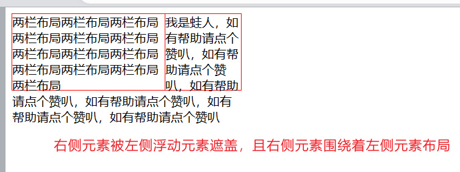
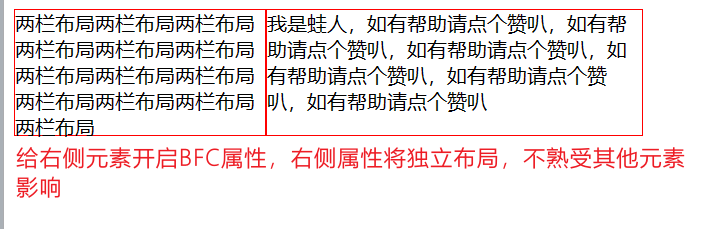
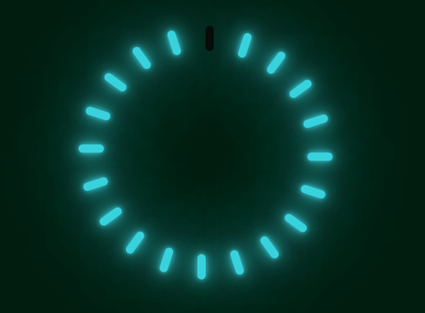

# 归纳

## 什么是 BFC，如何触发 BFC，如何解决 margin 塌陷问题？

BFC： Block Formatting Context（块级格式上下文），BFC 提供一个完全独立的布局环境，其子元素的布局不会影响到外部的布局，其子元素在这个环境中按照一定的规则进行布局；

BFC 的规则：

- 开启了 BFC 的元素是一个块级元素，块级元素在在垂直方向上一个接一个排列；
- 开启了 BFC 的元素在页面上是一个独立的容器，容器的元素布局不影响外部；
- 同一个 BFC 下的垂直相邻元素会发生 margin 重叠，取两者间较大的 margin 值；
- BFC 环境下，可以包含浮动元素，可解决父元素高度塌陷问题；

触发 BFC（通过设置元素的 CSS）：

- overflow： hidden(此时开启了此属性的元素，其子元素将处于 BFC 环境)；
- display: inline-block;
- display: flex;
- display: table-cell;
- position: absolute;
- position: fixed;

BFC 解决的问题：

- 子元素开启 Float 属性导致脱离文档流，造成父元素高度塌陷；
- BFC 环境下的垂直相邻子元素 margin 重叠；
- 两栏布局（左侧元素开启左浮动，会造成右侧元素被遮挡，此时通过给右侧元素开启 BFC，可实现紧挨着左栏元素）





## CSS 如何处理溢出，overflow 不同取值的区别

通过设置 overflow 属性来处理元素的内容溢出；

overflow 取值：

- visible（默认值）：此时溢出内容不会被裁剪，将在盒子外面继续布局；
- hidden： 超出元素盒子大小的内容将被裁剪；
- scroll： 内容溢出时，元素内部出现滚动；
- auto： 类同 scroll 属性；
- inherit： 继承祖先元素；

利用 overflow 实现单行文本溢出省略：

```css
{
    width: 200px;
    white-space: nowrap;
    overflow: hidden;
    text-overflow: ellipsis;
}
```

利用 overflow 实现多行文本溢出省略：

```css
{
    width: 200px;
    overflow : hidden;
    text-overflow: ellipsis;
    display: -webkit-box;
    -webkit-line-clamp: 2; /* 控制行数 */
    -webkit-box-orient: vertical;
}
```

1. 三栏布局的实现

三栏布局： 左右元素宽度固定，中间元素自适应；

- 流体布局

左右元素各自开启左右浮动，中间元素通过设置左右两边的 margin 来实现；

缺点：中间内容无法最先加载

```html
<!DOCTYPE html>
<html lang="en">
<head>
    <style>
        .left {
            float: left;
            height: 200px;
            width: 100px;
            background-color: red;
        }
        .right {
            width: 200px;
            height: 200px;
            background-color: blue;
            float: right;
        }
        .main {
            margin-left: 120px;
            margin-right: 220px;
            height: 200px;
            background-color: green;
        }
    </style>
</head>
<body>
    <div class="container">
        <div class="left"></div>
        <div class="right"></div>
        <div class="main"></div>
    </div>
</body>
</html>
```

- BFC 三栏布局

左右两侧依旧是各自开启左右浮动，中间元素通过开启 BFC 来隔离浮动元素

缺点：无法先加载中间元素

```html
<!DOCTYPE html>
<html lang="en">
<head>
    <style>
        .left {
            float: left;
            height: 200px;
            width: 100px;
            margin-right: 20px;
            background-color: red;
        }
        .right {
            width: 200px;
            height: 200px;
            float: right;
            margin-left: 20px;
            background-color: blue;
        }        
        .main {
            height: 200px;
            overflow: hidden;
            background-color: green;
        }
    </style>
</head>
<body>
    <div class="container">
        <div class="left"></div>
        <div class="right"></div>
        <div class="main"></div>
    </div>
</body>
</html>
```

- 双飞翼布局

中间元素和左侧元素开启左浮动，中间元素设置宽度 100%，左侧元素设置负 margin100%，右侧元素设置右浮动，并设置自身宽度的负 margin-left 值；

优点：可先加载中间元素

```html
<!DOCTYPE html>
<html lang="en">
<head>
    <style>
        .content {
              float: left;
              width: 100%;
        }
        .main {
              height: 200px;
              margin-left: 110px;
              margin-right: 220px;
              background-color: green;
        }
        /*用于清除浮动*/
        .main::after {
              display: block;
              content: '';
              font-size: 0;
              height: 0;
              clear: both;
              zoom: 1;
        }
        .left {
            float: left;
            height: 200px;
            width: 100px;
            margin-left: -100%;
            background-color: red;
        }
        .right {
            width: 200px;
            height: 200px;
            float: right;
            margin-left: -200px;
            background-color: blue;
        }        
    </style>
</head>
<body>
    <div class="content">
        <div class="main"></div>
    </div>
    <div class="left"></div>
    <div class="right"></div>
</body>
</html>
```

- 圣杯布局

类似双飞翼布局，也是可以优先加载中间元素

```html
<!DOCTYPE html>
<html lang="en">
<head>
    <style>
        .container {
            margin-left: 120px;
            margin-right: 220px;
        }
        .main {
            float: left;
            width: 100%;
            height: 300px;
            background-color: red;
        }
        .left {
            float: left;
            width: 100px;
            height: 300px;
            margin-left: -100%;
            position: relative;
            left: -120px;
            background-color: blue;
        }
        .right {
            float: left;
            width: 200px;
            height: 300px;
            margin-left: -200px;
            position: relative;
            right: -220px;
            background-color: green;
        }
    </style>
</head>
<body>
    <div class="container">
        <div class="main"></div>
        <div class="left"></div>
        <div class="right"></div>
    </div>
</body>
</html>
```

- Flex 布局

通过给父容器开启 flex 布局，并将中间元素的 flex-grow 设置为 1，左侧元素通过 order 设置为-1 实现；

优点：布局简单，css 样式书写简单，但需要考虑浏览器的兼容性；

```html
<!DOCTYPE html>
<html lang="en">
<head>
    <style>
        .container {
            display: flex;
        }
        .main {
            flex-grow: 1;
            height: 300px;
            background-color: red;
        }
        .left {
            order: -1;
            flex: 0 1 200px;
            margin-right: 20px;
            height: 300px;
            background-color: blue;
        }
        .right {
            flex: 0 1 100px;
            margin-left: 20px;
            height: 300px;
            background-color: green;
        }
    </style>
</head>
<body>
    <div class="container">
        <div class="main"></div>
        <div class="left"></div>
        <div class="right"></div>
    </div>
</body>
</html>
```

- Table 布局

通过给父元素开启 table 布局，子元素左中右设置为 table-cell 布局实现；

缺点： 无法优先加载中间元素，且无法给左中右元素设置 margin 值；

```html
<!DOCTYPE html>
<html lang="en">
<head>
    <style>
        .container {
            display: table;
            width: 100%;
        }
        .left, .main, .right {
            display: table-cell;
        }
        .left {
            width: 200px;
            height: 300px;
            background-color: red;
        }
        .main {
            background-color: blue;
        }
        .right {
            width: 100px;
            height: 300px;
            background-color: green;
        }
    </style>
</head>
<body>
    <div class="container">
        <div class="left"></div>
        <div class="main"></div>
        <div class="right"></div>
    </div>
</body>
</html>
```

- 绝对定位布局

优点：布局简单，且可以优先加载中间元素

```html
<!DOCTYPE html>
<html lang="en">
<head>
    <style>
        .container {
            position: relative;
        }
        .main {
            height: 300px;
            margin: 0 120px;
            background-color: green;
        }
        .left {
            position: absolute;
            width: 100px;
            height: 300px;
            left: 0;
            top: 0;
            background-color: red;
        }
        .right {
            position: absolute;
            width: 100px;
            height: 300px;
            background-color: blue;
            right: 0;
            top: 0;
        }
    </style>
</head>
<body>
    <div class="container">
        <div class="main"></div>
        <div class="left"></div>
        <div class="right"></div>
    </div>
</body>
</html>
```

## CSS 中的 calc 函数有什么作用？

calc 函数允许在指定 CSS 属性值时进行计算，可对不同单位进行结合计算，其遵循四则运算法则（加减乘除），遵循标准运算符优先规则

使用注意事项：

操作符两边必须要有一个空格，否则运算无效；

使用 calc 和 animation 实现一个简单的 loading 加载：

```html
<!DOCTYPE html>
<html lang="en">
<head>
    <style>
        root * {
            margin: 0;
            padding: 0;
            box-sizing: border-box;
            font-family: 'Courier New', Courier, monospace;
        }
        section {
            display: flex;
            justify-content: center;
            align-items: center;
            min-height: 100vh;
            background: #001d10;
        }
        .animate-loading {
            position: relative;
            width: 250px;
            height: 250px;
        }
        .animate-loading .block {
            position: absolute;
            width: 8px;
            height: 25px;
            background: #050c09;
            left: 50%;
            border-radius: 8px;
            transform: rotate(calc(18deg * var(--i)));
            transform-origin: 0 125px;
            animation: animate 1.9s ease-in-out infinite;
            animation-delay: calc(0.05s * var(--i));
        }
        @keyframes animate {

            0%,
            50% {
                background: #050c09;
                box-shadow: none;
            }
            50.1%,
            100% {
                background: #38d2dd;
                box-shadow: 0 0 5px #38d2dd,
                    0 0 15px #38d2dd,
                    0 0 30px #38d2dd,
                    0 0 60px #38d2dd,
                    0 0 90px #38d2dd;
            }
        }
    </style>
</head>
<body>
    <section>
        <div class="animate-loading">
            <div class="block" style="--i: 1"></div>
            <div class="block" style="--i: 2"></div>
            <div class="block" style="--i: 3"></div>
            <div class="block" style="--i: 4"></div>
            <div class="block" style="--i: 5"></div>
            <div class="block" style="--i: 6"></div>
            <div class="block" style="--i: 7"></div>
            <div class="block" style="--i: 8"></div>
            <div class="block" style="--i: 9"></div>
            <div class="block" style="--i: 10"></div>
            <div class="block" style="--i: 11"></div>
            <div class="block" style="--i: 12"></div>
            <div class="block" style="--i: 13"></div>
            <div class="block" style="--i: 14"></div>
            <div class="block" style="--i: 15"></div>
            <div class="block" style="--i: 16"></div>
            <div class="block" style="--i: 17"></div>
            <div class="block" style="--i: 18"></div>
            <div class="block" style="--i: 19"></div>
            <div class="block" style="--i: 20"></div>
        </div>
    </section>
</body>
</html>
```



## 渐进增强（Progressive Enhancement）和优雅降级（Graceful Degradation）

渐进增强（Progressive Enhancement）：一开始就针对低版本浏览器进行构建页面，完成基本的功能，然后再针对高级浏览器进行效果、交互、追加功能达到更好的体验。

优雅降级（Graceful Degradation）：一开始就构建站点的完整功能，然后再针对低版本浏览器进行兼容。比如一开始使用 CSS3 的特性构建了一个应用，然后逐步针对各大浏览器进行 hack 使其可以在低版本浏览器上正常浏览。

## 可替换元素（replace element）

可替换元素也称置换元素，其展现效果不由 CSS 来控制，这些元素的渲染独立于 CSS，与之对比的是非置换元素，其内容由 CSS 直接渲染到客户端；

可替换元素的内容不受当前文档的样式的影响，CSS 可以影响可替换元素的位置，但不会影响到可替换元素自身的内容。对于某些可替换元素，例如 `<iframe>` 元素，可能具有自己的样式表，但它们不会继承父文档的样式。

常见的可替换元素，例如 `<iframe>`、`<video>`、`<embed>`、`` 等，有些元素在特定情况下会被当作可替换元素处理，例如 `<option>`、`<audio>`、`<canvas>`、`<object>`、`<applet>`、`<input>` 等。

## 让浏览器支持小于 12px 大小的字体

1.通过 CSS 中的 transform 中的 scale 来解决；

```css
transform：scale(0.5)
```

2.通过 CSS 中的 zoom 属性；

3.使用图片；

## CSS3 新特性

1.新增选择器

- E:nth-child(n)：选择器匹配其父元素的第 n 个子元素，不论元素类型，n 可以使数字，关键字，或公式。
- E:nth-of-type(n)： 选择与之其匹配的父元素的第 N 个子元素。
- E:first-child： 相对于父级做参考，“所有”子元素的第一个子 r 元素，并且“位置”要对应。
- E:first-of-type： 相对于父级做参考，“特定类型”（E）的第一个子元素。
- E:empty： 选择没有子元素的每个 E 元素。
- E:target： 选择当前活动的 E 元素。
- ::selection： 选择被用户选取的元素部分。
- E[abc*="def"]：属性选择器， 选择 adc 属性值中包含子串"def"的所有元素。

2.文本相关属性设置

- text-shadow： 2px 2px 8px #000； 向右偏移量 向左偏移量 渐变的像素 渐变的颜色
- text-overflow： clip | ellipisis | string； 文本溢出相关
- text-wrap：规定文本换行的规则。
- word-wrap:normal|break-word; 对长的不可分割的单词进行分割并换行到下一行。
- white-space：规定如何处理元素中的空白 white-space:nowrap 规定段落中的文本不进行换行。

3.边框

- border-radius： 边框的圆角。
- border-image：边框图片。

4.背景

- rgba：（rgb 为颜色值，a 为透明度）。
- hsla：“s：饱和度”，“l：亮度”，“a：透明度”。
- background-size:cover/contain，其中 background-size：cover，会使“最大”边进行缩放，另一边同比缩放，铺满容器，超出部分会溢出。background-size:contain，会使“最小”边进行缩放，另一边同比缩放，不一定铺满容器，会完整显示图片。
- background-clip：padding-box/padding-box/content-box。
- background-origin：padding-box/padding-box/content-box。
- background：多张背景图。

5.渐变

- 线性渐变

```css
background-image:linear-gradient(90deg,yellow 20%,green 80%)
```

- 辐射渐变

```css
background-iamge:radial-gradient(120px at center center,yellow,green)
```

6.Filter（滤镜）

```html
<p>原图</p>

<p>黑白色filter: grayscale(100%)</p>

<p>褐色filter:sepia(1)</p>

<p>饱和度saturate(2)</p>

<p>色相旋转hue-rotate(90deg)</p>

<p>反色filter:invert(1)</p>

<p>透明度opacity(.5)</p>

<p>亮度brightness(.5)</p>

<p>对比度contrast(2)</p>

<p>模糊blur(3px)</p>

<p>阴影drop-shadow(5px 5px 5px #000)</p>

```

7.新增布局

- Flex 布局
- Grid 布局
- 多列布局

8.过渡（transition）

- transition-property:width //property 为定义过渡的 css 属性列表，列表以逗号分隔。
- transition-duration:2s; //过渡持续的时间。
- transition-timing-function:ease;
- transition-delay:5s //过渡延迟 5s 进行。

9.变换（transform）

- transform ：translate（x,y) rotate(deg) scale(x,y)
- translate
- scale
- rotate
- skew（倾斜）

10.动画（animation）

11.媒体查询 @media

## Position 定位

在 CSS 中，position 属性用于控制元素的定位方式。它有以下几种取值：

1. static（默认值）：

   - 元素按照正常的文档流进行布局，不受 top、bottom、left、right 等属性的影响。
   - 不会被设置为其他定位方式的元素所覆盖。
2. relative：

   - 元素相对于其正常位置进行定位，通过设置 top、bottom、left、right 属性来调整元素的位置。
   - 元素在文档流中仍占据原来的空间，其他元素不会填充其位置。
   - 元素的定位不会影响其他元素的布局。
3. absolute：

   - 元素相对于其最近的非 static 定位的父元素进行定位，如果没有非 static 定位的父元素，则相对于文档的初始包含块（viewport）进行定位。
   - 通过设置 top、bottom、left、right 属性来调整元素的位置。
   - 元素在文档流中被移除，不占据原来的空间，其他元素会填充其位置。
   - 元素的定位可能会影响其他元素的布局。
4. fixed：

   - 元素相对于文档的初始包含块（viewport）进行定位。
   - 通过设置 top、bottom、left、right 属性来调整元素的位置。
   - 元素在文档流中被移除，不占据原来的空间，其他元素会填充其位置。
   - 元素的定位不会随页面滚动而改变。
5. sticky：

   - 元素根据正常文档流进行定位，直到滚动到特定位置（由 top、bottom、left、right 属性指定）时，元素将固定在屏幕上。
   - 元素在文档流中仍占据原来的空间，其他元素不会填充其位置。
   - 元素的定位可能会影响其他元素的布局。
   - 粘性定位可以被认为是相对定位和固定定位的混合。元素在跨越特定阈值前为相对定位，之后为固定定位。

## Flex 布局

在 CSS 中，`flex: 1` 是 `flex-grow`, `flex-shrink`, 和 `flex-basis` 这三个弹性布局属性的简写形式。具体对应如下：

- `flex-grow: 1;`：定义了 flex 项目（子元素）在容器有多余空间时的增长比例，值为 1 表示如果存在剩余空间，该项目将会等分这部分空间。
- `flex-shrink: 1;`：定义了 flex 项目在容器空间不足时的收缩比例，值为 1 表示如果空间不够，该项目将会按比例缩小。
- `flex-basis: 0%;`（或 `auto`）：定义了 flex 项目的初始大小，即在分配剩余空间之前的基础大小。当值为 `0%` 或 `auto` 且同时设置了 `flex-grow: 1` 时，意味着该项目首先会根据自身的尺寸来计算，然后参与分配容器的剩余空间。

因此，当你给一个 flex 项目设置 `flex: 1` 时，实际上是告诉它：“如果有额外的空间，请平等地增长以填充容器；若空间不足，则按比例收缩，并且在分配空间之前不要有任何固有的基础大小。”

### justify-content

- `flex-start`：弹性项目沿主轴（默认为水平方向，从左到右）起点对齐。第一个项目与容器的起始边对齐。
- `flex-end`：弹性项目沿主轴终点对齐。最后一个项目与容器的结束边对齐。
- `center`：弹性项目沿主轴居中对齐。
- `space-between`：弹性项目之间的间隔相等。第一个项目与容器的起始边对齐，最后一个项目与容器的结束边对齐。
- `space-around`：弹性项目之间的间隔相等，但两侧的间隔是项目间距的一半，因此整体上每个项目周围都有等量的空间。
- `space-evenly`：所有项目之间的间隔完全相等，包括项目与容器边缘之间。

### align-item

- `stretch`（默认值）：弹性项目沿交叉轴（默认为垂直方向，从上到下）拉伸以填满容器的高度。如果项目未设置高度或高度为自动，则项目会被拉伸至与其所在行的容器高度相同。
- `flex-start`：弹性项目沿交叉轴起点对齐。项目的顶部（在 LTR 布局中）与容器的顶部对齐。
- `flex-end`：弹性项目沿交叉轴终点对齐。项目的底部与容器的底部对齐。
- `center`：弹性项目沿交叉轴居中对齐。
- `baseline`：弹性项目按照其第一行文字基线对齐。注意，并非所有项目都必须有可比较的基线，而且该行为可能依赖于具体的文本内容和字体。

## Linear-gradient

在 CSS 中，使用线性渐变属性（linear-gradient）可以创建从一种颜色平滑过渡到另一种颜色的效果。以下是如何使用线性渐变的详细说明：

### 基本语法

```css
background: linear-gradient(direction, color-stop1, color-stop2, ...);
```

- `direction`：指定渐变的方向。这可以通过角度值或关键词来表示。

  - 角度值示例：`45deg` 表示从左上角至右下角的对角线方向。
  - 关键词示例：`to right`、`to bottom left` 等。
- `color-stop1`, `color-stop2`, ...：定义颜色及其在渐变中的位置。每个颜色后面可以跟一个百分比值或者长度值，用来指定颜色开始和结束的位置。

例如：

```css
/* 从左到右从红色渐变到蓝色 */
background: linear-gradient(to right, red, blue);

/* 使用多个颜色，并且设置颜色停止点 */
background: linear-gradient(to bottom, red 0%, yellow 50%, green 100%);

/* 使用角度表示方向 */
background: linear-gradient(45deg, #ff0000, #00ff00, #0000ff);
```

### 更高级用法

- 可以添加更多的颜色停止点以创建更复杂的渐变效果。
- 可以在渐变中使用透明度（RGBA 颜色格式）以实现颜色与透明度的渐变。
- 在需要时，也可以通过 `background-image` 属性配合使用其他背景图像。

### 示例代码

```css
/* 渐变从顶部到底部，从浅蓝渐变到深蓝 */
div {
  background: linear-gradient(to bottom, lightblue, darkblue);
  height: 200px;
  width: 200px;
}
```

在这个例子中，一个 div 元素将具有一个从浅蓝色到深蓝色的垂直渐变背景。

## Transition

CSS 中的 `transition` 属性用于为元素添加过渡效果，当元素的一个或多个 CSS 属性值发生改变时，这些变化不会立即生效，而是会在一定时间段内平滑地过渡到新的值。以下是 `transition` 属性的基本使用方法：

### 简写形式：

```css
/* 语法 */
transition: property duration timing-function delay;

/* 示例 */
transition: background-color 1s ease-in-out 0.5s;
```

- **property**：指定要应用过渡效果的 CSS 属性名称，可以是一个具体的属性（如 `background-color`），也可以是 `all` 表示对所有可动画属性进行过渡。
-
- **duration**：过渡持续的时间，单位可以是秒（s）或毫秒（ms）。例如 `1s` 或 `500ms`。
- **timing-function**：定义过渡速度曲线，包括但不限于以下几种预定义函数：

  - `ease`（默认值）：开始缓慢，然后加速，最后减速结束。
  - `linear`：在整个过渡过程中保持相同的速度。
  - `ease-in`：在开始时缓慢启动，之后加快速度。
  - `ease-out`：在结束时缓慢停止，之前速度快一些。
  - `ease-in-out`：在开始和结束时缓慢改变，在中间阶段快速改变。
  - 还可以使用关键词之外的贝塞尔曲线函数（cubic-bezier）或者 steps 函数等自定义过渡曲线。
- **delay**：过渡效果开始前的延迟时间，同样以秒或毫秒为单位。例如 `0.5s` 表示延迟半秒后开始过渡。

### 长格式：

如果需要分别设置各个过渡属性，可以分开写成四个独立的属性：

```css
transition-property: background-color, color;
transition-duration: 1s, 2s;
transition-timing-function: ease-in-out, linear;
transition-delay: 0s, 0.5s;
```

### 触发方式：

过渡效果通常在状态改变时自动触发，比如通过 `:hover`、`:focus`、`:active` 等伪类，或者 JavaScript 动态修改样式时触发。

### 示例场景：

假设我们有一个按钮，希望在鼠标悬停时背景颜色渐变且稍微延迟开始：

```css
.button {
  background-color: lightblue;
  transition: background-color 0.5s ease-in-out 0.2s;
}

.button:hover {
  background-color: darkblue;
}
```

在这个例子中，当鼠标悬停在 `.button` 元素上时，背景色将在 0.2 秒后开始以 0.5 秒的时长从浅蓝色平滑过渡到深蓝色。
