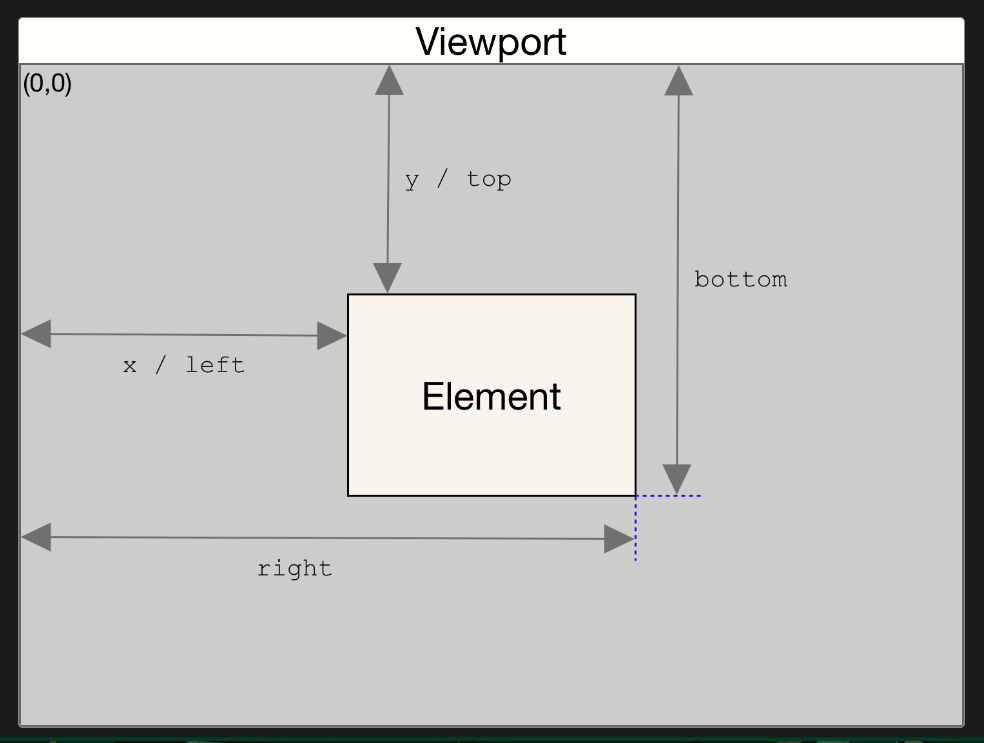

# 归纳

## var，let， const 声明变量的区别

### `var`

在 ES5 及之前的版本中，`var` 是用于声明变量的关键字。它具有函数作用域，意味着变量的作用域限定在最近的函数内部。如果在函数内部使用 `var` 声明的变量，在函数外部也可以访问到它。此外，`var` 声明的变量可以被多次重复声明，而不会引发错误。

### `let`

在 ES6 引入的 `let` 关键字用于声明块级作用域的变量。块级作用域是指变量的作用域限定在最近的一对花括号（{}）内部，例如 if 语句、循环语句等。与 `var` 不同，使用 `let` 声明的变量只在当前作用域内有效，不会被提升到作用域的顶部。此外，`let` 声明的变量不能被重复声明，否则会引发错误。

### `const`

`const` 也是在 ES6 引入的关键字，用于声明常量。与 `let` 类似，`const` 也具有块级作用域，并且不会被提升。不同之处在于，使用 `const` 声明的变量必须进行初始化，并且不能再次赋值给其他值。这意味着 `const` 声明的变量是不可变的。但是，对于复合类型（如对象和数组），虽然不能将其重新赋值，但可以修改其属性或元素。

暂时性死区：

- 暂时性死区是指在块级作用域中，使用 `let` 或 `const` 声明的变量在声明之前是不可访问的。
- 在变量声明之前的区域被称为暂时性死区（Temporal Dead Zone，简称 TDZ）。

总结：

1. 使用 `var` 声明的变量具有函数作用域，可以被重复声明。
2. 使用 `let` 声明的变量具有块级作用域，不可重复声明。
3. 使用 `const` 声明的变量也具有块级作用域，必须进行初始化，并且不可重新赋值。
4. `var` 声明的变量存在变量提升，而 `let` 和 `const` 声明的变量不存在变量提升。
5. `var` 声明的全局变量会自动挂载到全局 `window` 对象上，`let` 和 `const` 不会。

## 闭包

在 JavaScript 中，闭包是指函数以及其在定义时可以访问的词法作用域的组合。换句话说，闭包是一个函数和它周围的状态的包裹体。

当一个函数在定义时，它可以访问其外部作用域中的变量和函数。如果这个函数在其内部定义了一个内部函数，并将内部函数作为返回值或者传递给其他函数，那么内部函数就形成了一个闭包。这个内部函数可以访问其外部函数的作用域，即使在外部函数执行完毕后，闭包仍然可以访问外部函数的变量。

闭包的一个重要特性是它可以“记住”其创建时的作用域。这意味着即使外部函数已经执行完毕并返回，闭包仍然可以访问和操作外部函数的变量。这种特性使得闭包在很多情况下非常有用。

```javascript
function outerFunction() {
  let outerVariable = 'I am from the outer function';

  function innerFunction() {
    console.log(outerVariable);
  }

  return innerFunction;
}

const closure = outerFunction();
closure(); // 输出: "I am from the outer function"
```

## 理解函数执行上下文

当前函数执行上下文是指当前正在执行的函数的环境和状态信息。每当函数被调用时，都会创建一个执行上下文，用于管理函数的执行过程。

### 作用域链

当前函数执行上下文包含一个作用域链，它决定了函数可以访问哪些变量和函数。作用域链由当前函数的词法环境和它的父级词法环境组成。通过查看作用域链，可以了解函数在执行过程中如何解析变量和函数标识符。

补充执行上下文与函数作用域的关系：

执行上下文（Execution Context）和函数作用域（Function Scope）是相关但不同的概念。

执行上下文是一个关于函数执行的概念，它包含了函数执行所需的所有信息，包括函数的变量、参数、this 值、作用域链等。每当函数被调用时，都会创建一个新的执行上下文，并将其推入调用栈。执行上下文管理着函数的执行过程，包括变量的创建、赋值、函数调用和返回等。执行上下文可以理解为函数执行时的环境和状态。

函数作用域是指变量和函数在代码中可访问的范围。每个函数都有自己的作用域，作用域由函数的定义位置决定。在函数作用域中，变量和函数在函数内部可见，外部代码无法直接访问函数作用域中的变量和函数。函数作用域可以防止变量名冲突和提供封装性。

函数作用域和执行上下文之间的关系在于，执行上下文中的作用域链决定了函数在执行过程中可以访问的变量和函数。作用域链由当前执行上下文的词法环境和它的父级词法环境组成。父级词法环境通常指的是包含当前函数的外层函数或全局环境。通过作用域链，函数可以访问外层作用域中的变量和函数。

可以将执行上下文看作是函数执行时的执行环境和状态，而函数作用域是函数定义时的静态范围。执行上下文可以动态地创建和销毁，而函数作用域在函数定义时就确定了。

### 变量对象

每个函数执行上下文都有一个变量对象，用于存储函数内部定义的变量和函数声明。变量对象中包含函数的形参、函数内部声明的变量和函数，以及特殊变量（如 `this`）。通过检查变量对象，可以了解当前函数中定义的变量和函数。

### this 值

当前函数执行上下文中的 `this` 值表示当前函数的执行上下文所属的对象。`this` 的值根据函数的调用方式而不同，可以是全局对象、调用函数的对象（如果函数作为对象的方法调用），或者是通过 `call`、`apply` 等方法明确指定的对象。理解 `this` 的值可以帮助我们确定函数在执行时所操作的对象。

### 执行状态

当前函数执行上下文中还包含了函数的执行状态，包括函数的当前位置、待执行的代码、已经执行的代码等。通过观察执行状态，可以了解函数的执行进度和执行过程中的代码路径。

### 闭包

如果当前函数是一个闭包（即它引用了外部作用域的变量），则执行上下文还会包含对外部变量的引用。通过查看闭包中的引用，可以了解函数如何访问外部作用域的变量。

## new 关键字背后发生的操作

1. 创建一个空对象：`new` 关键字会创建一个空的 JavaScript 对象。
2. 将新对象的原型指向构造函数的原型：新对象的 `[[Prototype]]`（隐式原型）属性会被设置为构造函数的 `prototype` 属性。这使得新对象可以继承构造函数原型上的属性和方法。
3. 将构造函数的作用域赋给新对象：`this` 关键字会被设置为新创建的对象。这样在构造函数内部，我们可以通过 `this` 来引用新对象。
4. 执行构造函数代码：构造函数会被调用，通过 `this` 关键字可以在构造函数内部操作新对象。构造函数可以在新对象上添加属性和方法。
5. 返回新对象：如果构造函数没有显式地返回一个对象，则 `new` 表达式会隐式地返回新创建的对象。如果构造函数有返回一个对象，则返回的是该对象，而不是新创建的对象

## call，apply，bind 函数的区别

`call`, `apply`, 和 `bind` 都是 JavaScript 中用于修改函数执行上下文（`this` 值）的方法，它们的区别如下：

1. `call`: `call` 方法是函数对象的一个方法，它立即调用函数并指定函数执行时的 `this` 值和参数列表。它接受一个指定的 `this` 值作为第一个参数，后续参数为函数的参数列表。例如：`func.call(thisValue, arg1, arg2, ...)`
2. `apply`: `apply` 方法与 `call` 类似，也是立即调用函数并指定函数执行时的 `this` 值和参数列表。不同之处在于，`apply` 接受一个指定的 `this` 值作为第一个参数，后续参数以数组或类数组对象的形式传递给函数。例如：`func.apply(thisValue, [arg1, arg2, ...])`
3. `bind`: `bind` 方法不会立即调用函数，而是创建一个新的函数，将指定的 `this` 值绑定到函数中，并返回这个新函数。调用这个新函数时，它会以绑定的 `this` 值和参数列表执行原始函数。例如：`var newFunc = func.bind(thisValue, arg1, arg2, ...)`

总结一下区别：

- `call` 和 `apply` 是立即调用函数并指定 `this` 值和参数列表，`call` 接受参数列表，而 `apply` 接受数组或类数组对象作为参数。
- `bind` 创建了一个新函数，并将指定的 `this` 值绑定到新函数中，但不会立即调用原始函数。

这些方法在实际应用中常用于改变函数执行时的上下文，允许我们明确指定函数中的 `this` 值，并传递参数。

## 箭头函数与 function 关键字函数

### 语法形式

箭头函数使用更简洁的语法形式。它们由参数列表、箭头符号（`=>`）和函数体组成。

```javascript
// 箭头函数
const sum = (a, b) => a + b;

// 普通函数
function sum(a, b) {
  return a + b;
}
```

### `this` 的绑定

箭头函数的 `this` 是词法上绑定的，它继承自外部作用域，而不是动态绑定。普通函数的 `this` 是在运行时动态确定的，根据函数的调用方式和上下文对象而变化。

对象字面量本身确实不构成一个新的函数作用域，但它内部定义的箭头函数会根据词法作用域（lexical scope）规则去确定 `this` 的引用。在对象字面量中直接定义的箭头函数，其 `this` 继承的是它所在的位置（即定义位置）的上下文环境，而非调用位置的上下文环境。

```javascript
const obj = {
  name: 'John',
  sayHello: function() {
    // 普通函数中的this指向调用该方法的对象
    console.log('Hello, ' + this.name);
  },
  sayHelloArrow: () => {
    // 箭头函数中的this继承自外部作用域，指向sayHelloArrow函数定义时的this
    console.log('Hello, ' + this.name);
  }
};

obj.sayHello();        // 输出：Hello, John
obj.sayHelloArrow();   // 输出：Hello, undefined
```

### `arguments` 对象

普通函数内部可以使用 `arguments` 对象访问传递给函数的参数列表。而箭头函数没有自己的 `arguments` 对象，在箭头函数中访问参数列表，可以使用剩余参数（rest parameters）和展开语法（spread syntax）来接收和传递参数。剩余参数允许你将多个参数收集到一个数组中，而展开语法允许你将数组中的元素展开为单独的参数。

```javascript
function sum() {
  console.log(arguments);
}

const sumArrow = (...args) => {
  console.log(arguments); 
  console.log(args);
}

sum(1, 2, 3);      // 输出：[1, 2, 3]
sumArrow(1, 2, 3);
```

### 箭头函数不能用做构造函数

普通函数可以用作构造函数，通过 `new` 关键字创建对象实例。而箭头函数不能用作构造函数，它们没有自己的 `this` 绑定。

### function 关键字函数存在提升

需要注意的是，使用函数表达式（如匿名函数或具名函数表达式）定义的函数不会被提升。只有使用 `function` 关键字声明的函数才会被提升。

## this 指向问题

在 JavaScript 中，可以将 `this` 理解为当前执行代码的上下文对象，`this` 的值将在运算时动态确定，

不同执行上下文中 this：

### 全局上下文

在全局作用域中，`this` 指向全局对象（在浏览器中是 `window` 对象，在 Node.js 中是 `global` 对象）。

### 函数上下文

在函数内部，`this` 指向取决于当前函数是如何被调用的；

1. 如果函数作为对象上的方法被调用，此时 `this` 指向调用该方法的对象；
2. 如果函数通过 `new` 关键字被调用，此时 `this` 指向新创建的对象；
3. 如果函数使用 `call`、`apply` 或 `bind` 方法调用，`this` 将由这些方法的第一个参数指定；
4. 如果函数作为普通函数调用，`this` 将指向全局对象（在浏览器中是 `window` 对象，在 Node.js 中是 `global` 对象）或严格模式下为 `undefined`。

### 箭头函数上下文

箭头函数的 `this` 是词法上绑定的，即它继承自外部作用域，而不是动态绑定。

1. 箭头函数没有自己的 `this` 绑定，它会捕获上层作用域中的 `this` 值。

## 继承方式

### 原型链继承

原型链继承是 JavaScript 中最基本的继承方式。它通过将一个对象的原型设置为另一个对象来实现继承。当访问一个对象的属性或方法时，如果对象本身没有定义，它会沿着原型链向上查找。

优点：

- 简单易懂，容易实现。

缺点：

- 所有实例共享原型对象上的属性和方法，当一个实例修改了原型对象上的属性时，其他实例也会受到影响。
- 无法在不影响所有实例的情况下向父类构造函数传递参数。

```javascript
function Parent() {
  this.name = 'Parent';
}

Parent.prototype.sayHello = function() {
  console.log('Hello, I am ' + this.name);
};

function Child() {
  this.name = 'Child';
}

Child.prototype = new Parent();

var child = new Child();
child.sayHello(); // 输出: Hello, I am Child
```

### 构造函数继承

构造函数继承是通过在子类构造函数中调用父类构造函数来实现继承。这样可以在每个实例中创建独立的属性。

优点：

- 每个实例都有独立的属性，互不影响。
- 可以向父类构造函数传递参数。

缺点：

- 无法继承父类原型对象上的方法。

```javascript
function Parent(name) {
  this.name = name || 'Parent';
  this.sayHello = function() {
    console.log('Hello, I am ' + this.name);
  };
}

function Child(name) {
  Parent.call(this, name || 'Child');
}

var child = new Child();
child.sayHello(); // 输出: Hello, I am Child
```

### 寄生组合继承

寄生组合继承是将原型链继承和构造函数继承结合起来的一种方式。它通过使用父类的原型对象的副本作为子类的原型对象，避免了原型链继承中共享原型对象的问题，并且可以调用父类构造函数传递参数。

优点：

- 避免了原型链继承中共享原型对象的问题。
- 可以向父类构造函数传递参数。

```javascript
function Parent(name) {
  this.name = name || 'Parent';
}

Parent.prototype.sayHello = function() {
  console.log('Hello, I am ' + this.name);
};

function Child(name) {
  Parent.call(this, name || 'Child');
}

Child.prototype = Object.create(Parent.prototype);
Child.prototype.constructor = Child;

var child = new Child();
child.sayHello(); // 输出: Hello, I am Child
```

### Class 继承

在 ES6 中，引入了 `class` 和 `extend` 继承语法，它们提供了更简洁和直观的方式来定义和使用类，并且避免了一些繁琐的手动操作。使用 class 和 extend 继承语法，我们可以更清晰地指定类之间的继承关系，自动继承父类的构造函数和原型对象。

1. 语法简洁明了：`class` 语法提供了更加清晰和易于理解的语法结构，使得定义和使用类更加直观和简洁。通过使用 `class` 关键字，我们可以更容易地定义类、构造函数和方法，并使用 `extends` 关键字实现类的继承。
2. 显式继承关系：使用 class 和 extend 继承语法，可以更明确地表示类之间的继承关系，提高了代码的可读性。通过 `extends` 关键字，我们可以明确指定一个类继承自另一个类，而不需要手动操作原型链。
3. 构造函数的继承：在寄生组合继承方法中，需要通过调用父类的构造函数来实现属性的继承。而在 class 和 extend 继承语法中，子类会自动继承父类的构造函数，无需手动调用。只需要在子类的构造函数中使用 `super()` 来调用父类的构造函数，以确保继承父类的属性和初始化逻辑。
4. 原型链继承：`class` 和 `extend` 继承语法中，子类默认继承了父类的原型对象，从而可以直接访问父类原型上的方法。这样可以避免在寄生组合继承方法中手动操作原型链，使继承关系更加清晰和直接。

```javascript
// 父类 Animal
class Animal {
  constructor(name) {
    this.name = name;
  }

  eat() {
    console.log(`${this.name} is eating.`);
  }
}

// 子类 Dog 继承自父类 Animal
class Dog extends Animal {
  constructor(name, breed) {
    super(name); // 调用父类的构造函数
    this.breed = breed;
  }

  bark() {
    console.log(`${this.name} is barking.`);
  }
}

// 创建一个 Dog 实例
const dog = new Dog('Buddy', 'Golden Retriever');

// 调用继承自父类的方法
dog.eat(); // 输出: Buddy is eating.

// 调用子类自己的方法
dog.bark(); // 输出: Buddy is barking.
```

## DOM 部分属性

### Element.getBoundingClientRect()

函数的返回值，包含整个元素的最小矩形（包括 `padding` 和 `border-width`）。该对象使用 `left`、`top`、`right`、`bottom`、`x`、`y`、`width` 和 `height` 这几个以像素为单位的只读属性描述整个矩形的位置和大小。除了 `width` 和 `height` 以外的属性是相对于视图窗口的左上角来计算的。



该方法返回的 <u>DOMRect</u> 对象中的 `width` 和 `height` 属性是包含了 `padding` 和 `border-width` 的，而不仅仅是内容部分的宽度和高度。在标准盒子模型中，这两个属性值分别与元素的 `width`/`height` + `padding` + `border-width` 相等。而如果是 <u>box-sizing: border-box</u>，两个属性则直接与元素的 `width` 或 `height` 相等。

### offsetWidth/offsetHeight

元素的布局宽度/高度，包括元素的边框（border）、内边距（padding）以及元素的宽度（width）/高度。换句话说，它返回的是元素占据的总宽度/总高度，包括元素本身以及它的内边距和边框。

### clientWidth/clientHeight

返回元素的内部宽度/高度，即元素的宽度（width）加上左右内边距（padding）（高度加上下边距），但不包括边框（border）、外边距（margin）和滚动条（如果有的话）。

### offsetTop/offsetLeft

表示元素相对于其第一个有定位的父元素上方/左侧的偏移量。如果父元素没有设置定位（即 position 属性为 static），那么 offsetTop 的值将相对于初始包含块（通常是`<html>`元素）来计算。这意味着，如果父元素没有设置相对定位（position:relative）或绝对定位（position:absolute），那么 offsetTop 的值将不会相对于父元素，而是相对于整个文档或窗口。

需要注意的是，offsetTop 的值包括元素本身的上边距（margin-top）和上边框（border-top），但不包括上边距的外边距（outer margin）。此外，如果元素的 CSS 属性 box-sizing 设置为 border-box，那么 offsetTop 的值还会包括元素的上内边距（padding-top）。

## 事件部分属性

### pageX/pageY

`pageX` 是一个由 <u>MouseEvent</u> 接口返回的相对于整个文档的 x（水平）/y（垂直）坐标以像素为单位的只读属性。

这个属性将基于文档的边缘，考虑任何页面的水平方向上的滚动。举个例子，如果页面向右滚动 200px 并出现了滚动条，这部分在窗口之外，然后鼠标点击距离窗口左边 100px 的位置，pageX 所返回的值将是 300。

### clientX/clientY

表示鼠标指针相对于浏览器窗口可视区域的水平/垂直坐标。这个坐标值是从浏览器窗口的左边/顶部开始计算的，不包括任何滚动偏移。clientX/clientY 属性是只读的，不能被设置。

需要注意的是，clientX 的值不包括浏览器窗口的边框和内边距，只包括窗口的可视区域。同时，clientX 的值也不受 CSS 变换（如缩放、旋转等）的影响。

## DOM 拖拽缩放实现

```html
<style>
.dragEle {
    width: 200px;
    height: 200px;
    position: relative;
    cursor: grab;
    background-color: blue;
}
.dragging {
  cursor: grabbing;
}
</style>
<div class="dragEle" id="dragRef"></div>
<script>
const scaleInfo = {
  currentScale: 1,
};
const dragInfo = {
  isDrag: false,
  offsetX: 0,
  offsetY: 0,
};
const dragRef = document.getElementById('dragRef');
// 实现拖拽
dragRef.addEventListener('mousedown', function (event) {
    dragInfo.isDrag = true;
    dragInfo.offsetX = event.clientX - dragElement.offsetLeft;
    dragInfo.offsetY = event.clientY - dragElement.offsetTop;
    document.addEventListener('mousemove', dragDiv);
    document.addEventListener('mouseup', releaseDiv);
    dragRef.classList.add('dragging');
  });
function dragDiv(event) {
  if (dragInfo.isDrag) {
    let left = event.clientX - dragInfo.offsetX;
    let top = event.clientY - dragInfo.offsetY;
    dragRef.style.left = left + 'px';
    dragRef.style.top = top + 'px';
  }
}
function releaseDiv() {
  document.removeEventListener('mousemove', dragDiv);
  document.removeEventListener('mouseup', releaseDiv);
  dragRef.classList.remove('dragging');
  dragInfo.isDrag = false;
}
// 实现缩放
dragRef.addEventListener('wheel', function (event) {
  event.preventDefault();
  const delta = Math.sign(event.deltaY);
  const scaleFactor = 0.1;
  scaleInfo.currentScale += delta * scaleFactor;
  if (scaleInfo.currentScale < 0.1) {
    scaleInfo.currentScale = 0.1;
  }
  if (scaleInfo.currentScale > 3) {
    scaleInfo.currentScale = 3;
  }
  dragRef.style.transform = `scale(${scaleInfo.currentScale})`;
  });
</script>
```

## 获取 DOM 在屏幕上的位置（存在误差）

```javascript
export const getDPI = function () {
    const div = document.createElement('div');
    div.style.cssText = 'height: 1in; left: -100%; position: absolute; top: -100%; width: 1in;';
    document.body.appendChild(div);
    const devicePixelRatio = window.devicePixelRatio || 1,
    dpi = div.offsetWidth * devicePixelRatio;
    document.body.removeChild(div);
    return dpi / 100;
}

export const getElementPosition = function(elem) {
    const rect = elem.getBoundingClientRect();
    const scrollTop = window.pageYOffset || document.documentElement.scrollTop;
    const scrollLeft = window.pageXOffset || document.documentElement.scrollLeft;
    const devicePixelRatio = window.devicePixelRatio || 1;
    const fullscreenTopOffsetList = {
        1: 0,
        1.25: 0,
        1.5: 4,
        1.75: 6,
        2: 5.5,
        2.25: 8
    }
    const noFullscreenTopOffsetList = {
        2.25: 6.5,
        2: 6.5,
        1.75: 6.5,
        1.5: 6.5,
        1.25: 8.5,
        1: 8.5
    }
    const devicePixelRatioOffsetTop = fullscreenTopOffsetList[devicePixelRatio] / devicePixelRatio;
    const devicePixelRatioOffsetLeft = devicePixelRatio > 1.25 ? 0.5 /devicePixelRatio : 0;
    // 屏幕的上下偏移量
    let topOffset = window.screenY > 1 ? noFullscreenTopOffsetList[devicePixelRatio] / devicePixelRatio : 0;
    return {
        width: elem.clientWidth,
        height: elem.clientHeight,
        // 返回dom元素相对系统桌面的位置
        top: Math.ceil((rect.top + scrollTop) + (window.screenY + (window.outerHeight  - window.innerHeight)) - topOffset - devicePixelRatioOffsetTop),
        left: Math.ceil((rect.left + scrollLeft)  + window.screenLeft + (window.outerWidth - window.innerWidth)/2 - devicePixelRatioOffsetLeft) 
    }
}
```

```javascript
// 更新版本 添加矫正当页面右侧打开控制台时距离计算
**export** **const** getElementPosition = **function**(elem) {
    **const** isBrowserScreen = window.screen.width === window.outerWidth;
    **const** rect = elem.getBoundingClientRect();
    **const** scrollTop = window.pageYOffset || document.documentElement.scrollTop;
    **const** scrollLeft = window.pageXOffset || document.documentElement.scrollLeft;
    **const** devicePixelRatio = window.devicePixelRatio || 1;
    **const** fullscreenTopOffsetList = {
        1: 0,
        **1.25**: 0,
        **1.5**: 4,
        **1.75**: 6,
        2: **5.5**,
        **2.25**: 8
    }
    **const** noFullscreenTopOffsetList = {
        **2.25**: **6.5**,
        2: **6.5**,
        **1.75**: **6.5**,
        **1.5**: **6.5**,
        **1.25**: **8.5**,
        1: **8.5**
    }
    **const** devicePixelRatioOffsetTop = fullscreenTopOffsetList[devicePixelRatio] / devicePixelRatio;
    **const** devicePixelRatioOffsetLeft = devicePixelRatio > **1.25** ? **0.5** /devicePixelRatio : 0;
    // 屏幕的上下偏移量
    **let** topOffset = window.screenY > 1 ? noFullscreenTopOffsetList[devicePixelRatio] / devicePixelRatio : 0;
    **return** {
        width: elem.clientWidth,
        height: elem.clientHeight,
        // 返回dom元素相对系统桌面的位置
        top: Math.ceil((rect.top + scrollTop) + (window.screenY + (window.outerHeight  - window.innerHeight)) - topOffset - devicePixelRatioOffsetTop),
        left: Math.ceil((rect.left + scrollLeft)  + window.screenLeft + (Math.min(window.outerWidth - window.innerWidth, isBrowserScreen ? 0 : 15))/2 - devicePixelRatioOffsetLeft) 
    }
}
```

## 监听 DOM 元素的大小变化

使用原生的 `ResizeObserver` API 实现

```javascript
// 页面挂载完成后执行
const observer = new ResizeObserver((entries, observer) => {
    // 执行自定义回调 -- 需结合防抖使用
  });
// 传入DOM实例，开启监听
observer.observe(domRef);

// 页面销毁前执行
observer && observer.disconnect();
```

## 实现防抖和节流函数

1. 防抖函数

```javascript
function debounce(func, delay) {
  let timerId;
  
  return function(...args) {
    clearTimeout(timerId);
    
    timerId = setTimeout(() => {
      func.apply(this, args);
    }, delay);
  };
}
// 防抖函数使用示例
const debounceFunc = debounce(() => {
  console.log('Debounced function is executed.');
  }, 1000);

window.addEventListener('resize', debounceFunc);
```

1. 节流函数

```javascript
function throttle(func, delay) {
  let timerId;
  let lastExecTime = 0;
  
  return function(...args) {
    const currentTime = Date.now();
    
    if (currentTime - lastExecTime < delay) {
      clearTimeout(timerId);
      
      timerId = setTimeout(() => {
        lastExecTime = currentTime;
        func.apply(this, args);
      }, delay);
    } else {
      lastExecTime = currentTime;
      func.apply(this, args);
    }
  };
}

// 节流函数使用示例
const throttleFunc = throttle(() => {
  console.log('Throttled function is executed.');
  }, 1000);

window.addEventListener('scroll', throttleFunc);
```

## 滚动到指定 DOM 元素

`scrollIntoView()` 是一个 DOM 元素的方法，用于将元素滚动到可视区域内。它可以通过调用元素的 `scrollIntoView()` 方法来实现滚动，从而使元素可见。

```javascript
element.scrollIntoView(scrollIntoViewOptions);
```

参数说明：

- `scrollIntoViewOptions`（可选）：一个配置对象，用于自定义滚动行为。它可以包含以下属性：
  - `behavior`：指定滚动的行为方式，默认为 "auto"。可选值有：
    - "auto"：如果元素在可视区域外，则滚动到可视区域内，如果元素已经在可视区域内，则不进行滚动。
    - "smooth"：平滑滚动到可视区域内。
  - `block`：指定垂直方向上的对齐方式，默认为 "start"。可选值有：
    - "start"：将元素的顶部与可视区域的顶部对齐。
    - "center"：将元素的中心与可视区域的中心对齐。
    - "end"：将元素的底部与可视区域的底部对齐。
    - "nearest"：将元素滚动到可视区域内，尽可能地与可视区域的顶部或底部对齐。
  - `inline`：指定水平方向上的对齐方式，默认为 "nearest"。可选值有：
    - "start"：将元素的左边与可视区域的左边对齐。
    - "center"：将元素的中心与可视区域的中心对齐。
    - "end"：将元素的右边与可视区域的右边对齐。
    - "nearest"：将元素滚动到可视区域内，尽可能地与可视区域的左边或右边对齐。

## 实现一个简单深拷贝

```javascript
function deepCopy(target, map = new WeakMap()) {
  if (target !== null && (typeof target === 'object')) {
    if (map.has(target)) {
      // 如果该引用类型数据已存在map，直接返回，避免循环引用
      return map.get(target);
    } else {
      // 初始化该引用类型
      const _target = Array.isArray(target) ? [] : {};
      map.set(target, _target);
      // 遍历属性
      for (let key in target) {
        if (target.hasOwnProperty(key)) {
            // 递归处理
          _target[key] = deepCopy(target[key], map);
        }
      }
      // 返回拷贝后的数据
      return _target;
    }
  } else {
    // 基本类型数据直接返回
    return target;
  }
}

// 测试
const obj = {
  a: 1,
  b: {
    c: 2,
    d: {
      e: 3,
      f: [
        1, 2
      ]
    }
  }
}
console.log(deepCopy(obj));
```

## 实现函数柯理化

```javascript
function curry(fn){
  return function curried(...args){
    if(args.length >= fn.length){
      // 如果参数数量已经大于指定函数的参数列表，直接执行函数
      return fn.apply(this, args);
    }else{
      return function(...args2){
        // 拼接参数，返回新的函数
        return curried.apply(this, args.concat(args2));
      }
    }
  }
}
// 测试
function add(x, y, z) {
  return x + y + z;
}

const curryAdd = curry(add);
console.log(curryAdd(1)(2)(3));
console.log(curryAdd(1, 2, 3));
console.log(curryAdd(1)(2, 3));
```

## 实现一个 Promise.any

接受一个 promise 的数组，当其中任何一个 promise 的状态为 fullfilled 是，resolved 一个 promise，否则将全部数组的中全部 promise 的 reject 的值收集完一起返回。

```javascript
function promiseAny (promiseArr){
  return new Promise((resolve, reject) => {
    const resArr = [];
    // 添加一个标志位来确保当有任意一个Promise resolve时，其他的Promise将不再影响最终结果
    let resolvedFlag = false;
    promiseArr.forEach((p, index) => {
      p.then(res => {
        if(!resolvedFlag){
          resolvedFlag = true;
          resolve(res);
          promiseArr.forEach((_p, i) => {
            if(i !== index){
              promiseArr[i].catch(() => {}); _// 防止进一步触发reject_
            }
          })
        }
      })
      .catch(e => {
        if(!resolvedFlag){
          resArr[index] = e;
        if(resArr.length >= promiseArr.length){
          reject(resArr);
        }
        }
      })
    })
  })
}

// 测试
let promises = [
  new Promise((resolve, reject) => setTimeout(resolve, 50, 'Resolved First')),
  new Promise((resolve, reject) => setTimeout(reject, 100, 'Rejected Second')),
  new Promise((resolve, reject) => setTimeout(reject, 300, 'Rejected Third'))
];

promiseAny(promises)
  .then(result => console.log('Resolved with:', result))
  .catch(errors => console.log('All promises rejected with errors:', errors));
```

## 字符串与数字进行运算

加法 (+)：

- 如果其中一方是字符串(`string`)，JavaScript 会将另一方（无论它是数字(`number`)或其他类型）转换为字符串，然后再进行字符串的拼接操作。

```javascript
let str = "12";
let num = 34;
console.log(str + num); // 输出 "1234"，因为字符串和数字相加时，数字被转换为了字符串进行拼接
```

减法 (-)、乘法 (*) 和除法 (/)：

- 当尝试对字符串和数字执行减法、乘法或除法运算时，JavaScript 会自动将字符串转换为数字进行数学运算（通过 `Number()` 内部调用）。
- 如果字符串不能被合法地转换为数字，则会得到 `NaN`（非数字）的结果.

```javascript
let strNum = "3";
let anotherNum = 2;

console.log(strNum - anotherNum); // JavaScript会尝试将strNum转换为数字，所以输出的是1
console.log(strNum * anotherNum); // 输出6
console.log(strNum / anotherNum); // 输出1.5

// 但是，如果字符串不能转换为数字：
let notANumber = "abc";
console.log(notANumber - anotherNum); // 输出NaN
```

## 获取指定日期前后的日期

```javascript
function getSurroundingDates(
  today = new Date(),
  preDay = 7,
  nextDay = 7,
) {
  const dateObj =
    today instanceof Date ? today : new Date(today.replace(/-/g, '/'));

  const formatDate = (d) => {
    let year = d.getFullYear();
    let month = ('0' + (d.getMonth() + 1)).slice(-2);
    let day = ('0' + d.getDate()).slice(-2);
    return `${year}-${month}-${day}`;
  };

  let datesWithYear = [];
  let datesWithoutYear = [];

  for (let i = -preDay; i <= nextDay; i++) {
    let currentDate = new Date(dateObj);
    currentDate.setDate(dateObj.getDate() + i);
    let formattedDate = formatDate(currentDate);

    datesWithYear.push(formattedDate);
    datesWithoutYear.push(formattedDate.slice(5));
  }

  return {
    datesWithYear,
    datesWithoutYear,
  };
}
```

## 获取当前日期

```javascript
function getDateStr() {
  let currentDate = new Date();
  let year = currentDate.getFullYear();
  let month = String(currentDate.getMonth() + 1).padStart(2, '0');
  let day = String(currentDate.getDate()).padStart(2, '0');
  let formattedDate = year + '-' + month + '-' + day;
  let formattedDateWithoutYear = month + '-' + day;
  return {
    formattedDate,
    formattedDateWithoutYear,
  };
}
```

## Promise A+ 规范

Promise A+ 规范是一套关于 JavaScript Promise 对象行为的标准，旨在确保不同实现之间的互操作性和一致性。这个规范是在现有 Promise 设计基础上提炼出来的最小核心规范，目的是提供一种可靠且易于理解和使用的异步编程模式。

Promise A+ 规范的主要内容包括但不限于以下几个方面：

1. Promise 状态：

   - Promise 有三种确定的状态：pending（进行中）、fulfilled（已成功）和 rejected（已失败）。一旦状态改变，就不能再更改。
2. Resolver 函数：

   - 创建 Promise 时会传入一个执行器（executor）函数，该函数接受两个参数：resolve 和 reject，分别用来改变 Promise 的状态并传递相应值。
3. Then 方法：

   - Promise 必须有一个 `then` 方法，它接受两个可选的回调函数：onFulfilled 和 onRejected，分别在 Promise 被 resolve 或 reject 时调用。
     - 如果 Promise 已 fulfilled，那么会调用 onFulfilled，并将 resolve 时传入的值（value）作为参数。
     - 如果 Promise 被 rejected，则调用 onRejected，并将 reject 时传入的原因（reason）作为参数。
     - `then` 方法返回一个新的 Promise，这样可以支持链式调用。
4. 错误处理：

   - 如果回调函数（onFulfilled 或 onRejected）抛出异常，那么返回的新 Promise 应进入 rejected 状态，并以抛出的异常作为拒绝原因。
5. 决议传播：

   - 当 `then` 方法中的回调函数返回的是另一个 Promise 或 thenable 对象时，新 Promise 的状态应该取决于那个返回值的 Promise/thenable 的状态。
6. 执行顺序：

   - `then` 方法的回调函数应当在一个“事件循环”的下一轮中异步调用，以保证 Promise 的异步特性。

符合 Promise A+ 规范的 Promise 实现可以确保跨库、跨框架的一致性，从而简化异步编程模型，并被广泛采纳为现代 JavaScript 开发的最佳实践之一。许多流行的库如 jQuery、Q、Bluebird 以及浏览器内置的原生 Promise API 都遵循这一规范。

## 判断是否为 Promise 对象

判断一个对象是否是符合 Promise A+ 规范的 Promise，可以通过检查它是否具有 `then` 方法，并且该方法满足 Promise 规范定义的行为。尽管无法百分之百确定一个对象是否为原生 Promise 或兼容 Promise A+ 规范的第三方实现，但通常采用如下简单而实用的方法：

```javascript
function isPromise(obj) {
  return obj !== null &&
         (typeof obj === 'object' || typeof obj === 'function') &&
         typeof obj.then === 'function';
}
```

其次，在一些高版本浏览器中（当前环境提供原生的 Promise 对象）,可以使用 `instanceof` 操作符来判断,于来自其他库或者不同上下文（如 iframe、Web Workers 等）的 Promise 实现，由于它们的构造函数与当前环境中的 Promise 构造函数不是同一个，所以即使这些实现遵循 Promise A+ 规范，也无法通过 `instanceof` 操作符正确判断。

```javascript
if (myObject instanceof Promise) {
  console.log('myObject 是 Promise 类型');
} else {
  console.log('myObject 不是 Promise 类型');
}
```

## 封装 script 加载函数

```javascript
if (!window.scriptLoadedMap) {
  window.scriptLoadedMap = {};
}

function loadScript(url) {
  if (window.scriptLoadedMap[url] === true) {
    // 如果已经加载过，则直接返回Promise.resolve()
    return Promise.resolve();
  } else if (window.scriptLoadedMap[url] === 'loading') {
    // 如果正在加载，则返回一个新的pending状态的Promise
    return new Promise(() => {});
  }
  window.scriptLoadedMap[url] = 'loading';
  const $script = document.createElement('script');
  $script.type = 'text/javascript';
  $script.src = url;
  window.document.head.appendChild($script);
  return new Promise((resolve, reject) => {
    $script.addEventListener('load', () => {
      window.scriptLoadedMap[url] = true;
      resolve(true);
    });
    $script.addEventListener('error', () => {
      window.scriptLoadedMap[url] = false;
      reject(false);
    });
  });
}

// 使用 使用场景一般为需要动态引入
loadScript(`http://api.tianditu.gov.cn/api?v=4.0&tk=${key}`).then(() => {
    getData()；
  })
```

## 在 JavaScript 中，为什么有了 function 关键字定义的函数 ，ES6 还要提出箭头函数

ES6 引入箭头函数（Arrow Function）的原因主要包括以下几个方面：

1. **语法简洁性**：

   - 箭头函数的语法更为简洁，它通过 `=>` 符号替代了 `function` 关键字，减少了代码量，使代码看起来更加清晰和易于阅读。特别是对于匿名函数表达式来说，箭头函数极大地简化了书写。
2. **词法作用域**（Lexical this）：

   - 箭头函数没有自己的 `this` 值，其 `this` 值继承自外层（即封闭上下文）作用域。这意味着在箭头函数中无需使用 `.bind(this)` 或者 `var self = this` 等方式来保存或绑定 `this` 值，从而解决了 JavaScript 中 `this` 指向问题带来的常见困扰。
3. **更直观的回调函数定义**：

   - 在处理数组方法、Promise 链、事件处理器等需要回调函数的场合时，箭头函数提供了更自然的语言结构，因为它们更紧凑，而且能直接访问所在作用域的变量，减少闭包创建的复杂度。
4. **没有原型（prototype）和构造器（constructor）**：

   - 箭头函数不能用作构造函数，也就是说不能使用 `new` 操作符来调用，这有助于避免意外创建对象实例的情况，并且明确区分普通函数与纯粹用于计算的函数。
5. **更符合函数式编程风格**：

   - 箭头函数在设计上更接近于其他一些现代编程语言中的函数表达式，符合函数式编程的趋势，使得编写高阶函数和函数组合变得更容易。

综上所述，箭头函数提供了一种更轻量级、更易读、更不易出错的方式来定义和使用函数，特别是在异步编程和数据处理场景下带来了很大的便利。
