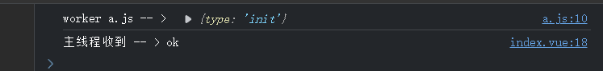
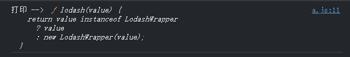
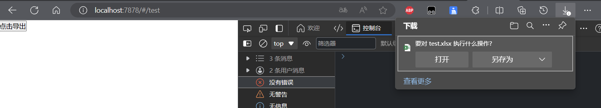
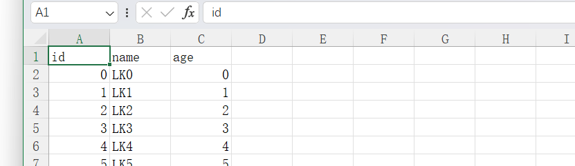

# Web Worker 的使用

Web Worker API 允许在浏览器环境中创建后台线程，从而实现多线程处理能力，避免长时间运行或计算密集型任务阻塞用户界面线程。

## 简单使用

主线程开启

```javascript
const worker = new Worker('./a.js');
    worker.postMessage({
        type: 'init',
    });
    worker.addEventListener('message', (e) => {
        console.log("主线程收到 -- >",e.data);
    });
```

a.js

```javascript
self.addEventListener('message', e => {
    console.log('worker a.js -- > ',e.data);
    self.postMessage('ok');
})
```

运行结果：



## 注意事项

1. worker 文件需要遵循同源策略；
2. webworker 不能试用版 window 上的 dom 操作，也不能获取 dom 对象；
3. 函数，dom 节点，对象的特殊设置（freeze，getter， setter 等）无法通过主线程进行传递；

## 模块的引入

如果 worker 文件需要导入 ESModule 的模块，需要在创建时声明；

主线程

```javascript
const worker = new Worker('./a.js', {
        type: 'module',
    });
    worker.postMessage({
        type: 'init',
    });
    worker.addEventListener('message', (e) => {
        console.log("主线程收到 -- >",e.data);
    });
```

a.js

```javascript
import { b } from './b.js';

console.log("打印 --> ", b);

self.addEventListener('message', e => {
    console.log('worker a.js -- > ',e.data);
    self.postMessage('ok');
})
```

b.js

```javascript
export const b = 'hello';
```

可以通过 `importScripts` 进行第三方库的加载

```javascript
importScripts('https://cdn.bootcdn.net/ajax/libs/lodash.js/4.17.21/lodash.core.js')
console.log("打印 --> ", _);
```



## 案例 - 大文件导出

前端工程安装 `xlsx` 库

主线程

```javascript
<template>
    <button @click="exportFile()">点击导出</button>
</template>
<script setup>
import { writeFile } from 'xlsx';
const worker = new Worker('./file.js');
worker.addEventListener('message', (e) => {
    writeFile(e.data, 'test.xlsx');
})
function exportFile() {
    worker.postMessage({
        type: 'init',
    });
}
</script>
```

file.js

```javascript
importScripts('./xlsx.js');
let arr = [];
for (let i = 0; i < 100000; i++) {
    arr.push({
        id: i,
        name: 'LK' + i,
        age: i
    })
}
self.addEventListener('message', function (e) {
    const sheet = XLSX.utils.json_to_sheet(arr);
    const workbook = XLSX.utils.book_new();
    XLSX.utils.book_append_sheet(workbook, sheet, 'Sheet1');
    self.postMessage(workbook);
})
```

点击按钮后成功导出




