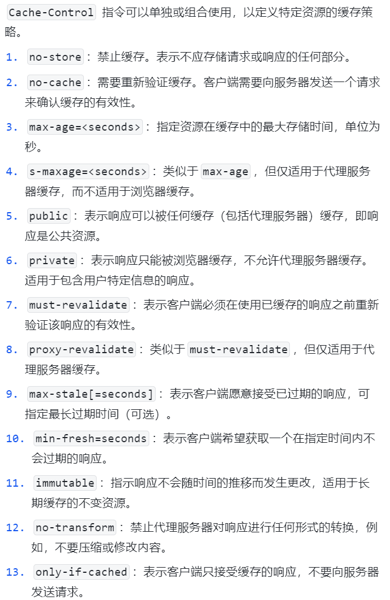
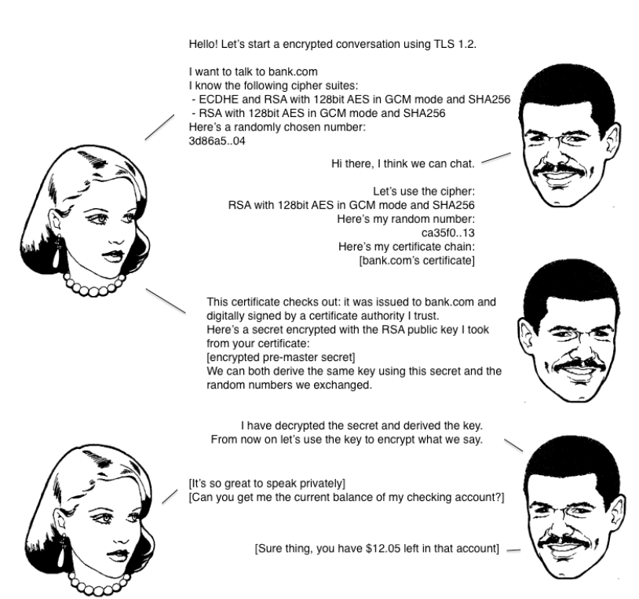
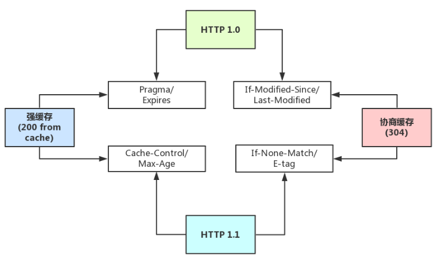
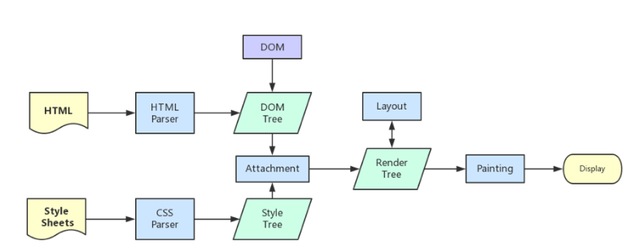
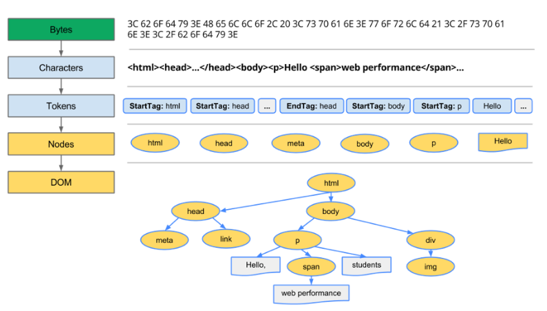
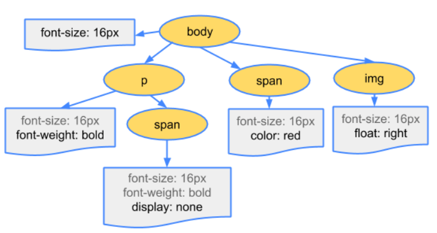
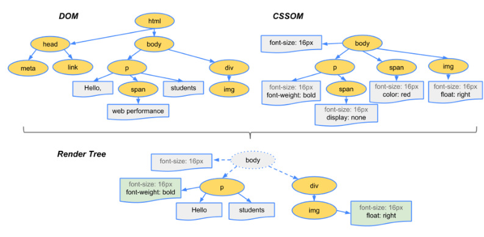
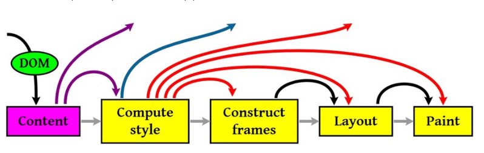

# 大致流程

## **浏览器的进程与线程**

首先需要明确的是，浏览器是多进程的，每开一个标签页，就会新开一个进程。

### 浏览器进程分类

1. 浏览器主进程：只有一个，负责控制浏览器的界面，包括地址栏、书签、前进后退按钮等。它还协调其他进程的工作，并提供存储功能；
2. 第三方插件进程，每个插件一个进程，仅当使用该插件时才创建；
3. GPU 进程：负责整个浏览器界面的渲染，包括图形处理单元（GPU）的使用，最多一个；
4. 浏览器渲染进程（内核）：默认每个 Tab 页面一个进程，互不影响，控制页面渲染，脚本执行，事件处理等（有时候会优化，如多个空白 tab 会合并成一个进程）
5. 网络进程：负责发起和接收网络请求，处理与服务器的通信；

### 浏览器渲染进程的多线程分类

1. GUI 渲染线程：负责渲染浏览器界面，解析 HTML、CSS，构建 DOM 树和 RenderObject 树，布局和绘制等。当界面需要重绘（Repaint）或由于某种操作引发回流（reflow）时，该线程负责处理。
2. JS 引擎线程：负责执行 JavaScript 代码，处理事件循环、函数调用和异步操作。与 GUI 渲染线程互斥，因为 JS 执行可能会阻塞页面加载。
3. 事件线程：负责处理用户输入、定时器、异步请求等事件。通过事件循环机制来处理这些事件。
4. 定时器线程：负责处理定时器相关的任务，例如 `setTimeout` 和 `setInterval`。在指定的时间间隔后触发相应的回调函数。
5. 异步 HTTP 请求线程：负责处理异步的网络请求，例如 AJAX 请求。当请求完成时，会通知事件线程。

## URL 解析

在浏览器获得 URL 后，会对 URL 进行解析，如果是不合法 URL，会将此 URL 作为关键字进程搜索；如果 URL 解析到 HTTP 协议，就会新开辟单独的网络线程去处理资源下载。

## 开启网络线程

### DNS 查询

如果输入的是域名，会进行 DNS 解析，获取该域名下的服务器 IP，DNS 解析大致流程如下：

1. 优先使用浏览器缓存，再到本机 host 缓存；
2. 本地没有，则向 DNS 域名服务器请求查询对应 IP（递归查询）；

### TCP/IP 请求

#### **三次握手**，建立连接（全双工通信）

1. 第一步（SYN）：客户端发送一个带有 SYN（同步）标志的数据包给服务器，表明客户端请求建立连接。该数据包中包含一个随机生成的初始序列号（ISN）。
2. 第二步（SYN-ACK）：服务器收到客户端的请求后，如果同意建立连接，则会发送一个带有 SYN 和 ACK（确认）标志的数据包给客户端。该数据包中包含服务器的初始序列号（ISN）以及确认号（ACK）为客户端的 ISN+1。
3. 第三步（ACK）：客户端收到服务器的确认后，会发送一个带有 ACK 标志的数据包给服务器，确认服务器的 ISN+1。此时，连接已经建立，客户端和服务器可以开始进行数据传输

#### **四次挥手**

1. 第一步（FIN）：当客户端想要关闭连接时，发送一个带有 FIN（结束）标志的数据包给服务器，表明客户端不再发送数据。
2. 第二步（ACK）：服务器收到客户端的结束请求后，发送一个带有 ACK 标志的数据包给客户端，确认收到了客户端的 FIN。
3. 第三步（FIN）：服务器决定关闭连接时，会发送一个带有 FIN 标志的数据包给客户端，表示服务器不再发送数据。
4. 第四步（ACK）：客户端收到服务器的结束请求后，发送一个带有 ACK 标志的数据包给服务器，确认收到了服务器的 FIN。此时，连接关闭。

**补充**：浏览器对同一域名下并发的 TCP 连接有一定的限制。

1. 并发连接数限制：浏览器通常对同一域名下的并发连接数进行限制。这意味着浏览器在与同一域名建立的 TCP 连接数量上有一个上限。一般情况下，浏览器会限制每个域名的并发连接数在 4 到 8 个之间，但具体的数字可能会因浏览器的不同而有所变化。
2. 域名分片：为了绕过并发连接数的限制，一些网站会将内容分布在多个子域名上，从而允许浏览器同时建立更多的连接。这被称为域名分片或域名切片。
3. 持久连接：浏览器还支持持久连接（Keep-Alive），这使得在单个 TCP 连接上可以发送多个 HTTP 请求和响应，而不必为每个请求都建立一个新的连接。这有助于减少连接的建立和关闭开销，并提高性能。

#### **五层因特网协议栈**

从客户端发出 http 请求到服务器接收，中间会经过一系列的流程。从应用层的发送 http 请求，到传输层通过三次握手建立 tcp/ip 连接，再到网络层的 ip 寻址，再到数据链路层的封装成帧，最后到物理层的利用物理介质传输。

```
1.应用层(dns,http) DNS解析成IP并发送http请求
2.传输层(tcp,udp) 建立tcp连接（三次握手）
3.网络层(IP,ARP) IP寻址
4.数据链路层(PPP) 封装成帧
5.物理层(利用物理介质传输比特流) 物理传输（然后传输的时候通过双绞线，电磁波等各种介质）
```

补充： OSI 七层框架

OSI 七层框架：`物理层`、`数据链路层`、`网络层`、`传输层`、`会话层`、`表示层`、`应用层`

```
会话层：它具体管理不同用户和进程之间的对话，如控制登陆和注销过程
表示层：主要处理两个通信系统中交换信息的表示方式，包括数据格式交换，数据加密与解密，数据压缩与终端类型转换等
```

#### **HTTP 报文结构**

报文一般包括了：`通用头部`，`请求/响应头部`，`请求/响应体`

##### 通用头部：

```
Request Url: 请求的web服务器地址
Request Method: 请求方式（Get、POST、OPTIONS、PUT、HEAD、DELETE、CONNECT、TRACE）
Status Code: 请求的返回状态码，如200代表成功
Remote Address: 请求的远程服务器地址（会转为IP）
```

常用状态码：

```
1xx——指示信息，表示请求已接收，继续处理
2xx——成功，表示请求已被成功接收、理解、接受
3xx——重定向，要完成请求必须进行更进一步的操作
4xx——客户端错误，请求有语法错误或请求无法实现
5xx——服务器端错误，服务器未能实现合法的请求

200——表明该请求被成功地完成，所请求的资源发送回客户端
301——表示资源已经永久移动到新的URL，客户端应该使用新的URL来访问资源
304——自从上次请求后，请求的网页未修改过，请客户端使用本地缓存
400——客户端请求有错（譬如可以是安全模块拦截）
401——请求未经授权
403——禁止访问（譬如可以是未登录时禁止）
404——资源未找到
500——服务器内部错误
503——服务不可用
```

##### 请求/响应头部

常用的请求头部（部分）：

```
Accept: 接收类型，表示浏览器支持的MIME类型（对标服务端返回的Content-Type）
Accept-Encoding：浏览器支持的压缩类型,如gzip等,超出类型不能接收
Content-Type：客户端发送出去实体内容的类型
Cache-Control: 指定请求和响应遵循的缓存机制，如no-cache
If-Modified-Since：对应服务端的Last-Modified，用来匹配看文件是否变动，只能精确到1s之内，http1.0中
Expires：缓存控制，在这个时间内不会请求，直接使用缓存，http1.0，而且是服务端时间
Max-age：代表资源在本地缓存多少秒，有效时间内不会请求，而是使用缓存，http1.1中
If-None-Match：对应服务端的ETag，用来匹配文件内容是否改变（非常精确），http1.1中
Cookie: 有cookie并且同域访问时会自动带上
Connection: 当浏览器与服务器通信时对于长连接如何进行处理,如keep-alive
Host：请求的服务器URL
Origin：最初的请求是从哪里发起的（只会精确到端口）,Origin比Referer更尊重隐私
Referer：该页面的来源URL(适用于所有类型的请求，会精确到详细页面地址，csrf拦截常用到这个字段)
User-Agent：用户客户端的一些必要信息，如UA头部等
```

常用的响应头部（部分）：

```
Access-Control-Allow-Headers: 服务器端允许的请求Headers
Access-Control-Allow-Methods: 服务器端允许的请求方法
Access-Control-Allow-Origin: 服务器端允许的请求Origin头部（譬如为*）
Content-Type：服务端返回的实体内容的类型
Date：数据从服务器发送的时间
Cache-Control：告诉浏览器或其他客户，什么环境可以安全的缓存文档
Last-Modified：请求资源的最后修改时间
Expires：应该在什么时候认为文档已经过期,从而不再缓存它
Max-age：客户端的本地资源应该缓存多少秒，开启了Cache-Control后有效
ETag：请求变量的实体标签的当前值
Set-Cookie：设置和页面关联的cookie，服务器通过这个头部把cookie传给客户端
Keep-Alive：如果客户端有keep-alive，服务端也会有响应（如timeout=38）
Server：服务器的一些相关信息
```



##### 请求/响应实体

CRLF（Carriage-Return Line-Feed），意思是回车换行，一般作为分隔符存在。

请求头和实体消息之间有一个 CRLF 分隔，响应头部和响应实体之间用一个 CRLF 分隔。

#### HTTP 各版本特效

1. HTTP/1.0:

   - 首个公开发布的 HTTP 版本，于 1996 年发布。
   - 每个请求/响应周期都需要建立一个新的 TCP 连接。
   - 不支持持久连接，每个请求都需要单独的连接。
   - 请求和响应中的头信息较少。
   - 不支持管道化（pipelining），即客户端不能在同一连接上同时发送多个请求。
2. HTTP/1.1:

   - 于 1999 年发布，广泛使用至今。
   - 引入了持久连接（Keep-Alive），允许在单个 TCP 连接上发送多个请求和响应。
   - 支持管道化（pipelining），即客户端可以在同一连接上同时发送多个请求。
   - 引入了更多的请求和响应头字段，如 Host、Cache-Control、Content-Type 等。
   - 支持分块传输编码（Chunked Transfer Encoding），可以将响应分成多个块进行传输。
3. HTTP/2:

   - 于 2015 年发布，是 HTTP/1.1 的重大升级版本。
   - 引入了二进制分帧层，将 HTTP 消息分割为更小的帧进行传输，提高效率。
   - 支持多路复用（Multiplexing），允许在同一连接上同时传输多个请求和响应，避免了 HTTP/1.1 中的队头阻塞问题。
   - 引入了头部压缩（Header Compression），减少了传输过程中的头部开销。
   - 支持服务器推送（Server Push），服务器可以预测客户端需要的资源并主动推送给客户端，提高性能。
4. HTTP/3:

   - 基于 QUIC 协议，于 2020 年发布。
   - 使用 UDP 协议代替 TCP 协议，提供更快的连接建立和传输速度。
   - 支持多路复用和头部压缩，类似于 HTTP/2。
   - 引入了可靠的数据传输，通过 QUIC 协议提供了可靠性和拥塞控制。
   - 支持 0-RTT 连接，减少了握手的延迟。

#### HTTPS

https 与 http 的区别就是： **在请求前，会建立 ssl 链接，确保接下来的通信都是加密的，无法被轻易截取分析。**

SSL/TLS 的握手流程：

```
1. 浏览器请求建立SSL链接，并向服务端发送一个随机数–Client random和客户端支持的加密方法，比如RSA加密，此时是明文传输。 

2. 服务端从中选出一组加密算法与Hash算法，回复一个随机数–Server random，并将自己的身份信息以证书的形式发回给浏览器（证书里包含了网站地址，非对称加密的公钥，以及证书颁发机构等信息）

3. 浏览器收到服务端的证书后
- 验证证书的合法性（颁发机构是否合法，证书中包含的网址是否和正在访问的一样），如果证书信任，则浏览器会显示一个小锁头，否则会有提示
- 用户接收证书后（不管信不信任），浏览会生产新的随机数–Premaster secret，然后证书中的公钥以及指定的加密方法加密`Premaster secret`，发送给服务器。
- 利用Client random、Server random和Premaster secret通过一定的算法生成HTTP链接数据传输的对称加密key-`session key`
- 使用约定好的HASH算法计算握手消息，并使用生成的`session key`对消息进行加密，最后将之前生成的所有信息发送给服务端。 
    
4. 服务端收到浏览器的回复- 利用已知的加解密方式与自己的私钥进行解密，获取`Premaster secret`- 和浏览器相同规则生成`session key`- 使用`session key`解密浏览器发来的握手消息，并验证Hash是否与浏览器发来的一致- 使用`session key`加密一段握手消息，发送给浏览器

5. 浏览器解密并计算握手消息的HASH，如果与服务端发来的HASH一致，此时握手过程结束，
```



#### HTTP 缓存

##### 强缓存

- 强缓存（`200 from cache`）时，浏览器如果判断本地缓存未过期，就直接使用，无需发起 http 请求。

属于强缓存控制的：

```
（http1.1）Cache-Control/Max-Age
（http1.0）Pragma/Expires
```

注意：`Max-Age` **不是一个头部，它是** `Cache-Control` **头部的值**

##### 协商缓存（弱缓存）

- 协商缓存（`304`）时，浏览器会向服务端发起 http 请求，然后服务端告诉浏览器文件未改变，让浏览器使用本地缓存。

属于协商缓存控制的：

```
（http1.1）If-None-Match/E-tag
（http1.0）If-Modified-Since/Last-Modified
```

**http1.0 中的缓存控制：**

- `Pragma`：严格来说，它不属于专门的缓存控制头部，但是它设置 `no-cache` 时可以让本地强缓存失效（属于编译控制，来实现特定的指令，主要是因为兼容 http1.0，所以以前又被大量应用）
- `Expires`：服务端配置的，属于强缓存，用来控制在规定的时间之前，浏览器不会发出请求，而是直接使用本地缓存，注意，Expires 一般对应服务器端时间，如 `Expires：Fri, 30 Oct 1998 14:19:41`
- `If-Modified-Since/Last-Modified`：这两个是成对出现的，属于协商缓存的内容，其中浏览器的头部是 `If-Modified-Since`，而服务端的是 `Last-Modified`，它的作用是，在发起请求时，如果 `If-Modified-Since` 和 `Last-Modified` 匹配，那么代表服务器资源并未改变，因此服务端不会返回资源实体，而是只返回头部，通知浏览器可以使用本地缓存。`Last-Modified`，顾名思义，指的是文件最后的修改时间，而且只能精确到 `1s` 以内。

**http1.1 中的缓存控制：**

- `Cache-Control`：缓存控制头部，有 no-cache、max-age 等多种取值
- `Max-Age`：服务端配置的，用来控制强缓存，在规定的时间之内，浏览器无需发出请求，直接使用本地缓存，注意，Max-Age 是 Cache-Control 头部的值，不是独立的头部，譬如 `Cache-Control: max-age=3600`，而且它值得是绝对时间，由浏览器自己计算
- `If-None-Match/E-tag`：这两个是成对出现的，属于协商缓存的内容，其中浏览器的头部是 `If-None-Match`，而服务端的是 `E-tag`，同样，发出请求后，如果 `If-None-Match` 和 `E-tag` 匹配，则代表内容未变，通知浏览器使用本地缓存，和 Last-Modified 不同，E-tag 更精确，它是类似于指纹一样的东西，基于 `FileEtag INode Mtime Size` 生成，也就是说，只要文件变，指纹就会变，而且没有 1s 精确度的限制。



## 服务端处理请求

### 负载均衡

用户发起的请求都指向调度服务器（反向代理服务器，譬如安装了 nginx 控制负载均衡），然后调度服务器根据实际的调度算法，分配不同的请求给对应集群中的服务器执行，然后调度器等待实际服务器的 HTTP 响应，并将它反馈给用户。

### 后台处理

1. 请求到服务容器中，对应容器中的后台程序接受到请求；
2. 统一安全验证，安全拦截，跨域验证等；
3. 验证通过后，执行查询，计算等；
4. 程序执行完毕，返回 HTTP 响应包；

## 解析页面

浏览器内核拿到内容后，渲染步骤大致可以分为以下几步：

```
1. 解析HTML，构建DOM树
2. 解析CSS，生成CSS规则树
3. 合并DOM树和CSS规则，生成render树
4. 布局render树（Layout/reflow），负责各元素尺寸、位置的计算
5. 绘制render树（paint），绘制页面像素信息
6. 浏览器会将各层的信息发送给GPU，GPU会将各层合成（composite），显示在屏幕上
```



### 解析 HTML，构建 DOM

解析 HTML 到构建出 DOM 当然过程可以简述如下：

```
Bytes → characters → tokens → nodes → DOM
```

浏览器的处理流程大致如下：



其中的一些重点过程：

```
1. Conversion转换：浏览器将获得的HTML内容（Bytes）基于他的编码转换为单个字符
2. Tokenizing分词：浏览器按照HTML规范标准将这些字符转换为不同的标记token（词法分析）。每个token都有自己独特的含义以及规则集
3. Lexing词法分析：分词的结果是得到一堆的token，此时把他们转换为对象，这些对象分别定义他们的属性和规则
4. DOM构建：因为HTML标记定义的就是不同标签之间的关系，这个关系就像是一个树形结构一样例如：body对象的父节点就是HTML对象，然后段略p对象的父节点就是body对象
```

### 生成 CSS 规则

CSS 规则树的生成也是类似，简述为：

```
Bytes → characters → tokens → nodes → CSSOM
```

生成的 CSSOM 树类似：



### 构建渲染树

一般来说，渲染树和 DOM 树相对应的，但不是严格意义上的一一对应

因为有一些不可见的 DOM 元素不会插入到渲染树中，如 head 这种不可见的标签或者 `display: none` 等。

整体来说可以看图：



### 渲染

基本流程如下：



重要的四个步骤：

```
1. 计算CSS样式
2. 构建渲染树
3. 布局，主要定位坐标和大小，是否换行，各种position overflow z-index属性
4. 绘制，将图像绘制出来
```

图中的线与箭头代表通过 js 动态修改了 DOM 或 CSS，导致了重新布局（Layout）或渲染（Repaint）；

- Layout，也称为 Reflow，即回流。一般意味着元素的内容、结构、位置或尺寸发生了变化，需要重新计算样式和渲染树
- Repaint，即重绘。意味着元素发生的改变只是影响了元素的一些外观之类的时候（例如，背景色，边框颜色，文字颜色等），此时只需要应用新样式绘制这个元素就可以了

回流的成本开销要高于重绘，而且一个节点的回流往往会导致子节点以及同级节点的回流， 所以优化方案中一般都包括，尽量避免回流。

#### 简单图层和复合图层

浏览器渲染的图层一般包含两大类：`普通图层` 以及 `复合图层`。**GPU 中，各个复合图层是单独绘制的，所以互不影响。**

普通文档流内可以理解为一个复合图层（这里称为 `默认复合层`，里面不管添加多少元素，其实都是在同一个复合图层中）；

其次，absolute 布局（fixed 也一样），虽然可以脱离普通文档流，但它仍然属于 `默认复合层`。

可以通过 `硬件加速` 的方式，声明一个 `新的复合图层`，它会单独分配资源（当然也会脱离普通文档流，这样一来，不管这个复合图层中怎么变化，也不会影响 `默认复合层` 里的回流重绘）。

**如何变成复合图层（硬件加速）**

- 最常用的方式：`translate3d`、`translateZ`
- `opacity` 属性/过渡动画（需要动画执行的过程中才会创建合成层，动画没有开始或结束后元素还会回到之前的状态）
- `will-chang` 属性（这个比较偏僻），一般配合 opacity 与 translate 使用（而且经测试，除了上述可以引发硬件加速的属性外，其它属性并不会变成复合层），

作用是提前告诉浏览器要变化，这样浏览器会开始做一些优化工作（这个最好用完后就释放）

- `<video><iframe><canvas><webgl>` 等元素
- 其它，譬如以前的 flash 插件

**absolute 和硬件加速的区别**

absolute 虽然可以脱离普通文档流，但是无法脱离默认复合层。所以，就算 absolute 中信息改变时不会改变普通文档流中 render 树，

但是，浏览器最终绘制时，是整个复合层绘制的，所以 absolute 中信息的改变，仍然会影响整个复合层的绘制。（浏览器会重绘它，如果复合层中内容多，absolute 带来的绘制信息变化过大，资源消耗是非常严重的），而硬件加速直接就是在另一个复合层了（另起炉灶），所以它的信息改变不会影响默认复合层（当然了，内部肯定会影响属于自己的复合层），仅仅是引发最后的合成（输出视图）。

**硬件加速时请使用 index**

可以认为是一个隐式合成的概念：**如果 a 是一个复合图层，而且 b 在 a 上面，那么 b 也会被隐式转为一个复合图层。**
