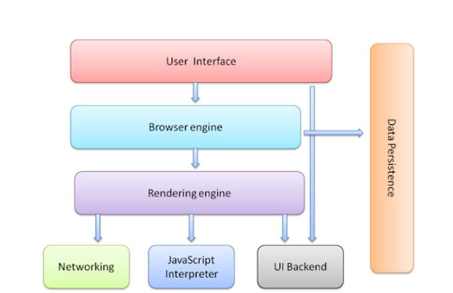
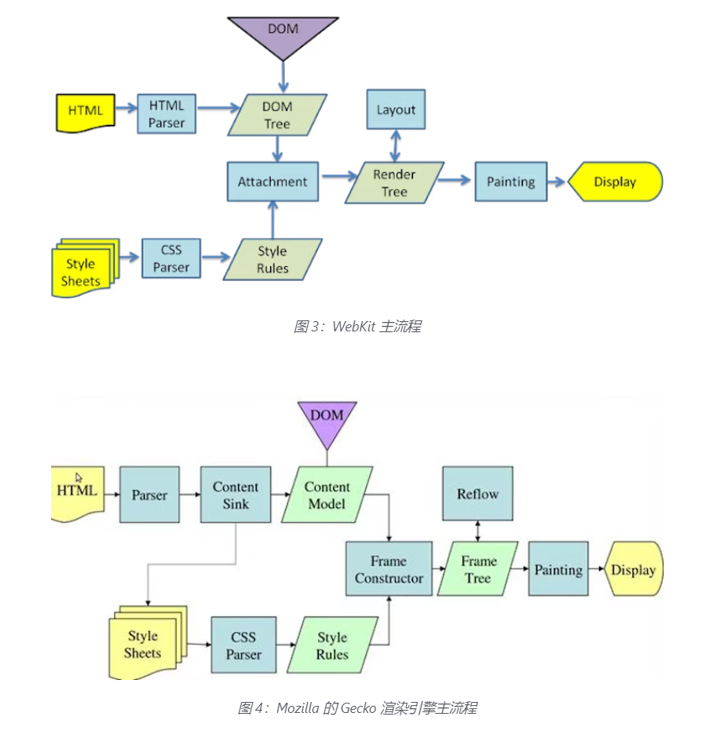
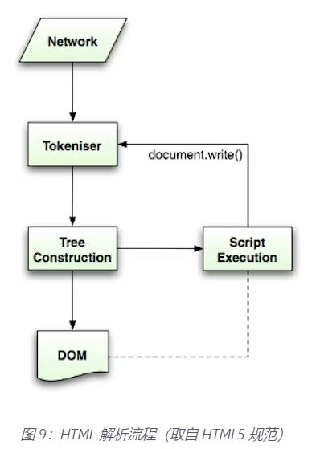
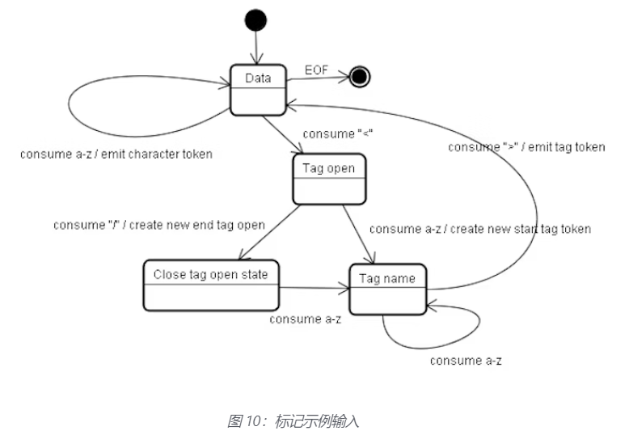
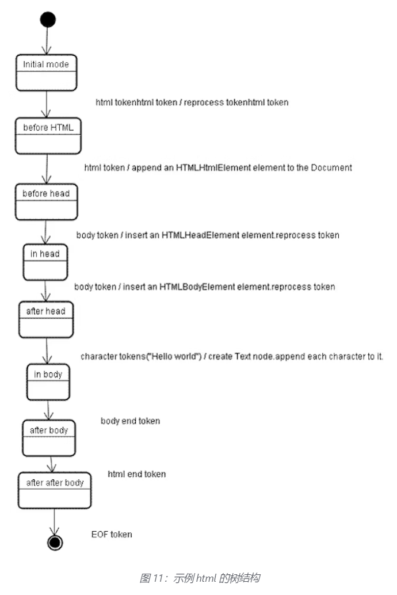
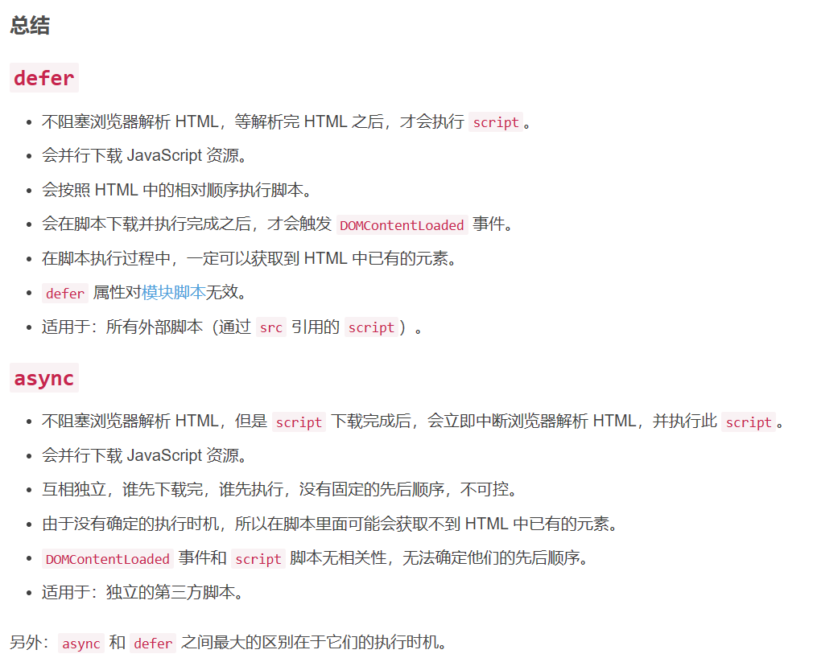
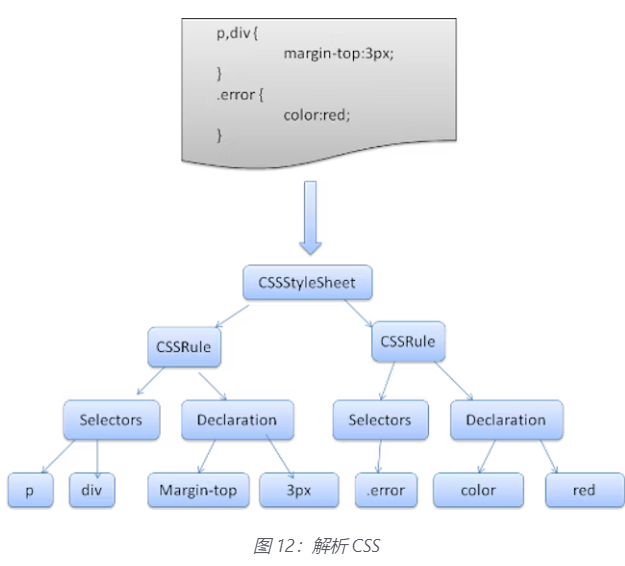
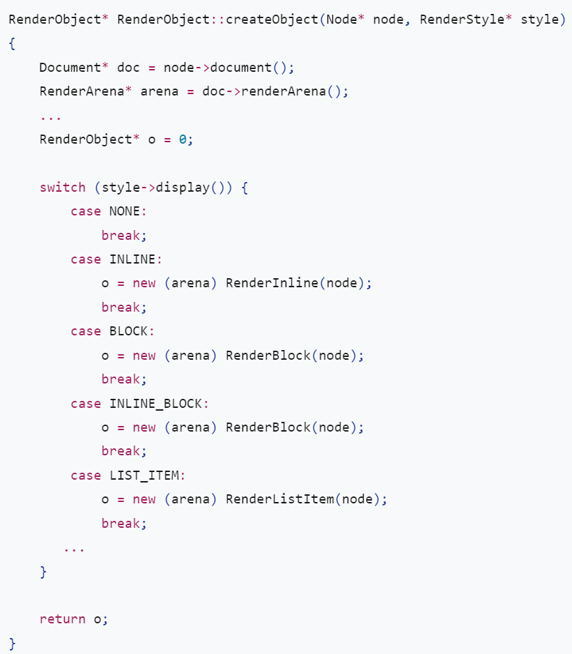
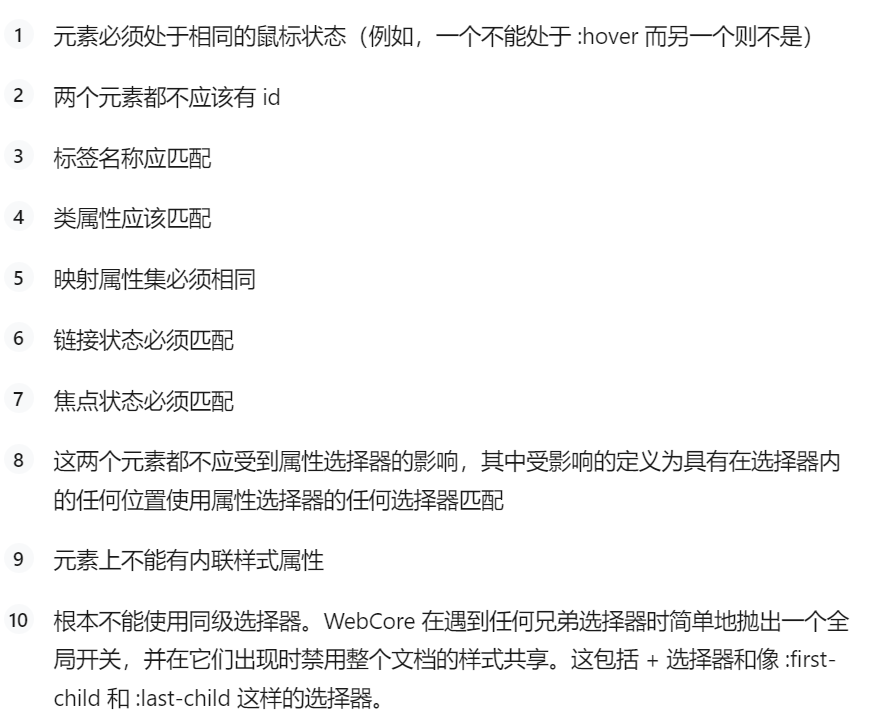

# 补充

# 1.浏览器的结构

1. User Interface（用户界面）；
2. Browser engine（浏览器引擎）；
3. Rendering engine（渲染引擎）；
4. Networking（网络模块）；
5. JavaScript Interpreter（JavaScript 解释器）；
6. UI Backend（UI 后端）：用于绘制组合框和窗口等基本小部件；
7. Data Persistence（数据持久层）：localStorage，sessionStorage，IndexDB 等；



Tip：每一个 Tab 页为一个单独的进程；

# 2.渲染引擎

渲染引擎的基本流程(从下载到 HTML 文档开始)：

1. 解析 HTML 文档成 DOM 树；
2. 合成渲染树；
3. 布局渲染树：在屏幕上确定每个 DOM 节点的坐标；
4. 绘制渲染树；



Tip：渲染是一个渐进的过程，渲染引擎会尽快进行 DOM 的渲染，他不会等到所有 HTML 都被解析后才开始构建布局渲染树，部分内容将被解析和显示，同时继续处理来自网络的其他内容；

# 3.HTML 解析器

值得注意的的是，由于 HTML 格式的“宽容”，HTML 允许开发者省略某些标记（浏览器将隐式添加），有时省略开始或结束标记等，所以 HTML 格式不是一种上下文无关语法，传统的 XML 解析器无法解析 HTML；无法使用常用的解析技术，浏览器创建自定义解析器来解析 HTML，分为标记化（tokenization）和树构建（tree construction）;

## 标记化

标记化过程是词法分析，将输入解析为标记，HTML 标记（token）包括开始标记，结束标记，属性名称，属性值；tokenizer 识别 token，将其交给树构造函数，并使用下一个字符来识别下一个 token，以此类推，知道输入结束；



## 标记化算法

该算法输出一个 HTML 标记，该算法是一个有限状态机（state machine），每个状态消耗输入流的一个或多个字符，并根据这些字符更新下一个状态，该决定受当前标记化状态和树构造状态的影响；基本示例：

```html
<html>
  <body>
    Hello world
  </body>
</html>
```

上述 HTML 文档的大致标记化流程：

初始状态是“数据状态”。遇到字符时 `<` ，状态变为“标签打开状态”。消耗一个 'a-z' 字符会导致创建“开始标记令牌”，状态更改为“标记名称状态”。我们一直保持这种状态，直到 `>` 字符被消耗掉。每个字符都附加到新令牌名称。在我们的例子中，创建的令牌是一个 html 令牌。

到达标签时 `>` ，会发出当前令牌，并且状态会变回“数据状态”。标签`<body>`将通过相同的步骤处理。到目前为止，已经发出了 html 和 body 标签。我们现在回到“数据状态”。消耗 H 字符 Hello world 将导致创建和发出字符标记，这一直持续到达到 '<' 字符为止。`</body>` 我们将为 的每个字符发出一个字符标记 'Hello world' 。

我们现在回到“标签打开状态”。使用下一个输入 '/' 将导致创建一个 'end tag token' 并移动到“标签名称状态”。我们再次保持这种状态，直到我们到达 '>' 。然后新的标记令牌将被发出，我们回到“数据状态”。输入`</html>`将像以前的情况一样处理。



## 树构建算法

树构建算法与标记化算法是同时进行的，当接收到一个 token 时，树构建算法将创建该 token 对应的 DOM 元素；依旧是下述示例代码：

```html
<html>
  <body>
    Hello world
  </body>
</html>
```

树构建阶段的输入是来自标记化阶段的一系列标记。第一种模式是“初始模式”。接收“html”令牌将导致移动到“before html”模式并在该模式下重新处理令牌。这将导致创建 HTMLHtmlElement 元素，该元素将附加到根 Document 对象。

状态将更改为"before head"。然后收到“body”令牌。尽管我们没有“head”标记，但会隐式创建一个 HTMLHeadElement 并将其添加到树中。

我们现在转到“in head”模式，然后转到“after head”。重新处理 body 标记，创建并插入 HTMLBodyElement 并将模式转移到“in body”。

现在收到“Hello world”字符串的字符标记。第一个将导致创建和插入“文本”节点，其他字符将附加到该节点。

接收主体结束令牌将导致转移到“after body”模式。我们现在将收到 html 结束标记，这将使我们进入“after after body”模式。收到文件结束标记将结束解析。



## HTML 解析后的工作

在 HTML 解析完成后，会继续处理那些被设置为 defer 的 script 脚本，在脚本执行完毕以后，将出发 DOMContentLoaded 事件；在这里补充一下 script 脚本上设置 defer 和 async 的区别，参考文章：



# 4.CSS 解析

与 HTML 文档不同的是，CSS 是上下文无关语法，可以使用传统的解析器进行解析；每个 CSS 文件都会被解析成一个 StyleSheet 对象，每个对象包含 CSS 规则，CSS 规则对象包含选择器和声明对象以及与 CSS 语法对应的其他对象；



值得注意的是，StyleSheet 不会更改 DOM 树，所以在实际中，CSSOM 树和 DOM 树是同步解析的；

# 5.渲染树构建

在构建 DOM 树的同时，浏览器会开始构建渲染树，这棵树按元素的显示顺序排列，是文档的可视化表示，webkit 将渲染树的元素成为渲染器（renderer）或渲染对象（render object），渲染器知道如何布局和绘制自身及其子项；

每个渲染器代表一个矩形区域（盒模型），它包括宽度，高度，位置等几何信息；

框类型受节点相关的样式属性的“display”值影响，下面是 webkit 代码中，根据 display 属性决定为 DOM 节点创建什么类型的渲染器：



## 1.渲染树与 DOM 树的关系

渲染器对应 DOM 元素，并不是一对一的关系，非可视化的 DOM 元素不会被插入到渲染树中，（例如 DOM 树种的 head 元素并不会出现在渲染树中，其次 display 值被设置为 none 的 DOM 元素也不会出现在渲染树中，但是 display 值设置为 hidden 的 DOM 元素会出现在渲染树中）

（题外话：在 Vue 中，v-if 指向的元素在条件为 false 时，不会生成实际的 DOM 元素放入 DOM 树中，更不会出现在渲染树中，但是 v-show 指向的元素在条件为 false 是，仍然会生成实际的 DOM 元素放入 DOM 树中，当 v-show 条件为 false 是，对应的元素的 display 值为 none，故此元素也不会出现在渲染树中）

一些复杂的 DOM 元素无法使用单个矩形来描述，例如 select 元素具有三个渲染器，一个用于显示区域，一个用于下拉列表框，一个用于按钮；此外，当文本因一行宽度不够而被分成多行时，新行将作为额外的渲染器添加；

一些渲染对象对应于一个 DOM 节点，但不在树中的同一位置。浮动元素和绝对定位元素脱离流，被放置在树的不同部分，并映射到真实的框架。占位符框架是他们应该在的地方。

在 WebKit 中，解析样式和创建渲染器的过程称为“attachment”。每个 DOM 节点都有一个“attach”方法。attachment 是同步的，节点插入 DOM 树调用新节点的“attach”方法。

## 2.样式计算

构建渲染树需要计算每一个渲染对象的视觉属性，这是通过计算每个元素的样式属性来完成的；

webkit 使用引用样式对象（RenderStyle），这些对象可以被渲染对象共享，这些渲染对象必须是兄弟姐妹或堂兄弟姐妹，此外还需满足下面的条件：



在 FireFox 上额外的树来简化样式计算：规则树和样式上下文树；

# 6.布局（Layout）

创建渲染器并添加到渲染树中时，此时渲染器还没有位置和大小，计算渲染器的位置和大小等称为布局（layout）或回流（reflow）；

HTML 使用基于流的布局模型，这意味着大多数时候可以一次计算几何图形。“流中”较晚的元素通常不会影响“流中”较早的元素的几何形状，因此布局可以从左到右、从上到下遍历文档。

坐标系是相对于根框架的。使用顶部和左侧坐标。

布局是一个递归过程。它从根渲染器开始，对应于`<html>`文档的元素。布局通过部分或全部帧层次结构递归地继续，为需要它的每个渲染器计算几何信息。

根渲染器的位置是 0,0，它的尺寸是视口——浏览器窗口的可见部分。

所有渲染器都有一个“布局”或“回流”方法，每个渲染器调用其需要布局的子级的布局方法。

## 1.脏位系统（Dirty bit system）

为了不为每一个小的变化做一个完整的布局，浏览器使用了一个“脏位”系统。更改或添加的渲染器将其自身及其子项标记为“脏”：需要布局。

有两个标志：“dirty”和“children are dirty”，这意味着尽管渲染器本身可能没问题，但它至少有一个子项需要布局。

## 2.全局布局（Global layout）

可以在整个渲染树上触发全局布局（回流），这可能是由于：

1.影响所有渲染器的全局样式更改，如字体大小更改；

2.调整屏幕大小；

## 3.增量布局（incremental layout）

布局可以是增量的，只有脏渲染器会被布局。当渲染器变脏时，会异步的触发增量布局；

增量布局是异步完成的，全局布局是同步完成的。

# 7.绘画（Paint）

在绘画阶段，遍历渲染树，调用渲染器的“paint()”方法在屏幕上显示内容。绘画使用 UI 基础结构组件。

和布局一样，绘画也可以是全局的——整棵树都被绘画——或者是增量的。在增量绘画中，一些渲染器的变化不会影响整个树。更改后的渲染器使其在屏幕上的矩形无效。这会导致操作系统将其视为“脏区”并生成“绘制”事件。操作系统巧妙地做到了这一点，并将多个区域合并为一个区域。在 Chrome 中，它更复杂，因为渲染器与主进程处于不同的进程中。Chrome 在某种程度上模拟了操作系统的行为。表示监听这些事件并将消息委托给渲染根。遍历树直到到达相关的渲染器。

## 1.动态变化

浏览器会尝试执行最少的可能操作来响应更改。所以改变元素的颜色只会导致元素的重绘。元素位置的更改将导致元素及其子元素和可能的兄弟元素的布局和重绘。添加 DOM 节点将导致节点的布局和重绘。重大更改，如增加“html”元素的字体大小，将导致缓存失效、重新布局和重新绘制整个树。
