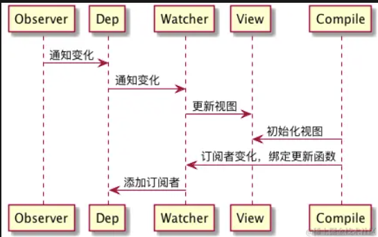
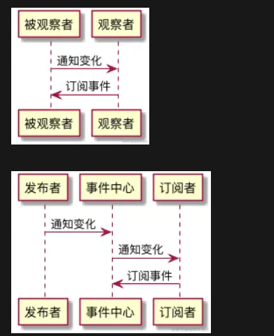
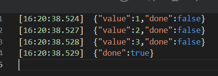

# 归纳

## 什么是 MVC

MVC（Model-View-Controller）是一种经典的软件架构模式，它起源于上世纪七八十年代的 Smalltalk 编程环境，后来被广泛应用到各种应用程序和 Web 开发框架中。MVC 的核心思想是将应用程序分为三个相互协作的组件：

### **模型 (Model)**

模型代表应用程序的核心业务逻辑和数据。它封装了数据的存储、检索以及相应的业务规则。 在 Web 开发中，模型通常负责与数据库或其他数据源交互，处理数据的创建、读取、更新和删除（CRUD）操作。 当模型数据发生变化时，模型可以主动通知相关组件。

### **视图 (View)**

视图是用户界面的呈现部分，它直接与用户交互并显示模型中的数据。 视图通常是动态生成的，根据模型提供的数据来渲染页面或输出内容。 视图只关注如何展示数据，而不关心数据是如何获取和处理的。

### **控制器 (Controller)**

控制器负责接收用户的输入请求（比如点击按钮、提交表单等），并对这些请求作出响应。 控制器解析请求参数，调用模型来处理业务逻辑，以及决定应该更新哪个视图以反映模型的变化。 控制器起到中介作用，它协调模型和视图之间的交互，确保视图展示的数据始终是最新的，同时也保证了模型的业务逻辑不会与具体的 UI 实现纠缠在一起。

通过 MVC 架构，程序开发者能够更容易地维护和扩展代码，因为各个组件职责单一且相互独立。当需求改变时，只需修改对应的组件而不会影响整体架构，从而增强了代码的可维护性和可重用性。随着技术发展，MVC 模式衍生出多种变体，例如 MVP（Model-View-Presenter）、MVVM（Model-View-ViewModel）等，但它们都继承了 MVC 的基本理念——将逻辑、数据和显示分离，实现松耦合。

## **什么是 MVVM**

MVVM（Model-View-ViewModel）是一种软件架构设计模式，尤其适用于构建现代桌面和 Web 应用程序，尤其是那些采用声明式 UI 和数据绑定特性的框架，如 WPF、Silverlight、Angular、Vue.js 和 React（配合 Redux 或 MobX）等。MVVM 源自 MVC（Model-View-Controller）模式，并对其进行优化以适应更现代化的 UI 开发实践。

以下是 MVVM 各组成部分及其功能的详细说明：

### **Model（模型）**

模型代表应用程序的核心数据结构和业务逻辑。

它包含数据实体以及对数据的操作方法，例如从数据库获取数据、处理业务规则、执行计算和验证等。

模型通常与具体 UI 无关，专注于数据本身和业务逻辑。

### **View（视图）**

视图是用户界面的实际呈现部分，它可以是 HTML、XAML 或其他任何用于构建用户界面的技术。

视图的作用是展示模型中的数据，但它并不直接操作模型。

在 MVVM 中，视图主要通过声明式的方式定义 UI 布局和样式，并使用数据绑定技术关联 ViewModel 的属性。

### **ViewModel（视图模型）**

ViewModel 是 MVVM 模式中最关键的一层，它作为 Model 和 View 之间的桥梁。

ViewModel 包含了所有与视图相关的逻辑和状态，但是并不包含具体的 UI 实现细节。

ViewModel 提供了对模型数据的一种抽象，通常会对模型数据进行转换、格式化，使其更适合于视图展示。

ViewModel 公开一组属性和命令（对于支持命令模式的框架），这些属性和命令可以直接绑定到视图中的元素，实现双向数据绑定。

当模型数据发生变更时，ViewModel 能够自动触发视图更新；同样，用户在视图上的交互也会反映到 ViewModel，并由 ViewModel 负责调用相应的模型方法进行数据操作。

这是 MVVM 相对于 MVC 的一个重要补充部分，它包含了视图的状态和行为逻辑，是 Model 的抽象表现形式，专门针对 View 的需求设计，实现了数据的转换和包装以便于 View 能更好地消费。ViewModel 通常会利用数据绑定技术，使得 View 可以直接观察 ViewModel 的属性变化，而无需手动管理 DOM 更新。

通过 MVVM 模式，开发者可以专注于业务逻辑和数据操作，而无需过多关注 UI 的细节和 DOM 操作。双向数据绑定机制大大减少了手动编写同步视图和模型状态的代码，提高了开发效率和代码的可维护性。此外，ViewModel 的设计也方便了单元测试，因为它隔离了底层的数据和业务逻辑，使之能够在没有实际 UI 运行的环境中进行测试。

## **MVC 与 MVVM 的关系**

MVC（Model-View-Controller）和 MVVM（Model-View-ViewModel）都是为了实现用户界面和业务逻辑解耦的设计模式，它们都在不同的背景下解决了软件架构上的相似问题，即数据与展示之间的关系管理和同步。

在复杂的现代前端应用中，尤其是在使用像 WPF、Angular、Vue.js 等支持声明式数据绑定的框架时，传统的 MVC 模式在实现数据和视图同步时可能显得不够高效或者直观，特别是在频繁交互和复杂 UI 的情况下。

### MVVM 相较于 MVC 的优势

1. 双向数据绑定：MVVM 引入了双向绑定机制，这意味着当 ViewModel 中的数据发生变化时，View 会自动更新；反之，当用户在 View 上进行交互更改时，ViewModel 也能感知并更新数据，大大简化了视图与模型之间的交互。
2. 更强的可测试性：由于 ViewModel 与 View 解耦，可以独立于 UI 进行单元测试。
3. 提高开发效率：通过减少手动编写 DOM 操作的代码量，提高了开发速度和代码质量。

## **实现一个简单的 MVVM**

```html
<!DOCTYPE html>
<html lang="en">
<head>
    <meta charset="UTF-8">
    <meta name="viewport" content="width=device-width, initial-scale=1.0">
    <title>简易MVVM实现 (使用Proxy)</title>
</head>
<body>
    <!-- View层 -->
    <input id="input" type="text" data-bind="text"/>
    <div id="content" data-bind="textContent"></div>
    <script type="text/javascript">
        class SimpleViewModel {
            constructor() {
                // 定义Model层
                this.model = { text: '' };
                // 使用Proxy实现ViewModel层
                this.viewModel = new Proxy(this.model, {
                    set(target, prop, value) {
                        const result = Reflect.set(target, prop, value);
                        if (result) {
                          this.updateViewFromModel(prop);
                        }
                        return result;
                    }
                });
                // 绑定视图到ViewModel
                this.bindViewToViewModel();
            }
            bindViewToViewModel() {
                const input = document.getElementById('input');
                input.addEventListener('input', (e) => {
                    this.viewModel.text = e.target.value;
                });
            }
            updateViewFromModel(prop) {
                const content = document.getElementById('content');
                content.textContent = this.viewModel[prop];
            }
        }
        window.onload = () => {
            const viewModel = new SimpleViewModel();
        };
    </script>
</body>
</html>
```

## **面向对象的设计原则**

面向对象设计原则是一系列指导我们在设计和实现软件系统时遵循的最佳实践，目的是提高代码的可读性、可维护性、可扩展性和灵活性。以下是几个核心的面向对象设计原则：

1. **单一职责原则 (Single Responsibility Principle, SRP)：**

   - 一个类应该只有一个引起它变化的原因。换句话说，每个类应该专注于做一件事，并把它做好，不应该承担过多责任。
2. **开放封闭原则 (Open-Closed Principle, OCP)：**

   - 类应该是对扩展开放的，对修改关闭的。也就是说，一旦一个类完成其设计后，应当尽量通过新增代码而非修改已有代码来扩展其功能。
3. **里氏替换原则 (Liskov Substitution Principle, LSP)：**

   - 子类型必须能够替换掉它们的基类型。子类应当可以在不违反父类约定的情况下自由地替换父类实例。
4. **依赖倒置原则 (Dependency Inversion Principle, DIP)：**

   - 高层模块不应依赖低层模块，二者都应依赖于抽象。具体地说，依赖于抽象比依赖于具体实现要好，接口优于实现。
5. **接口隔离原则 (Interface Segregation Principle, ISP)：**

   - 客户端不应该被迫依赖它不需要的方法。一个类对另一个类的依赖关系应当建立在最小的接口之上。
6. **迪米特法则（Law of Demeter, LoD）/最少知识原则 (Least Knowledge Principle, LKP)：**

   - 一个对象应当对其它对象有最少的了解。一个对象应尽可能少地知道其他对象的内部细节，降低耦合度。
7. **合成复用原则 (Composite Reuse Principle, CRP)：**

   - 尽量优先使用组合或聚合而不是继承来达到复用的目的。新功能的开发尽量通过增加新类，而不是通过修改已有类来完成。

以上原则有助于设计出更易于理解和维护的面向对象系统，同时也是 SOLID 原则的基础，SOLID 是上述五个原则首字母缩写（SRP, OCP, LSP, DIP, ISP）。在实践中，这些原则并非孤立使用，而是需要综合考虑，灵活运用。

## **创建型-工厂模式**

工厂模式就是将创建对象的过程单独封装；

### 简单工厂模式

```javascript
function User(name , age, career, work) {
    this.name = name
    this.age = age
    this.career = career 
    this.work = work
}

function Factory(name, age, career) {
    let work
    switch(career) {
        case 'coder':
            work =  ['写代码','写系分', '修Bug'] 
            break
        case 'product manager':
            work = ['订会议室', '写PRD', '催更']
            break
        case 'boss':
            work = ['喝茶', '看报', '见客户']
        case 'xxx':
            // 其它工种的职责分配
            ...
            
    return new User(name, age, career, work)
}
```

### 抽象工厂模式

就上述的简单工厂模式的代码来说，如果每次新增工种，都需要去修改 Factory 函数体，增加 switch 的相关判断和处理逻辑，如果工种类型增加，Factory 函数将会变得异常庞大，可以看出，造成这一切的根源是没有遵守开放封闭的原则；

而抽象工厂模式就是为了解决这方面的问题；

抽象工厂不干活，具体工厂（ConcreteFactory）来干活！

```javascript
class MobilePhoneFactory {
    // 提供操作系统的接口
    createOS(){
        throw new Error("抽象工厂方法不允许直接调用，你需要将我重写！");
    }
    // 提供硬件的接口
    createHardWare(){
        throw new Error("抽象工厂方法不允许直接调用，你需要将我重写！");
    }
}
```

当我们明确了生产方案，明确某一条手机生产流水线具体要生产什么样的手机了之后，就可以化抽象为具体，比如我现在想要一个专门生产 Android 系统 + 高通硬件的手机的生产线，我给这类手机型号起名叫 FakeStar，那我就可以为 FakeStar 定制一个具体工厂：

```javascript
// 具体工厂继承自抽象工厂
class FakeStarFactory extends MobilePhoneFactory {
    createOS() {
        // 提供安卓系统实例
        return new AndroidOS()
    }
    createHardWare() {
        // 提供高通硬件实例
        return new QualcommHardWare()
    }
}
```

这里我们在提供安卓系统的时候，调用了两个构造函数：AndroidOS 和 QualcommHardWare，它们分别用于生成具体的操作系统和硬件实例。像这种被我们拿来用于 new 出具体对象的类，叫做具体产品类（ConcreteProduct）。具体产品类往往不会孤立存在，不同的具体产品类往往有着共同的功能，比如安卓系统类和苹果系统类，它们都是操作系统，都有着可以**操控手机硬件系统**这样一个最基本的功能。因此我们可以用一个**抽象产品（AbstractProduct）类**来声明这一类产品应该具有的基本功能;

```javascript
// 定义操作系统这类产品的抽象产品类
class OS {
    controlHardWare() {
        throw new Error('抽象产品方法不允许直接调用，你需要将我重写！');
    }
}

// 定义具体操作系统的具体产品类
class AndroidOS extends OS {
    controlHardWare() {
        console.log('我会用安卓的方式去操作硬件')
    }
}

class AppleOS extends OS {
    controlHardWare() {
        console.log('我会用🍎的方式去操作硬件')
    }
}
...
```

```javascript
// 定义手机硬件这类产品的抽象产品类
class HardWare {
    // 手机硬件的共性方法，这里提取了“根据命令运转”这个共性
    operateByOrder() {
        throw new Error('抽象产品方法不允许直接调用，你需要将我重写！');
    }
}

// 定义具体硬件的具体产品类
class QualcommHardWare extends HardWare {
    operateByOrder() {
        console.log('我会用高通的方式去运转')
    }
}

class MiWare extends HardWare {
    operateByOrder() {
        console.log('我会用小米的方式去运转')
    }
}
...
```

如此一来，当我们需要生产一台 FakeStar 手机时，我们只需要这样做：

```javascript
// 这是我的手机
const myPhone = new FakeStarFactory()
// 让它拥有操作系统
const myOS = myPhone.createOS()
// 让它拥有硬件
const myHardWare = myPhone.createHardWare()
// 启动操作系统(输出‘我会用安卓的方式去操作硬件’)
myOS.controlHardWare()
// 唤醒硬件(输出‘我会用高通的方式去运转’)
myHardWare.operateByOrder()
```

假如有一天，FakeStar 过气了，我们需要产出一款新机投入市场，这时候怎么办？我们是不是**不需要对抽象工厂 MobilePhoneFactory 做任何修改**，只需要拓展它的种类：

```javascript
class newStarFactory extends MobilePhoneFactory {
    createOS() {
        // 操作系统实现代码
    }
    createHardWare() {
        // 硬件实现代码
    }
}
```

抽象工厂模式的定义，是**围绕一个超级工厂创建其他工厂**。

抽象工厂是「开放封闭原则」的实践，对修改关闭，对扩展开放，抽象工厂声明一套规则的抽象类，自身没有任何实现，具体工厂通过继承抽象工厂开展逻辑编写。

## 创建型-单例模式

**保证一个类仅有一个实例，并提供一个访问它的全局访问点**，这样的模式就叫做单例模式。

```javascript
class SingleDog {
    show() {
        console.log('我是一个单例对象')
    }
    static getInstance() {
        // 判断是否已经new过1个实例
        if (!SingleDog.instance) {
            // 若这个唯一的实例不存在，那么先创建它
            SingleDog.instance = new SingleDog()
        }
        // 如果这个唯一的实例已经存在，则直接返回
        return SingleDog.instance
    }
}

const s1 = SingleDog.getInstance()
const s2 = SingleDog.getInstance()

// true
s1 === s2
```

```javascript
SingleDog.getInstance = (function() {
    // 定义自由变量instance，模拟私有变量
    let instance = null
    return function() {
        // 判断自由变量是否为null
        if(!instance) {
            // 如果为null则new出唯一实例
            instance = new SingleDog()
        }
        return instance
    }
})()
```

### 实现一个全局模态框

```html
<!DOCTYPE html>
<html lang="en">
<head>
    <meta charset="UTF-8">
    <title>单例模式弹框</title>
</head>
<style>
    #modal {
        height: 200px;
        width: 200px;
        line-height: 200px;
        position: fixed;
        left: 50%;
        top: 50%;
        transform: translate(-50%, -50%);
        border: 1px solid black;
        text-align: center;
    }
</style>
<body>
        <button id='open'>打开弹框</button>
        <button id='close'>关闭弹框</button>
</body>
<script>
    class Modal {
        static getInstance() {
            if(!Modal.instance){
                Modal.instance = document.createElement('div');
                Modal.instance.innerHTML = '我是一个全局唯一的Modal';
                Modal.instance.id = 'modal';
                Modal.instance.style.display = 'none';
                document.body.**appendChild**(Modal.instance);
            }
            return Modal.instance;
        }
        static open() {
            Modal.getInstance().style.display = 'block';
        }
        static close() {
            Modal.getInstance().style.display = 'none';
        }
    }
    
    // 点击打开按钮展示模态框
    document.getElementById('open').addEventListener('click', function() {
        Modal.open();
    })
    
    // 点击关闭按钮隐藏模态框
    document.getElementById('close').addEventListener('click', function() {
           Modal.close();
    })
</script>
</html>
```

## 创建型-原型模式

原型模式是一种创建型设计模式，它利用了 JavaScript 的原型继承机制来实现对象的复用和快速创建。这种模式的工作原理基于每个 JavaScript 对象都有一个内部属性 `[[Prototype]]`（可通过 `proto` 或 `Object.getPrototypeOf()` 访问），它引用了创建该对象的构造函数的原型对象。

原型模式的关键在于“克隆”操作，通常是通过 `Object.create()` 方法（ES5 及以上）或者 `_.clone()`（Lodash 库等提供的工具方法）来实现。在早期的 JavaScript 版本中，通常会使用 `Object.prototype.clone()` 这样的自定义方法或者 `new Constructor()` 配合 `Object.assign()` 等方式来复制对象。

```javascript
function PrototypeObject() {
  this.commonProperty = 'shared value';
}

// 添加一个克隆方法到原型对象上
PrototypeObject.prototype.clone = function() {
  return Object.create(this);
};

var prototypeInstance = new PrototypeObject();
var clonedInstance = prototypeInstance.clone();

console.log(clonedInstance.commonProperty); // 输出 "shared value"
clonedInstance.commonProperty = 'custom value';
console.log(clonedInstance.commonProperty); // 输出 "custom value"
console.log(prototypeInstance.commonProperty); // 输出 "shared value"，未受克隆对象修改的影响
```

### 拓展-实现对象简单深克隆

```javascript
function deepClone(target, map = new WeakMap()) {
    if(target !== null && typeof target === 'object'){
        if(map.has(target)) return map.get(target);
        const _target = Array.isArray(target) ? [] : {};
        map.set(target, _target);
        for(let key in target){
            if(target.hasOwnProperty(key)){
                _target[key] = deepClone(target[key], map);
            }
        }
        return _target;
    }
    return target;
}
```

## 结构型-装饰器模式

JavaScript 中的装饰器模式是一种结构型设计模式，它的主要目的是在不修改对象自身的情况下，动态地给对象添加新的功能或责任。装饰器模式通过创建一个装饰器类，这个类包装（或“装饰”）原始对象，然后在保持原始对象接口的同时，提供额外的功能或修改原有的行为。

装饰器模式通常体现在以下方面：

1. 封装拓展：

   - 创建一个装饰器类，它接收原始对象作为构造函数的参数，并在其内部保存这个对象的引用。
   - 装饰器类提供了与原始对象相同的接口（方法和属性），当调用这些方法时，装饰器类可以在执行原始对象的方法前后附加额外的操作。
2. 透明性：

   - 对于客户端代码而言，装饰后的对象与原始对象是透明的，即它们拥有同样的接口，客户端无需了解具体是原始对象还是装饰过的对象，只需调用相应的接口即可。
3. 叠加效果：

   - 可以通过多个装饰器层层叠加的方式来为对象添加多种不同的功能，每个装饰器只负责一项特定的职责，从而实现功能的模块化和灵活性。
4. 替代继承：

   - 装饰器模式可以替代一部分继承关系来实现对象功能的扩展，尤其是在不需要修改基类源代码，或者基类数量庞大、不易修改的情况下，装饰器模式更加灵活。

装饰器模式可以认为是**单一职责原则**的体现；

类装饰器：

```javascript
// 装饰器函数，它的第一个参数是目标类
function classDecorator(target) {
    target.hasDecorator = true
          return target
}

// 将装饰器“安装”到Button类上
@classDecorator
class Button {
    // Button类的相关逻辑
}

// 验证装饰器是否生效
console.log('Button 是否被装饰了：', Button.hasDecorator)
```

方法装饰器：

```javascript
function funcDecorator(target, name, descriptor) {
    let originalMethod = descriptor.value
    descriptor.value = function() {
    console.log('我是Func的装饰器逻辑')
    return originalMethod.apply(this, arguments)
  }
  return descriptor
}

class Button {
    @funcDecorator
    onClick() { 
        console.log('我是Func的原有逻辑')
    }
}

// 验证装饰器是否生效
const button = new Button()
button.onClick()
```

此处的 target 变成了 `Button.prototype`，即类的原型对象。这是因为 onClick 方法总是要依附实例存在的，修饰 onClick 其实是在修饰它的实例。但我们的装饰器函数执行的时候，Button 实例还**并不存在**。为了确保实例生成后可以顺利调用被装饰好的方法，装饰器只能去修饰 Button 类的原型对象。

装饰器函数执行的时候，Button 实例还并不存在。这是因为实例是在我们的代码**运行时**动态生成的，而装饰器函数则是在**编译阶段（这里提到的“编译阶段”，是指在支持装饰器的编译器或转换工具（如 Babel）处理源代码时，会对装饰器进行解析和执行。）**就执行了。所以说装饰器函数真正能触及到的，就只有类这个层面上的对象。

## 结构型-适配器模式

avaScript 中的适配器模式是一种用于解决接口不兼容问题的行为型模式。当您有一个已经存在的接口或类，但它不符合您的系统或者新需求时，适配器模式提供了一个中间层，这个中间层允许老接口以一种符合新需求的方式工作。

```javascript
// 假设有一个老的API对象
const oldApi = {
  originalMethod: function() { /* ... */ }
};

// 新的需求要求一个具有相同功能但接口不同的对象
class NewInterface {
  adaptedMethod() { /* ... */ }
}

// 使用对象适配器
const adapter = {
  adaptedMethod() {
    return oldApi.originalMethod();
  }
};

// 现在可以使用adapter对象代替oldApi，同时满足新的接口需求
```

假设现在有新的业务，网络请求是基于 fetch 封装了一个工具库：

```javascript
export default class HttpUtils {
  // get方法
  static get(url) {
    return new Promise((resolve, reject) => {
      // 调用fetch
      fetch(url)
        .then(response => response.json())
        .then(result => {
          resolve(result)
        })
        .catch(error => {
          reject(error)
        })
    })
  }
  
  // post方法，data以object形式传入
  static post(url, data) {
    return new Promise((resolve, reject) => {
      // 调用fetch
      fetch(url, {
        method: 'POST',
        headers: {
          Accept: 'application/json',
          'Content-Type': 'application/x-www-form-urlencoded'
        },
        // 将object类型的数据格式化为合法的body参数
        body: this.changeData(data)
      })
        .then(response => response.json())
        .then(result => {
          resolve(result)
        })
        .catch(error => {
          reject(error)
        })
    })
  }
  
  // body请求体的格式化方法
  static changeData(obj) {
    var prop,
      str = ''
    var i = 0
    for (prop in obj) {
      if (!prop) {
        return
      }
      if (i == 0) {
        str += prop + '=' + obj[prop]
      } else {
        str += '&' + prop + '=' + obj[prop]
      }
      i++
    }
    return str
  }
}


// 定义目标url地址
const URL = "xxxxx"
// 定义post入参
const params = {
    ...
}

// 发起post请求
 const postResponse = await HttpUtils.post(URL,params) || {}
 
 // 发起get请求
 const getResponse = await HttpUtils.get(URL) || {}
```

现在需要把就业务的网络请求同步迁移到这个工具库，但是旧业务的网络请求是基于 XMLHttpRequest 的：

```javascript
function Ajax(type, url, data, success, failed){
    // 创建ajax对象
    var xhr = null;
    if(window.XMLHttpRequest){
        xhr = new XMLHttpRequest();
    } else {
        xhr = new ActiveXObject('Microsoft.XMLHTTP')
    }
 
   ...(此处省略一系列的业务逻辑细节)
   
   type = type.toUpperCase();
    
    // 识别请求类型
    if(type == 'GET'){
        if(data){
          xhr.open('GET', url + '?' + data, true); //如果有数据就拼接
        } 
        // 发送get请求
        xhr.send();
 
    } else if(type == 'POST'){
        xhr.open('POST', url, true);
        // 如果需要像 html 表单那样 POST 数据，使用 setRequestHeader() 来添加 http 头。
        xhr.setRequestHeader("Content-type", "application/x-www-form-urlencoded");
        // 发送post请求
        xhr.send(data);
    }
 
    // 处理返回数据
    xhr.onreadystatechange = function(){
        if(xhr.readyState == 4){
            if(xhr.status == 200){
                success(xhr.responseText);
            } else {
                if(failed){
                    failed(xhr.status);
                }
            }
        }
    }
}

// 发送get请求
Ajax('get', url地址, post入参, function(data){
    // 成功的回调逻辑
}, function(error){
    // 失败的回调逻辑
})
```

可以发现，旧业务的网络请求使用方式和新业务封装的工具库的使用方式完全不同，入参方式不同，此时就可以使用适配器模式：

```javascript
// Ajax适配器函数，入参与旧接口保持一致
async function AjaxAdapter(type, url, data, success, failed) {
    const type = type.toUpperCase()
    let result
    try {
         // 实际的请求全部由新接口发起
         if(type === 'GET') {
            result = await HttpUtils.get(url) || {}
        } else if(type === 'POST') {
            result = await HttpUtils.post(url, data) || {}
        }
        // 假设请求成功对应的状态码是1
        result.statusCode === 1 && success ? success(result) : failed(result.statusCode)
    } catch(error) {
        // 捕捉网络错误
        if(failed){
            failed(error.statusCode);
        }
    }
}

// 用适配器适配旧的Ajax方法
async function Ajax(type, url, data, success, failed) {
    await AjaxAdapter(type, url, data, success, failed)
}
```

经过上面是配置的修改，旧业务的网络请求代码就不需要修改，并且可以使用上新业务封装的工具库；

## 结构型-代理模式

avaScript 中的代理模式是一种结构型设计模式，它为对象的操作添加一个额外的间接层，即引入一个代理对象来代表原对象与外界交互。代理对象在客户端和目标对象之间起到中介的作用，对外界隐藏了真实的对象实体，同时可以控制对目标对象的访问，甚至可以在不修改目标对象的前提下增强或修改目标对象的功能。

### 保护代理

```javascript
let target = {
  data: 'Some important data',
  sensitiveFunction: function() {...}
};

// 创建一个代理对象
let proxy = new Proxy(target, {
  get: function(target, prop, receiver) {
    if (prop === 'sensitiveFunction') {
      console.log('Accessing sensitive function');
    }
    return Reflect.get(target, prop, receiver);
  },
  set: function(target, prop, value, receiver) {
    if (prop === 'data') {
      console.log('Updating data');
    }
    return Reflect.set(target, prop, value, receiver);
  }
});

// 当调用或修改代理对象的属性时，会触发相应的get和set陷阱
proxy.data = 'New data'; // 输出 "Updating data"
proxy.sensitiveFunction(); // 输出 "Accessing sensitive function"
```

在这个例子中，`proxy` 就是目标对象 `target` 的代理，它在读写属性时增加了额外的监控和控制逻辑。

### 事件代理

在实际业务开发中，利用事件冒泡的特性，将点击事件绑定到列表父元素上，从而优化性能开销；

```html
<!DOCTYPE html>
<html lang="en">
<head>
  <meta charset="UTF-8">
  <meta name="viewport" content="width=device-width, initial-scale=1.0">
  <meta http-equiv="X-UA-Compatible" content="ie=edge">
  <title>事件代理</title>
</head>
<body>
  <div id="father">
    <a href="#">链接1号</a>
    <a href="#">链接2号</a>
    <a href="#">链接3号</a>
    <a href="#">链接4号</a>
    <a href="#">链接5号</a>
    <a href="#">链接6号</a>
  </div>
</body>
<script type="javascript/text">
// 获取父元素
const father = document.getElementById('father')

// 给父元素安装一次监听函数
father.addEventListener('click', function(e) {
    // 识别是否是目标子元素
    if(e.target.tagName.toLowerCase() === 'a') {
        // 以下是监听函数的函数体
        e.preventDefault()
        alert(`我是${e.target.innerText}`)
    }
} )

</script>
</html>
```

在这种做法下，我们的点击操作并不会直接触及目标子元素，而是由父元素对事件进行处理和分发、间接地将其作用于子元素，因此这种操作从模式上划分属于代理模式。

### 虚拟代理

常见的网页性能优化方法——**图片预加载**。预加载主要是为了避免网络不好、或者图片太大时，页面长时间给用户留白的尴尬。常见的操作是先让这个 img 标签展示一个占位图，然后创建一个 Image 实例，让这个 Image 实例的 src 指向真实的目标图片地址、观察该 Image 实例的加载情况 —— 当其对应的真实图片加载完毕后，即已经有了该图片的缓存内容，再将 DOM 上的 img 元素的 src 指向真实的目标图片地址。此时我们直接去取了目标图片的缓存，所以展示速度会非常快，从占位图到目标图片的时间差会非常小、小到用户注意不到，这样体验就会非常好了。

```javascript
class PreLoadImage {
    constructor(imgNode) {
        // 获取真实的DOM节点
        this.imgNode = imgNode
    }
     
    // 操作img节点的src属性
    setSrc(imgUrl) {
        this.imgNode.src = imgUrl
    }
}

class ProxyImage {
    // 占位图的url地址
    static LOADING_URL = 'xxxxxx'

    constructor(targetImage) {
        // 目标Image，即PreLoadImage实例
        this.targetImage = targetImage
    }
    
    // 该方法主要操作虚拟Image，完成加载
    setSrc(targetUrl) {
       // 真实img节点初始化时展示的是一个占位图
        this.targetImage.setSrc(ProxyImage.LOADING_URL)
        // 创建一个帮我们加载图片的虚拟Image实例
        const virtualImage = new Image()
        // 监听目标图片加载的情况，完成时再将DOM上的真实img节点的src属性设置为目标图片的url
        virtualImage.onload = () => {
            this.targetImage.setSrc(targetUrl)
        }
        // 设置src属性，虚拟Image实例开始加载图片
        virtualImage.src = targetUrl
    }
}
```

`ProxyImage` 帮我们调度了预加载相关的工作，我们可以通过 `ProxyImage` 这个代理，实现对真实 img 节点的间接访问，并得到我们想要的效果。

在这个实例中，`virtualImage` 这个对象是一个“幕后英雄”，它始终存在于 JavaScript 世界中、代替真实 DOM 发起了图片加载请求、完成了图片加载工作，却从未在渲染层面抛头露面。因此这种模式被称为“虚拟代理”模式

### 缓存代理

缓存代理比较好理解，它应用于一些计算量较大的场景里。在这种场景下，我们需要“用空间换时间”——当我们需要用到某个已经计算过的值的时候，不想再耗时进行二次计算，而是希望能从内存里去取出现成的计算结果。这种场景下，就需要一个代理来帮我们在进行计算的同时，进行计算结果的缓存了。

对传入的参数进行求和：

```javascript
// addAll方法会对你传入的所有参数做求和操作
const addAll = function() {
    console.log('进行了一次新计算')
    let result = 0
    const len = arguments.length
    for(let i = 0; i < len; i++) {
        result += arguments[i]
    }
    return result
}

// 为求和方法创建代理
const proxyAddAll = (function(){
    // 求和结果的缓存池
    const resultCache = {}
    return function() {
        // 将入参转化为一个唯一的入参字符串
        const args = Array.prototype.join.call(arguments, ',')
        
        // 检查本次入参是否有对应的计算结果
        if(args in resultCache) {
            // 如果有，则返回缓存池里现成的结果
            return resultCache[args]
        }
        return resultCache[args] = addAll(...arguments)
    }
})()
```

## 行为型-策略模式

JavaScript 中的策略模式是一种行为设计模式，它的核心在于定义一系列可互换的算法或策略，并将这些策略封装在各自的类或对象中。这样做的好处是可以让客户端在运行时动态地选择所使用的策略，而不需要改变代码的结构，实现了算法或行为的选择和切换的灵活性。

策略模式一般包括以下组成部分：

1. **策略接口/抽象策略类**：定义所有支持的策略都需要遵循的公共接口或抽象方法。在 JavaScript 中，这可能是一个函数签名或者一个具有共同方法的对象原型。

例如：

```javascript
// 抽象策略
class Strategy {
  calculate(data) {
    throw new Error('This method needs to be implemented in subclasses');
  }
}
```

1. **具体策略类**：实现抽象策略接口的多个具体策略，每个类封装一种具体的算法或行为。

```javascript
// 具体策略A
class ConcreteStrategyA extends Strategy {
  calculate(data) {
    // 实现具体的计算逻辑A
    return data.operationA();
  }
}

// 具体策略B
class ConcreteStrategyB extends Strategy {
  calculate(data) {
    // 实现具体的计算逻辑B
  }
}
```

1. **上下文（Context）类**：上下文持有对某个策略对象的引用，并且负责调用所选策略的执行方法。上下文与具体策略解耦，只知道策略接口而不是具体的实现细节。

```javascript
class Context {
  constructor(strategy) {
    this.strategy = strategy;
  }

  setStrategy(strategy) {
    this.strategy = strategy;
  }

  execute(data) {
    return this.strategy.calculate(data);
  }
}

// 使用示例
let context = new Context(new ConcreteStrategyA());
let result = context.execute(someData); // 使用策略A进行计算

context.setStrategy(new ConcreteStrategyB());
result = context.execute(someOtherData); // 更改为策略B进行计算
```

在上述示例中，`Context` 可以根据需要在 `ConcreteStrategyA` 和 `ConcreteStrategyB` 之间切换，这意味着应用程序可以在运行时根据具体情况动态地选择和更换算法，体现了策略模式的核心理念。此外，由于策略是相互独立的，因此易于扩展新的策略而不影响其他策略和上下文的代码。

在某个差异化的询价需求中：

预售价 - pre

大促价 - onSale

返场价 - back

尝鲜价 - fresh

```javascript
// 定义一个询价处理器对象
const priceProcessor = {
  pre(originPrice) {
    if (originPrice >= 100) {
      return originPrice - 20;
    }
    return originPrice * 0.9;
  },
  onSale(originPrice) {
    if (originPrice >= 100) {
      return originPrice - 30;
    }
    return originPrice * 0.8;
  },
  back(originPrice) {
    if (originPrice >= 200) {
      return originPrice - 50;
    }
    return originPrice;
  },
  fresh(originPrice) {
    return originPrice * 0.5;
  },
};

// 询价函数
function askPrice(tag, originPrice) {
  return priceProcessor[tag](originPrice)
}
```

这时候如果你需要一个新人价，只需要给 priceProcessor 新增一个映射关系：

```javascript
priceProcessor.newUser = function (originPrice) {
  if (originPrice >= 100) {
    return originPrice - 50;
  }
  return originPrice;
}
```

## 行为型-状态模式

在设计模式中，JavaScript 中的状态模式是一种行为设计模式，它允许一个对象在其内部状态改变时改变它的行为。状态模式通过将对象的状态作为独立的类来封装，并使对象在其内部状态发生变化时，动态地改变它的行为，也就是改变它所引用的具体状态类。这样，对象看上去就像是改变了它的类一样。

在 JavaScript 中，状态模式通常包含以下几个关键要素：

1. **状态接口/抽象状态类**：定义所有具体状态类必须实现的接口，规定每个状态所能执行的方法。

```javascript
// 抽象状态类
class State {
  constructor(context) {
    this.context = context;
  }

  // 抽象方法，由具体状态类实现
  handleStateChange(newState) {
    throw new Error('Subclasses must implement handleStateChange method.');
  }

  // 其他根据不同状态共有的行为方法
  // ...
}
```

1. **具体状态类**：每一个具体状态类对应对象的一种状态，它们实现抽象状态类中定义的方法，根据当前状态的不同，有不同的行为。

```javascript
// 具体状态类 - 准备状态
class ReadyState extends State {
  handleStateChange(newState) {
    this.context.setState(newState);
  }

  // 具体的准备状态下的行为方法
  start() {
    // 执行开始动作，可能触发状态改变至下一个状态
    this.handleStateChange(new DownloadingState(this.context));
  }
}

// 具体状态类 - 下载状态
class DownloadingState extends State {
  handleStateChange(newState) {
    this.context.setState(newState);
  }

  pause() {
    // 执行暂停动作，可能触发状态改变至暂停状态
    this.handleStateChange(new DownloadPausedState(this.context));
  }

  finish() {
    // 执行完成动作，可能触发状态改变至下载完成状态
    this.handleStateChange(new DownloadedState(this.context));
  }
}

// 其他具体状态类...
```

1. **上下文(Context)**：拥有状态的对象，保存并管理当前状态对象的引用，并将请求委托给当前状态对象处理。

```javascript
class DownloadManager {
  constructor() {
    this.currentState = new ReadyState(this);
  }

  setState(state) {
    this.currentState = state;
  }

  start() {
    return this.currentState.start();
  }

  pause() {
    return this.currentState.pause();
  }

  resume() {
    // 根据当前状态决定resume的行为
    return this.currentState.resume();
  }

  // 其他与状态相关的方法...
}
```

在实际应用中，当 `DownloadManager` 对象的状态发生改变时，它会通过 `setState` 方法改变其内部的 `currentState` 引用，进而改变其行为。例如，当从准备状态变为下载状态时，调用 `start` 方法的行为会发生变化，不再是简单的启动准备，而是开始实际的数据下载过程。

通过这种方式，状态模式有效地解决了因状态变化带来的行为多样化问题，使得对象能够在不同状态下表现出恰当的行为，同时也提高了代码的可维护性和扩展性。

策略模式和状态模式的区别在于它们所关注的点不同，策略模式关注的是算法或行为的切换，状态模式关注的是对象的状态的切换。

## 行为型-观察者模式

观察者模式定义了一种一对多的依赖关系，让多个观察者对象同时监听某一个目标对象，当这个目标对象的状态发生变化时，会通知所有观察者对象，使它们能够自动更新。

```javascript
// 定义发布者类
class Publisher {
  constructor() {
    this.observers = []
    console.log('Publisher created')
  }
  // 增加订阅者
  add(observer) {
    console.log('Publisher.add invoked')
    this.observers.push(observer)
  }
  // 移除订阅者
  remove(observer) {
    console.log('Publisher.remove invoked')
    this.observers.forEach((item, i) => {
      if (item === observer) {
        this.observers.splice(i, 1)
      }
    })
  }
  // 通知所有订阅者
  notify() {
    console.log('Publisher.notify invoked')
    this.observers.forEach((observer) => {
      observer.update(this)
    })
  }
}
```

```javascript
// 定义订阅者类
class Observer {
    constructor() {
        console.log('Observer created')
    }

    update() {
        console.log('Observer.update invoked')
    }
}
```

基于上述的两个基本类，拓展案例：

让开发者们来监听需求文档（prd）的变化:

```javascript
// 定义一个具体的需求文档（prd）发布类
class PrdPublisher extends Publisher {
    constructor() {
        super()
        // 初始化需求文档
        this.prdState = null
        // 韩梅梅还没有拉群，开发群目前为空
        this.observers = []
        console.log('PrdPublisher created')
    }
    
    // 该方法用于获取当前的prdState
    getState() {
        console.log('PrdPublisher.getState invoked')
        return this.prdState
    }
    
    // 该方法用于改变prdState的值
    setState(state) {
        console.log('PrdPublisher.setState invoked')
        // prd的值发生改变
        this.prdState = state
        // 需求文档变更，立刻通知所有开发者
        this.notify()
    }
}
```

作为订阅方，开发者的任务也变得具体起来：接收需求文档、并开始干活：

```javascript
class DeveloperObserver extends Observer {
    constructor() {
        super()
        // 需求文档一开始还不存在，prd初始为空对象
        this.prdState = {}
        console.log('DeveloperObserver created')
    }
    
    // 重写一个具体的update方法
    update(publisher) {
        console.log('DeveloperObserver.update invoked')
        // 更新需求文档
        this.prdState = publisher.getState()
        // 调用工作函数
        this.work()
    }
    
    // work方法，一个专门搬砖的方法
    work() {
        // 获取需求文档
        const prd = this.prdState
        // 开始基于需求文档提供的信息搬砖。。。
        ...
        console.log('996 begins...')
    }
}
```

模拟开发流程：

```javascript
// 创建订阅者：前端开发李雷
const liLei = new DeveloperObserver()
// 创建订阅者：服务端开发小A
const A = new DeveloperObserver()
// 创建订阅者：测试同学小B
const B = new DeveloperObserver()
// 韩梅梅出现了
const hanMeiMei = new PrdPublisher()
// 需求文档出现了
const prd = {
    // 具体的需求内容
    ...
}
// 韩梅梅开始拉群
hanMeiMei.add(liLei)
hanMeiMei.add(A)
hanMeiMei.add(B)
// 韩梅梅发送了需求文档，并@了所有人
hanMeiMei.setState(prd)
```

### vue 的响应式系统实现逻辑

在 vue 中，有这些关键角色：

1. Observer：这是 Vue.js 中的一个对象观察者，负责监视数据对象的变化。当数据对象中的属性被访问或修改时，Observer 会触发相应的事件。
2. Dep：这是一个依赖收集器，用于跟踪哪些 Watcher 正在使用某个属性。当属性发生变化时，Dep 会通知相关的 Watcher 进行更新。
3. Watcher：这是一个观察者实例，它在创建时会注册到 Dep 中，并且在数据变化时执行更新操作。Watcher 的主要作用是将数据变化与视图更新关联起来。
4. View：这是用户界面，由 Vue.js 编译生成。当数据发生变化时，View 会根据新的数据重新渲染。
5. Compile：这是 Vue.js 的编译器，负责解析模板并生成对应的渲染函数。在编译过程中，Compile 会为每个绑定的数据属性创建一个 Watcher，并将其添加到 Dep 中。

在 Vue 中，每一个数据属性都有一个对应的 Dep 实例，Dep 实例中记录着与该属性相关的所有 Watcher 实例。当 Observer 检测到数据属性发生变化时，它会通知对应的 Dep 实例。Dep 实例接收到变化通知后，会遍历其关联的所有 Watcher 实例，并调用它们的 update 方法，从而触发视图的更新。

这个过程可以总结为以下几步：

1. 当 Vue.js 实例化时，首先会对数据对象进行遍历，为每个属性创建一个 Observer。
2. Compile 阶段，Vue.js 会解析模板，为每个绑定的数据属性创建一个 Watcher，并将其添加到 Dep 中。
3. 当用户操作导致数据发生变化时，Observer 会触发变化事件，通知 Dep。
4. Dep 收到变化通知后，会遍历所有关联的 Watcher，并调用它们的 update 方法。
5. Watcher 的 update 方法会触发视图的重新渲染，从而实现数据驱动视图的效果。
6. 在这个过程中，如果 Dep 发现有新的 Watcher 加入，那么它会将这个 Watcher 添加到自己的订阅列表中，以便在下次数据变化时通知它。



```javascript
// 定义响应式对象的 observe 函数
function observe(obj) {
  if (!obj || typeof obj !== 'object') {
    return;
  }

  Object.keys(obj).forEach(key => {
    defineReactive(obj, key, obj[key]);
  });
}

// 定义 defineReactive 函数
function defineReactive(obj, key, val) {
  const dep = new Dep();

  Object.defineProperty(obj, key, {
    enumerable: true,
    configurable: true,
    get: function() {
      if (Dep.target) {
        dep.addSub(Dep.target);
      }
      return val;
    },
    set: function(newVal) {
      if (val === newVal) {
        return;
      }
      console.log(`属性 ${key} 从 ${val} 变为 ${newVal}`);
      val = newVal;
      dep.notify();
    }
  });
}

// 定义订阅者列表 Dep
class Dep {
  constructor() {
    this.subs = [];
  }

  addSub(sub) {
    this.subs.push(sub);
  }

  notify() {
    this.subs.forEach(sub => {
      sub.update();
    });
  }
}

// 定义 Watcher 类
class Watcher {
  constructor(obj, key, callback) {
    this.obj = obj;
    this.key = key;
    this.callback = callback;
    this.value = this.get();
  }

  get() {
    Dep.target = this;
    const value = this.obj[this.key];
    Dep.target = null;
    return value;
  }

  update() {
    const newValue = this.obj[this.key];
    if (newValue !== this.value) {
      this.value = newValue;
      this.callback(newValue);
    }
  }
}

// 示例用法
const data = {
  message: 'Hello, Vue!'
};

observe(data);

// 创建一个 Watcher 实例来监听 message 属性的变化
const watcher = new Watcher(data, 'message', newValue => {
  console.log('message 属性的值发生了变化:', newValue);
});

// 修改 message 属性的值
data.message = 'Hello, OpenAI!';

// 输出:
// 属性 message 从 Hello, Vue! 变为 Hello, OpenAI!
// message 属性的值发生了变化: Hello, OpenAI!
```

### 实现一个 EventBus(发布-订阅模式)

```javascript
class EventEmitter {
  constructor() {
    this.handlers = {};
  }
  on(eventName, cb) {
    if(!this.handlers[eventName]) {
      this.handlers[eventName] = [];
    }
    this.handlers[eventName].push(cb);
  }
  emit(eventName, ...args) {
    if(this.handlers[eventName]) {
     _// 这里需要对 this.handlers[eventName] 做一次浅拷贝，主要目的是为了避免通过 once 安装的监听器在移除的过程中出现顺序问题_
      const handlers = this.handlers[eventName].slice();
      handlers.forEach(cb => {
        cb(...args);
      })
    }
  }
  off(eventName, cb) {
    if(this.handlers[eventName]) {
      const index = this.handlers[eventName].indexOf(cb);
      if(index !== -1) {
        this.handlers[eventName].splice(index, 1);
      }
    }
  }
  once(eventName, cb) {
    const wrapperFuc = (...args) => {
      cb(...args);
      this.off(eventName, wrapperFuc);
    }
    this.on(eventName, wrapperFuc);
  }
}
```

观察者模式和发布-订阅模式之间的区别，在于是否存在第三方、发布者能否直接感知订阅者（如图所示）。



在实际开发中，我们的模块解耦诉求**并非总是需要它们完全解耦**。如果两个模块之间本身存在关联，且这种关联是稳定的、必要的，那么我们使用观察者模式就足够了。而在模块与模块之间独立性较强、且没有必要单纯为了数据通信而强行为两者制造依赖的情况下，我们往往会倾向于使用发布-订阅模式。

## 行为型-迭代器模式

迭代器模式提供了一种方法来顺序访问聚合对象（例如数组、集合或映射）的元素，而又不需要暴露该对象的底层表示。这种模式统一了遍历各种数据结构的方式，使得客户端代码能够以一致的方式来处理不同类型的集合。

### ES6 对迭代器的实现

在 ES6 中，针对 Array、Map、Set、String、TypedArray、函数的 arguments 对象、NodeList 对象这些原生的数据结构都可以通过 for...of...进行遍历。

```javascript
const arr = [1, 2, 3]
const len = arr.length
for(item of arr) {
    console.log(`当前元素是${item}`)
}
```

for...of...的使用，其实是借助数组的 Symbol.iterator 生成了对应的迭代器对象

```javascript
const arr = [1, 2, 3]
// 通过调用iterator，拿到迭代器对象
const iterator = arr[Symbol.iterator]()

// 对迭代器对象执行next，就能逐个访问集合的成员
console.log(iterator.next())
console.log(iterator.next())
console.log(iterator.next())
console.log(iterator.next())

//for...of...做的事情，基本等价于下面这通操作：

// 通过调用iterator，拿到迭代器对象
const iterator = arr[Symbol.iterator]()

// 初始化一个迭代结果
let now = { done: false }

// 循环往外迭代成员
while(!now.done) {
    now = iterator.next()
    if(!now.done) {
        console.log(`现在遍历到了${now.value}`)
    }
}
```



### 实现一个迭代器生成函数

ES6 写法

```javascript
// 编写一个迭代器生成函数
function *iteratorGenerator() {
    yield '1号选手'
    yield '2号选手'
    yield '3号选手'
}

const iterator = iteratorGenerator()

console.log(iterator.next())
console.log(iterator.next())
console.log(iterator.next())
console.log(iterator.next())
```

ES5 写法（闭包的应用）

```javascript
// 定义生成器函数，入参是任意集合
function iteratorGenerator(list) {
    // idx记录当前访问的索引
    var idx = 0
    // len记录传入集合的长度
    var len = list.length
    return {
        // 自定义next方法
        next: function() {
            // 如果索引还没有超出集合长度，done为false
            var done = idx >= len
            // 如果done为false，则可以继续取值
            var value = !done ? list[idx++] : undefined
            
            // 将当前值与遍历是否完毕（done）返回
            return {
                done: done,
                value: value
            }
        }
    }
}

const iterator = iteratorGenerator(['1号选手', '2号选手', '3号选手'])

console.log(iterator.next())
console.log(iterator.next())
console.log(iterator.next())
console.log(iterator.next())
```
