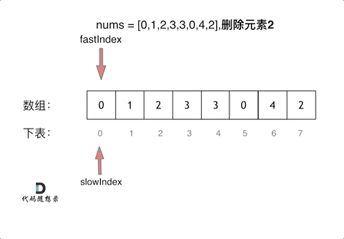
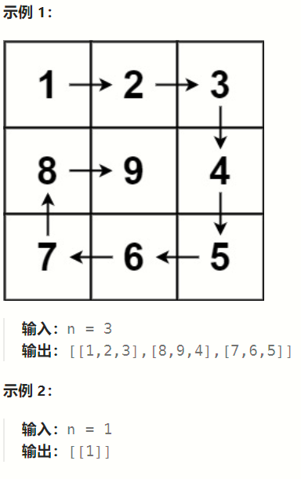

# 常用算法

## 数组

### 二分查找

场景：给定一个 n 个元素有序的（升序）整型数组 nums 和一个目标值 target  ，写一个函数搜索 nums 中的 target，如果目标值存在返回下标，否则返回 -1。

```javascript
function search(nums, target) {
  if (!nums || !nums.length) return -1;
  let left = 0, right = nums.length - 1, mid = 0;
  while (left <= right) {
    // 使用位运算的方法来求mid，避免下标溢出
    mid = left + （(right - left) >> 1）;
    if (nums[mid] < target) {
      right = mid - 1;
    } else if (nums[mid] > target) {
      left = mid + 1;
    } else {
      return mid;
    }
  }
  return -1;
}
// 测试
console.log(search([1, 2, 3, 4, 5, 6, 7, 8, 9], 5)); // 输出 4
```

需要注意的点：

1. 计算区间去左闭右闭区间，所以 `while` 循环的判断区间取 `left <= right`;
2. 求 `mid` 是可采用以下方法（推荐第一种，位运算较快）

   - `mid = left + ((right - left) >> 2)`
   - `mid = Math.floor((left + right) / 2)`

### 移除元素

给你一个数组 nums 和一个值 val，你需要 原地 移除所有数值等于 val 的元素，并返回移除后数组的新长度。

不要使用额外的数组空间，你必须仅使用 O(1) 额外空间并原地修改输入数组。

元素的顺序可以改变。你不需要考虑数组中超出新长度后面的元素。

示例 1: 给定 nums = [3,2,2,3], val = 3, 函数应该返回新的长度 2, 并且 nums 中的前两个元素均为 2。 你不需要考虑数组中超出新长度后面的元素。

示例 2: 给定 nums = [0,1,2,2,3,0,4,2], val = 2, 函数应该返回新的长度 5, 并且 nums 中的前五个元素为 0, 1, 3, 0, 4。

#### 暴力双重循环

```javascript
function removeElement(nums, target){
    let len = nums.length;
    for(let i = 0; i < len; i++){
        if(nums[i] === target){
            for(let j = i; j < len - 1; j++){
                nums[j] = nums[j+1];
            }
        }
        len--;
        i--;
    }
    return len;
}
console.log(removeElement([1, 3, 5, 6, 2, 4, 3, 6, 8, 2, 3], 3)); // 8
```

需要注意的点：

#### 双指针法

双指针法（快慢指针法）： 通过一个快指针和慢指针在一个 for 循环下完成两个 for 循环的工作。

定义快慢指针

- 快指针：寻找新数组的元素 ，新数组就是不含有目标元素的数组;
- 慢指针：指向更新 新数组下标的位置;



```javascript
function removeElement(nums, target) {
  let p = 0; // 只需要定义慢指针，快指针即为当前for循环的遍历下标
  for (let i = 0; i < nums.length; i++) {
    if (nums[i] !== target) {
      nums[p++] = nums[i];
    }
  }
  return p;
}
console.log(removeElement([1, 3, 5, 6, 2, 4, 3, 6, 8, 2, 3], 3));
```

### 有序数组的平方

给你一个按 非递减顺序 排序的整数数组 nums，返回 每个数字的平方 组成的新数组，要求也按 非递减顺序 排序。

示例 1：

- 输入：nums = [-4,-1,0,3,10]
- 输出：[0,1,9,16,100]
- 解释：平方后，数组变为 [16,1,0,9,100]，排序后，数组变为 [0,1,9,16,100]

示例 2：

- 输入：nums = [-7,-3,2,3,11]
- 输出：[4,9,9,49,121]

```javascript
function sortedSquares(nums) {
    const _nums = new Array(nums.length).fill(0);
    let i = 0, j = nums.length - 1, index = nums.length - 1;
    while(i <= j){
        let left = nums[i] * nums[i];
        let right = nums[j] * nums[j];
        if(left < right){
            _nums[index--] = right;
            j--;
        }else{
            _nums[index--] = left;
            i++;
        }
    }
    return _nums;
};
```

### 长度最小的子数组

给定一个含有 n 个正整数的数组和一个正整数 s ，找出该数组中满足其和 ≥ s 的长度最小的 连续 子数组，并返回其长度。如果不存在符合条件的子数组，返回 0。

示例：

- 输入：s = 7, nums = [2,3,1,2,4,3]
- 输出：2
- 解释：子数组 [4,3] 是该条件下的长度最小的子数组。

#### 暴力双重循环

```javascript
function minSubArrayLen(nums, target){
    let size = Infinity;
    for(let i = 0; i < nums.length; i++){
        let sum = 0;
        let _size = 0;
        for(let j = i; j < nums.length; j++){
            sum += nums[j];
            _size++;
            if(sum >= target){
                size = size < _size ? size : _size;
                break;
            }
        }
    }
    return size === Infinity ? 0 : size;
}
```

#### 滑动窗口

所谓滑动窗口，就是不断的调节子序列的起始位置和终止位置，从而得出我们要想的结果。

在暴力解法中，是一个 for 循环滑动窗口的起始位置，一个 for 循环为滑动窗口的终止位置，用两个 for 循环 完成了一个不断搜索区间的过程。


在本题中实现滑动窗口，主要确定如下三点：

- 窗口内是什么？
- 如何移动窗口的起始位置？
- 如何移动窗口的结束位置？

窗口就是 满足其和 ≥ s 的长度最小的 连续 子数组。

窗口的起始位置如何移动：如果当前窗口的值大于 s 了，窗口就要向前移动了（也就是该缩小了）。

窗口的结束位置如何移动：窗口的结束位置就是遍历数组的指针，也就是 for 循环里的索引。

```javascript
function minSubArrayLen(nums, target){
    let len = nums.length;
    if(len === 0) return 0;
    let start = 0, end = 0, sum = 0;
    let size = Infinity;
    while(end < len){
        sum += nums[end];
        while(sum >= target){
            size = Math.min(size, end - start + 1);
            sum -= nums[start];
            start++;
        }
        end++;
    }
    return size === Infinity ? 0 : size;
}
```

#### 螺旋矩阵

给你一个正整数 `n` ，生成一个包含 `1` 到 `n(2)` 所有元素，且元素按顺时针顺序螺旋排列的 `n x n` 正方形矩阵 `matrix` 。



```javascript
function generateMatrix(n){
    // 初始化数组
    const res = new Array(n).fill().map(()=>new Array(n).fill(0));
    // 需要赋值的圈数
    let loop = Math.floor(n/2);
    // 赋值时每个方向的偏移值
    let offset = 1;
    // 当前的圈起始所在的数组下标
    let x = 0, y = 0;
    // 当前的赋值计数
    let count = 1;
    while(loop){
        let row = x, col = y;
        for(; col < n - offset; col++){
            res[row][col] = count++;
        }
        for(; row < n - offset; row++){
            res[row][col] = count++
        }
        for(; col > x; col--){
            res[row][col] = count++;
        }
        for(; row > y; row--){
            res[row][col] = count++;
        }
        x++;
        y++;
        offset++;
        loop--;
    }
    if(n % 2 !== 0){
        // 圈数遍历完后，需要给最中间元素赋值
        let mid = Math.floor(n/2);
        res[mid][mid] = count;
    }
    return res;
}
```

## 链表

## 移除元素

题意：删除链表中等于给定值 val 的所有节点。

示例 1： 输入：head = [1,2,6,3,4,5,6], val = 6 输出：[1,2,3,4,5]

示例 2： 输入：head = [], val = 1 输出：[]

示例 3： 输入：head = [7,7,7,7], val = 7 输出：[]

#### 常规法

先判断头结点的情况，再处理其他节点的情况：

```javascript
/**
 * Definition for singly-linked list.
 * function ListNode(val, next) {
 *     this.val = (val===undefined ? 0 : val)
 *     this.next = (next===undefined ? null : next)
 * }
 */
/**
 * @param {ListNode} head
 * @param {number} val
 * @return {ListNode}
 */
var removeElements = function (head, val) {
   if(!head) return head;
   while(head && head.val === val){
       head = head.next;
   }
   let cur = head;
   while(cur && cur.next){
       if(cur.next.val === val){
           cur.next = cur.next.next;
       }else{
           cur = cur.next;
       }
   }
   return head;
};
```

#### 虚拟头结点

通过添加一个虚拟头节点来统一处理节点情况

```javascript
/**
 * Definition for singly-linked list.
 * function ListNode(val, next) {
 *     this.val = (val===undefined ? 0 : val)
 *     this.next = (next===undefined ? null : next)
 * }
 */
/**
 * @param {ListNode} head
 * @param {number} val
 * @return {ListNode}
 */
var removeElements = function (head, val) {
    if (!head) return head;
    let vh = new ListNode(0, head);
    head = vh;
    while(head && head.next){
        if(head.next.val === val){
            head.next = head.next.next;
        }else{
            head = head.next;
        }
    }
    return vh.next;
};
```

### 反转链表

场景：反转一个单链表。

示例: 输入: 1->2->3->4->5->NULL 输出: 5->4->3->2->1->NULL

#### 双指针法

代码思想：

```javascript
// 定义链表节点数据结构
class ListNode {
  constructor(val) {
    this.value = val;
    this.next = null;
  }
}
// 反转链表
function reverseList(head) {
  if (!head || !head.next) return head;
  let pre, cur = null;
  while (head) {
    cur = head.next;
    head.next = pre;
    pre = head;
    head = cur;
  }
  return pre;
}
// 实例化链表节点
const p1 = new ListNode(1);
const p2 = new ListNode(2);
const p3 = new ListNode(3);
// 节点连接
p1.next = p2;
p2.next = p3;
// 测试
let _head = reverseList(p1);
while (_head) {
  console.log(_head.value);
  _head = _head.next;
} // 输出 3 2 1
```

#### 递归

```javascript
class ListNode {
  constructor(val) {
    this.value = val;
    this.next = null;
  }
}

const p1 = new ListNode(1);
const p2 = new ListNode(2);
const p3 = new ListNode(3);
p1.next = p2;
p2.next = p3;

function reverseList(head, pre = null) {
  if (!head) return pre;
  const cur = head.next;
  head.next = pre;
  pre = head;
  return reverseList(cur, pre);
}
let _head = reverseList(p1);
while (_head) {
  console.log(_head.value);
  _head = _head.next;
} // 输出 3 2 1
```
