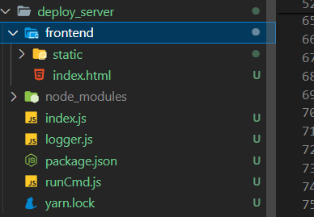
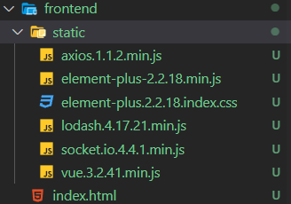

# 自动化部署搭建

前提 —— 此自动化部署项目需要放在前端工程化根目录，其原理是在接收到命令时，运行前端工程化根目录下的 `npm install` 和 `npm build` 命令(自动拉取当前前端工程化项目下的远程仓库的主分支最新代码进行构建)。

项目结构如下：



`index.js` 文件开启一个 `koa` 服务，用户可在远程访问静态页面，执行页面提供的按钮，进行远程部署。

- `frontend` 文件夹存放前端静态页面
- `index.js` 启动 `koa` 服务
- `logger.js` 服务日志工具
- `runCmd.js` 终端命令工具 -- 执行 `install` 和 `build` 命令

## 静态页面搭建

`static` 文件夹提供所需第三方依赖文件



`index.html`:

```html
<!DOCTYPE html>
<html lang="zh-CN">

<head>
    <meta charset="UTF-8">
    <meta name="viewport" content="width=device-width, initial-scale=1.0">
    <title>项目部署</title>
    <link rel="stylesheet" href="././static/element-plus.2.2.18.index.css" />
    <script src="././static/vue.3.2.41.min.js"></script>
    <script src="././static/element-plus-2.2.18.min.js"></script>
    <script src="././static/axios.1.1.2.min.js"></script>
    <script src="././static/socket.io.4.4.1.min.js"></script>
    <script src="././static/lodash.4.17.21.min.js"></script>
    <style>
        * {
            margin: 0;
            padding: 0;
        }

        #app {
            width: 100vw;
            height: 100vh;
            overflow: hidden;
            box-sizing: border-box;
            padding: 10px;
        }
        .text-log-wrap {
            font-size: 14px;
            background: rgba(0, 0, 0, 0.8);
            color: rgb(255, 255, 255);
            border-radius: 5px;
            padding: 20px;
            margin-bottom: 100px;
            max-height: 80vh;
            overflow-y: scroll;
            margin-top: 10px;
        }

        .text-log-wrap pre {
            padding: 0;
            margin: 0;
        }

        .text-log p {
            margin: 5px 0;
        }
    </style>
</head>

<body>
    <div id="app">
        <div>
            <el-button type="primary" @click="deploy" :disabled="disabled">{{ !disabled ? '部署' : '部署中' }}</el-button>
            <el-button type="danger" @click="reset">清空输出</el-button>
            <div>
                <p style="margin-top: 10px;">部署日志:</p>
                <div class="text-log-wrap">
                    <pre v-if="msgList.length" class="text-log">
                  <p v-for="(text, index) in msgList" :key="text+index">{{text}}</p>
                </pre>
                    <div v-else>请点击部署</div>
                </div>
            </div>
        </div>
    </div>
    <script>
        const app = {
            data() {
                return {
                    msgList: [],
                    disabled: false
                }
            },
            mounted() {
                this.socket = io() // 链接到 socket 服务器
                this.socket.on('deploy-log', (msg) => {
                    this.msgList.push(msg)
                })
                this.socket.on('start-log', (msg) => {
                    this.disabled = true;
                    this.msgList.push(msg)
                })
                this.socket.on('end-log', (msg) => {
                    this.disabled = false;
                    this.msgList.push(msg)
                })
            },
            methods: {
                deploy() {
                    this.msgList = []
                    axios.post('/deploy')
                        .then((response) => {
                            // handle success
                            console.log(response.data);
                            let {
                                code,
                                msg
                            } = response.data
                            if (code !== 0) {
                                this.$message.error(msg)
                            }
                            console.log(msg)
                        })
                        .catch(function (err) {
                            console.log(err);
                            this.$message.error(err.message)
                        })
                },
                reset(){
                    this.msgList = []
                }
            }
        }

        Vue.createApp(app).use(ElementPlus).mount('#app')
    </script>
</body>

</html>
```

## 逻辑实现

### 依赖安装

`package.json`:

```json
{
  "name": "server",
  "version": "1.0.0",
  "description": "",
  "main": "index.js",
  "scripts": {
    "test": "echo \"Error: no test specified\" && exit 1",
    "server": "node index.js"
  },
  "author": "",
  "license": "ISC",
  "dependencies": {
    "koa": "^2.14.2",
    "koa-bodyparser": "^4.4.1",
    "koa-router": "^12.0.0",
    "koa-session": "^6.4.0",
    "koa-static": "^5.0.0",
    "log4js": "^6.9.1",
    "socket.io": "^4.7.2"
  }
}
```

### 日志搭建

`logger.js`:

```javascript
const log4js = require("log4js");
const logger = log4js.getLogger("normal");
logger.level = "debug";

module.exports = logger;
```

### KOA 服务搭建

`index.js`:

```javascript
const Koa = require("koa");
const KoaStatic = require("koa-static");
const KoaRouter = require("koa-router");
const session = require("koa-session");
const bodyParser = require("koa-bodyparser");
const path = require("path");
const fs = require("fs");
const run = require("./runCmd");
const logger = require("./logger");
const app = new Koa();
const router = new KoaRouter();
app.use(bodyParser());
let args = {
  "port": "7777"
};
let socketList = [];
const server = require("http").Server(app.callback());
const socketIo = require("socket.io")(server);
socketIo.on("connection", (socket) => {
  socketList.push(socket);
  logger.info("a user connected");
});
router.post("/deploy", async (ctx) => {
  // 执行部署脚本
  // koa 注意异步 404 的问题
  let execFunc = () => {
    return new Promise((resolve, reject) => {
      try {
        run(socketIo);
      } catch (e) {
        logger.info(e);
        reject(e);
      }
    });
  };

  try {
    let res = await execFunc();
    ctx.body = {
      code: 0,
      msg: 'success',
    };
  } catch (e) {
    ctx.body = {
      code: -1,
      msg: e.message,
    };
  }
});
app.use(new KoaStatic(path.resolve(__dirname, "./frontend")));
app.use(router.routes()).use(router.allowedMethods());
server.listen(args.port, () => logger.info(`服务监听 ${args.port} 端口`));
```

### 终端命令工具实现

`runCmd.js`:

```javascript
const logger = require("./logger");
const path = require('path');
const outerFolder = path.join(__dirname, '../');
const {
  spawn
} = require('child_process');
let timeoutMinute = 2;
let msgTag = "deploy-log";
const gitCommand = 'git';
const npmCommand = process.platform === 'win32' ? 'npm.cmd' : 'npm';
const yarnCommand = process.platform === 'win32' ? 'yarn.cmd' : 'yarn';

function runCmd(command, args,flag = false,socketIo) {
  return new Promise((resolve, reject) => {
    if(flag){
        process.chdir(outerFolder);
    }
    let commandArgs = args.join(" ");
    const child = spawn(command, args);
    let resp = "";
    let startTime = +new Date();
    logger.info(`开始执行   ${commandArgs}`);
    socketIo && socketIo.emit(msgTag, `开始执行   ${commandArgs}` );
    let dataFunc = (buffer) => {
      if (child.killed) {
        child.stdout.off("data", dataFunc);
        return;
      }
      let info = buffer.toString();
      info = `${new Date().toLocaleString()}: ${info}`;
      resp += info;
      logger.info(info);
      socketIo && socketIo.emit(info);
    };
    child.stdout.on("data", dataFunc);
    child.stderr.on("data", (buffer) => {
      let info = buffer.toString();
      info = `${new Date().toLocaleString()}: ${info}`;
      resp += info;
      logger.info(info);
      socketIo && socketIo.emit(msgTag,info);
    });

    child.on("close", (code) => {
      logger.info("  >>child close", code);
      let useTime = (+new Date() - startTime) / 1000;
      if (code !== 0) {
        // 进程退出码不为0，表示执行出错
        logger.error(`  ${commandArgs} 运行出错!, code: ${code}, 耗时：${useTime}s`);
        socketIo && socketIo.emit(msgTag, `  ${commandArgs} 运行出错!, code: ${code}, 耗时：${useTime}s` );
        reject(false);
      } else {
        logger.info(`   ${commandArgs} 完成运行! 耗时：${useTime}s`);
        socketIo && socketIo.emit(msgTag, `   ${commandArgs} 完成运行! 耗时：${useTime}s` );
        resolve(true);
      }
    });

    const TIME_OUT_SEC = 1000 * 60 * timeoutMinute;
    let timeoutTimer = setTimeout(() => {
      let log = `>>> [system]  ${child.pid} 执行超时 ${TIME_OUT_SEC / 1000}s，结束执行!`;
      logger.info(msgTag, log);
      socketIo && socketIo.emit(msgTag, log );
      child.kill();
      reject(false);
    }, TIME_OUT_SEC);
    timeoutTimer && clearTimeout(timeoutTimer);
  });
}

module.exports = function run(socketIo){
  socketIo && socketIo.emit('start-log', `start` );
  runCmd(gitCommand, ['pull', 'origin', 'main'],false,socketIo)
  .then(()=> runCmd(yarnCommand, ['install'],true,socketIo))
  .then(() => runCmd(npmCommand, ['run', 'build'],false,socketIo))
  .then(()=>{
    socketIo && socketIo.emit('end-log', `end` );
  })
  .catch((e) => {
    logger.error(e);
    socketIo && socketIo.emit('end-log', `end` );
  });
}
```

### 使用

在终端运行此项目服务的 `server` 命令，启动 `KOA` 服务。通过访问端口代理的静态页面进行远程部署。
