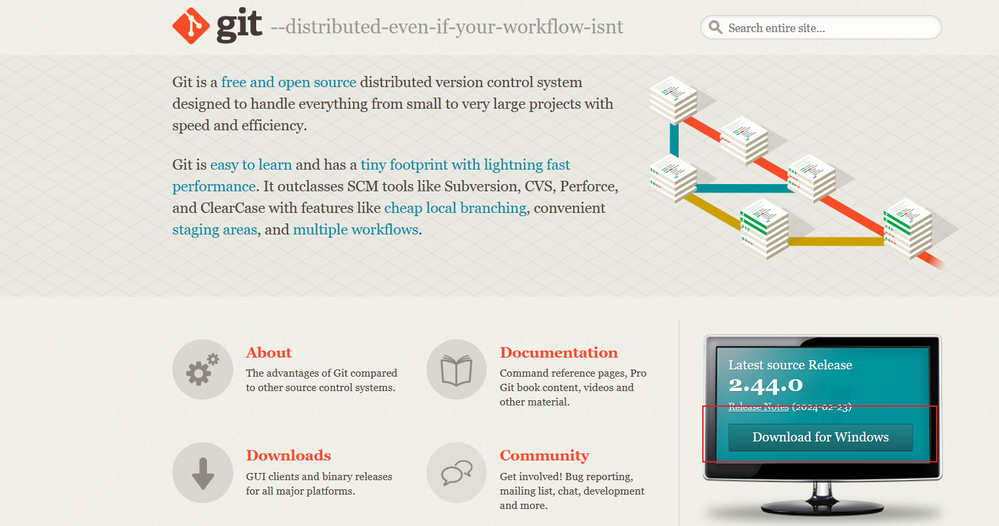
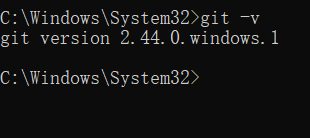
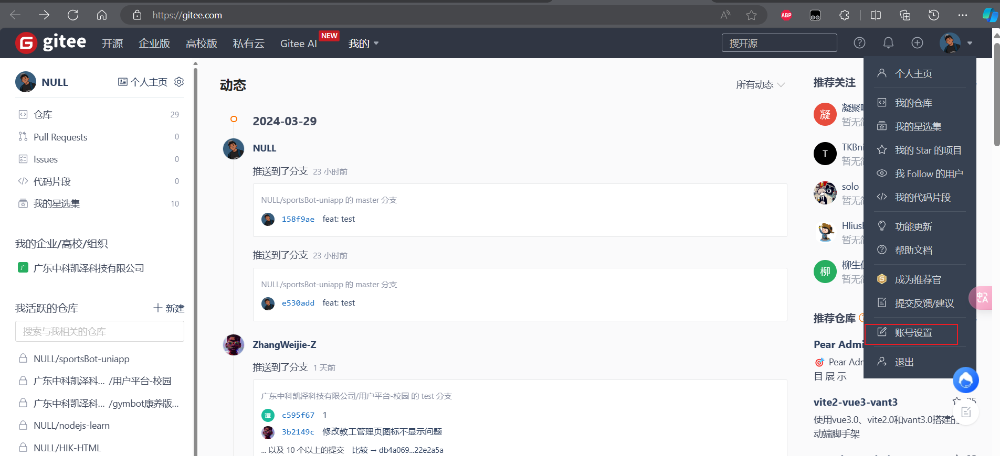
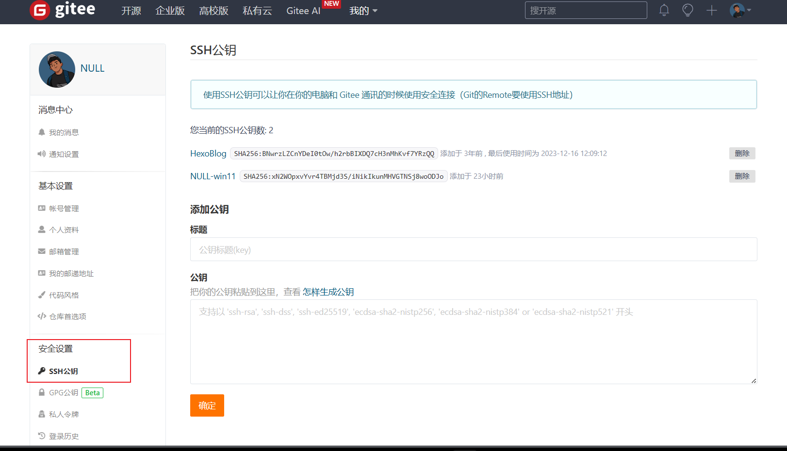
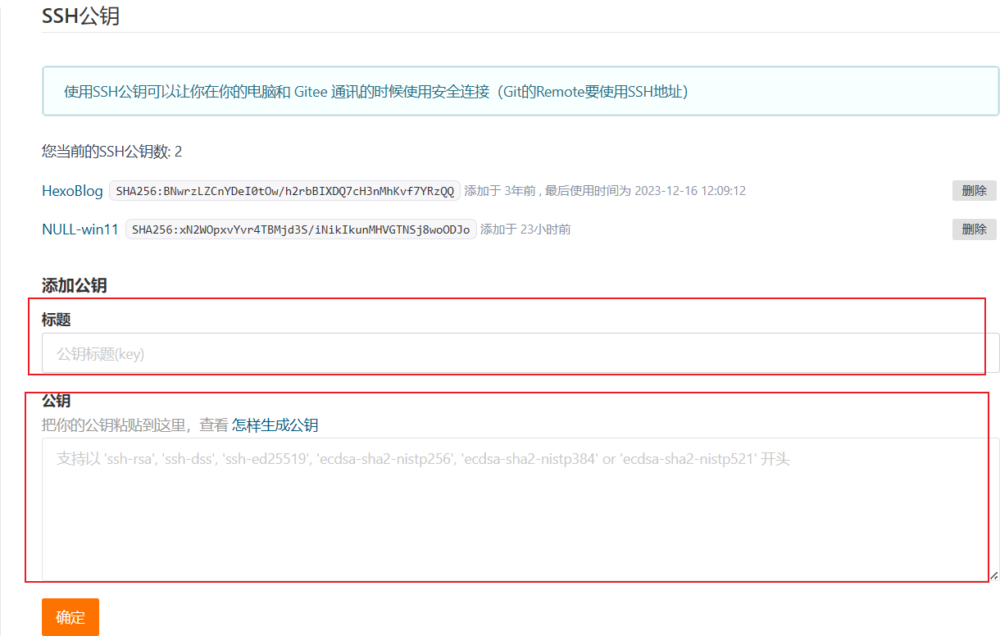
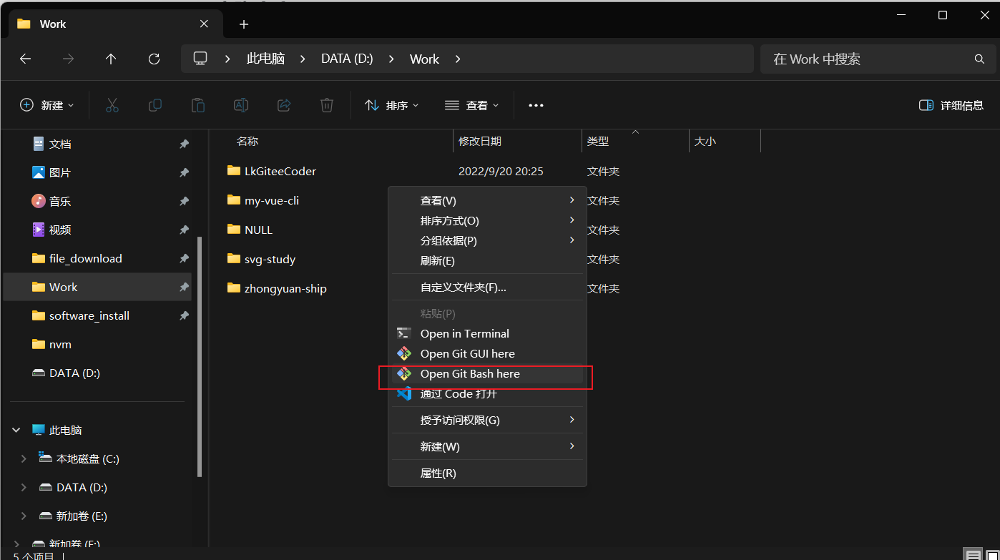

<!--
 * @Author: NULL 1628069508@qq.com
 * @Date: 2024-04-01 16:18:51
 * @LastEditTime: 2024-04-01 22:21:41
 * @LastEditors: NULL 1628069508@qq.com
 * @Description: 
 * @FilePath: \LkGiteeCoder\docs\env\Git安装配置\1.md
-->
# Git 安装使用

## 下载

Git 官网



## 安装

下载完成后，选择安装目录，之后一直点击 next 即可完成安装；

安装完成后，cmd 输入 `git -v` 检查是否安装成功：



## 本地与远程建立连接

1. 打开 cmd，输入如下命令标识用户信息：

```sql
git config --global user.name “用户名”
git config --global user.email “邮箱名”
```

1. 创建私钥和公钥

cmd 输入 `ssh-keygen -t rsa -b 2048 -C “邮箱名”`，然后一直按 enter，即可完成私钥和公钥生成；

1. 查看公钥

生成私钥和公钥后，输入 `cat ~/.ssh/id_rsa.pub`，查看公钥；

1. 远程添加 SSH 密钥， 以 Gitee 为例（GitHub 步骤也类似）：
   1. 复制上面命令查看的公钥
   2. 进入个人主页，点击头像账户的账户设置；
      
   3. 点击左侧菜单的安全设置-ssh 密钥；
      
   4. 添加公钥，输入当前公钥标题（建议为当前 PC 的环境，类似公司名-操作系统版本）,之后将之前查看的公钥复制到下方，并保存即可；
      

## 克隆仓库
   在工作目录下，右键选择 Open Git base here；
   
   输入命令 `git clone 仓库远程地址`，即可进行远程仓库克隆（非公开仓库，可能会需要进行远程仓库的登录，此时输入对应的 Gitee 的账户信息即可）；


## 新建仓库

1. 初始化仓库 git init 

2. 跟踪一个文件或目录 git add 文件名/文件夹名称（如果需要一次性跟踪当前目录下的所有文件 git add . 此处的 . 表示当前目录），此操作即为将文件添加到暂存区

3. 移除文件跟踪 git rm --cached 文件名/文件夹名称（此时将文件移出暂存区，但是不会删除文件）

4. 添加远程仓库 git remote add 远程仓库名字（自定义） 远程仓库地址

5. 查看远程仓库 git remote

6. 修改远程仓库的名字 git remote rename 远程仓库的旧名称 新的远程仓库名称

7. 将本地分支推送到仓库 git push 远程仓库名 本地分支名 

8. 拉取远程仓库代码 git pull 远程仓库名 远程分支名

## 分支管理

1. 查看分支 git branch --list （分支名前面带 * 表示为的当前分支）

2. 创建分支 git branch 新的分支名称（git checkout -b 新的分支名称 新建一个分支并切换到这个新的分支）

3. 切换分支 git checkout 分支名称

4. 合并分支 git merge 需要合并到当前分支的另一个分支名称（此操作默认将指定的分支合并到当前所在分支）

    - 合并分支冲突时，使用git status 命令查看冲突情况，当查看具体的冲突文件是， ====== 符号前面就是当前分支对此文件的修改，====== 符号下面就是合并进来的分支对此文        
      件的修改

## 分支存储

1. 在新的分支文件还没编写完成时，不对这些文件进行跟踪就切换到其他分支时会报错，此时使用命令 git stash 来保存新分支的编写（需要先将文件add到当前分支的工作区）

2. 使用 git stash apply来恢复新分支的工作

3. stash命令可以多次存储，每次stash后，工作区都会回到上一次提交后，工作区空的状态，可通过 git stash list 查看所有的stash

4. 通过 git stash apply 序号 ；来选择需要恢复的文件

5. 通过 git stash pop 来获取并恢复最后一次的stash的暂存区，此操作会在stash list中删除本次的stash记录

6. 通过 git stash drop 序号 来删除指定的stash记录

## 其他常用命令

1. git log  查看详细版本日志信息

2. git reflog 查看版本信息

3. 版本穿梭 git reset --hard 版本号 （版本号为使用git reflog命令查看到每一次提交时生成的哈希值）

4. 撤销提交 git reset head~ 撤销上一次提交，修改的文件不会回到暂存区（~后面可以加序号，指定上几次的提交）

    - git reset head~1 --soft 表示撤销上一次的提交，但是文件会回到暂存区

    - git reset head~1 --haed 表示撤销上一次的提交，且直接删除上一次提交的修改（会丢失数据，慎用！）

## merge 和 rebase 的区别

1. 相同点： 两者都可以进行分支代码的合并；

2. 不同点： 

    - 在主分支master merge 开发分支dev时，先寻找master分支和dev分支的共同祖先节点，之后将这个祖先节点分支的提交，master分支最新节点的提交，dev分支最新节点的提交，这三个节点的提交合并为一个新的提交节点；

    - 在主分支master rebase 开发分支dev时，先寻找master分支和dev分支的共同祖先节点，之后将master分支上祖先节点之后的提交一次嫁接到dev分支后，这样看commit tree时，仿佛没有dev分支一样，commit tree 为一条直的工作流，（明显可以看出这里的打乱了分支的提交顺序）；
    
3. 使用场景： 在已经push到远程仓库后的代码修改不要使用rebase操作，rebase仅在本地未提交的分支上进行使用；