# Mysql 安装配置

## 下载

官网地址：
[Mysql](https://dev.mysql.com/downloads/mysql/)

下载此版本：

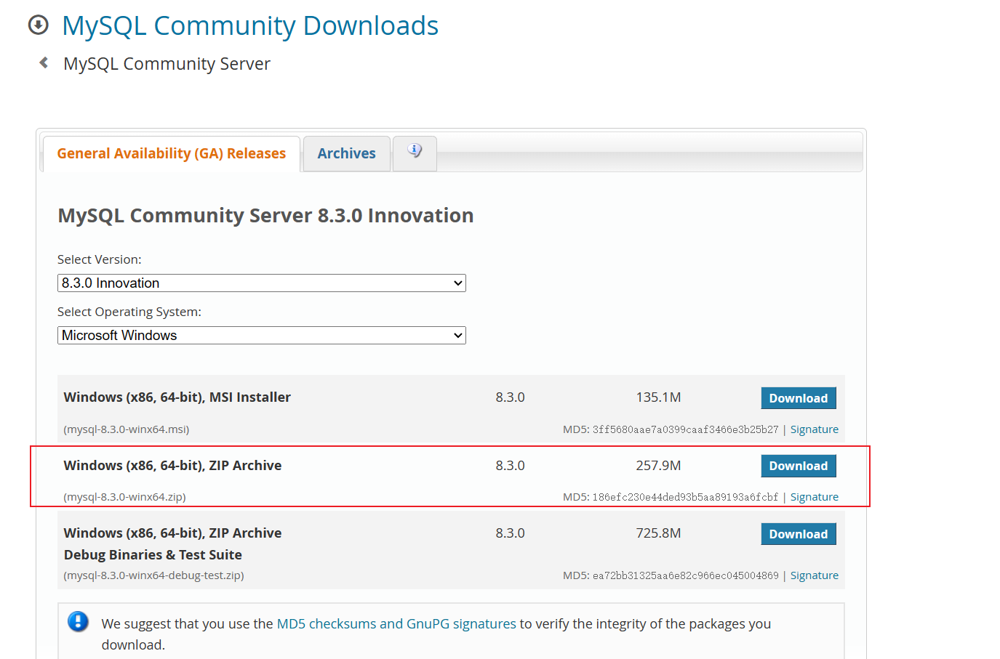

## 解压

将下载好的压缩包解压，解压出来的文件既是 MySQL 安装目录，建议移动到用户统一安装路径，修改命名为：

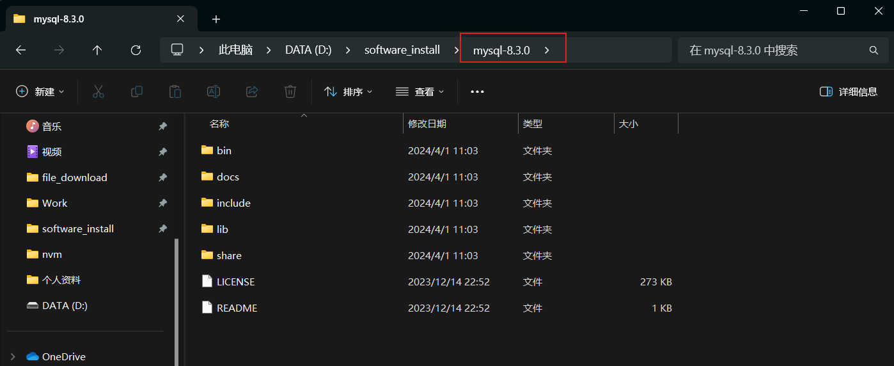

1. 在根目录下新建 `data` 文件夹；
2. 在根目录下新建 `my.ini` 配置文件;

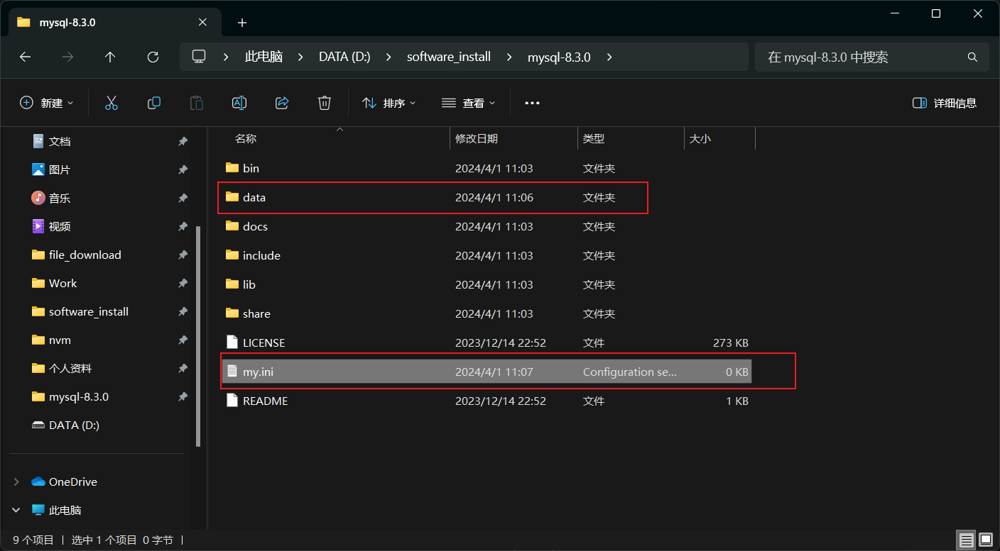

`my.ini` 文件配置如下（注意此文件配置中的安装目录和数据存放目录需按照当前安装目录实际修改,在 win11 系统环境下，文件夹路径使用 `/` 符号，如后续 cmd 初始化失败，可尝试将文件夹路径符改为 `\` 再试）：

```
[mysqld]
#设置3306端口
port=3306 
# 设置mysql的安装目录
basedir=D:/software_install/mysql-8.3.0
# 设置mysql数据库的数据的存放目录
datadir=D:/software_install/mysql-8.3.0/data
# 允许最大连接数
max_connections=200
# 服务端使用的字符集默认为8比特编码的latin1字符集
character-set-server=utf8
# 创建新表时将使用的默认存储引擎
default-storage-engine=INNODB
#跳过密码 -- 不建议添加
skip-grant-tables
#最最重要的一步
shared-memory
```

Tips: 以上配置中，存在跳过密码这一步，可能会导致 mysql 服务端口开启在 0 端口，并且导致 Navicat 出现以下的连接错误：

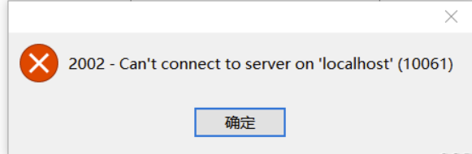

可以去掉跳过密码这一步骤，再进行初始化；

## 配置环境变量

在系统环境变量中的 `Path` 中，新建 MySQL 安装路径中的 bin 路径:

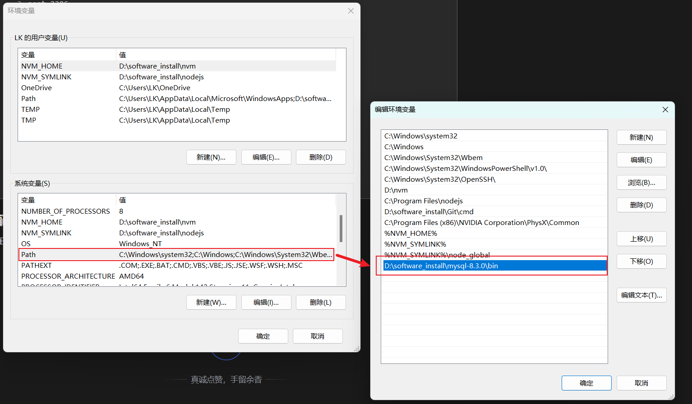

## 初始化

管理员方式打开 cmd，切换到 MySQL 的 bin 文件夹目录（win11 不需要这一步，只需管理员方式打开 cmd 即可）

1. 在 cmd 窗口输入 `mysqld install` 命令安装 MySQL 服务；

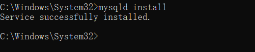

1. 在计算机管理中，查看 MySQL 服务是否成功启动：

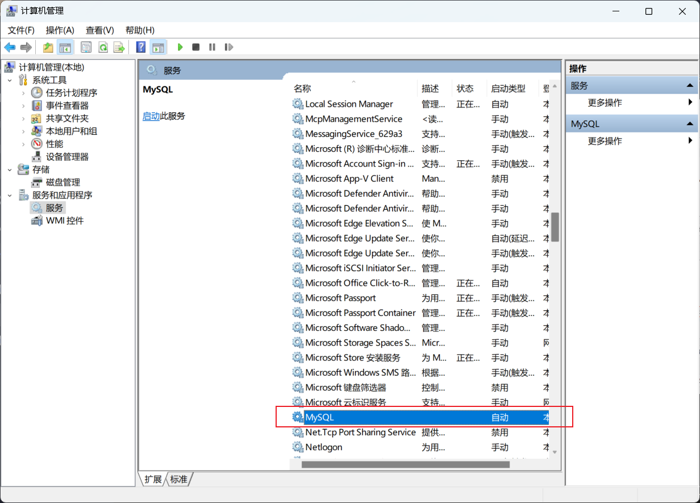

1. 继续在 cmd 窗口输入 `mysqld --``initialize`` --console`（win11 下，`my.ini` 文件夹路径，需改为 `/` 符号，否则此命令可能执行失败）

失败的截图：

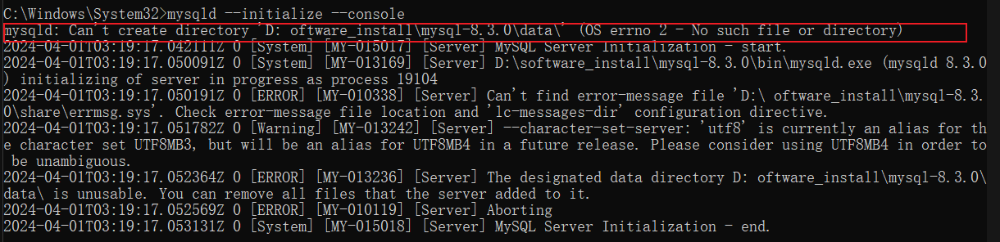

成功的截图（请截图保存初始化成功后的登录密码）：

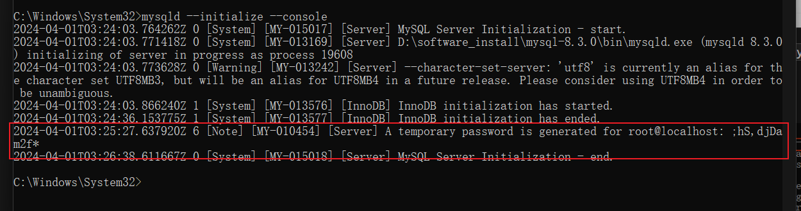

## 启动 MySQL 服务

继续在 cmd 窗口输入 `net start mysql` 命令，开始 MySQL 服务；

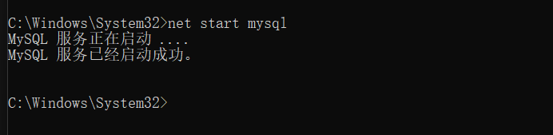

## 验证登录

在 cmd 窗口输入 `mysql -h ``localhost`` -u root -p` 命令进行登录，密码为刚才初始化的密码

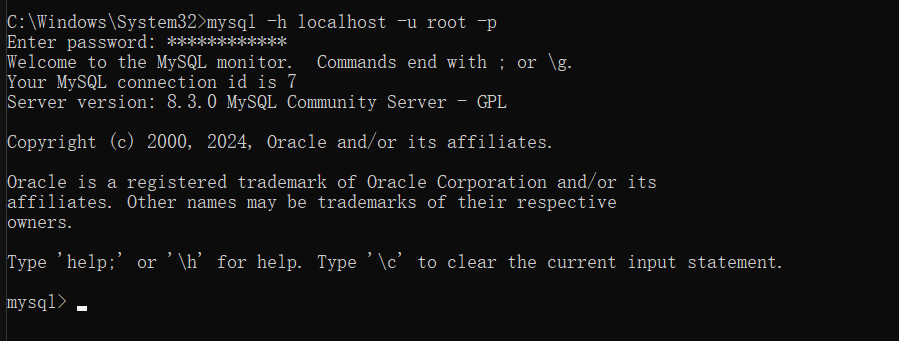

## 修改登录密码

初始化登录成功后，输入如下命令：**alter** `user 'root'@'``localhost``' identified` **by** ` "123456";`

tips: **by** 后为新密码，不要忘了';'号

可能出现的错误：

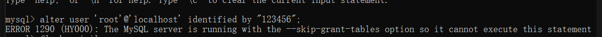

解决方法：

输入 `flush`` privileges;` 刷新配置后再试；

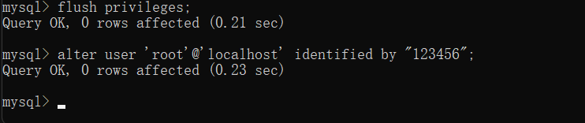
