# nvm 安装使用

## 下载前准备

1. 不能安装任何 node 版本，如存在请删除后再安装 nvm；
2. 打开系统的控制面板，点击卸载程序，卸载 nodejs；
3. 删除 node 的安装目录（取决于安装时的选择）；
4. 查找.npmrc 文件是否存在，有就删除（默认在 C:\User\用户名）；
5. 逐一查看一下文件是否存在，存在就删除；

   - C:\Program Files (x86)\Nodejs
   - C:\Program Files\Nodejs
   - C:\Users\用户名\AppData\Roaming\npm
   - C:\Users\用户名\AppData\Roaming\npm-cache
6. 查看是否删除成功；

   - cmd 下输入 `node -v` 判断；

## 下载

Nvm 下载地址：
[NVM](https://github.com/coreybutler/nvm-windows/releases)


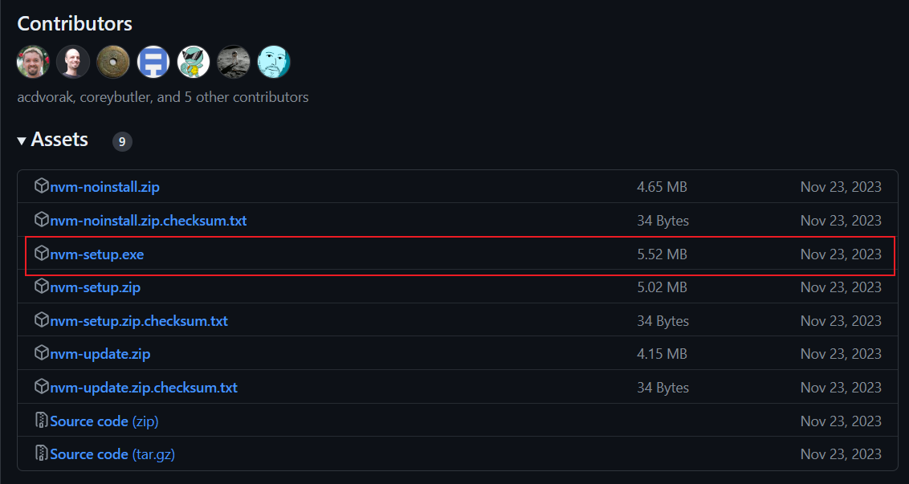

## 安装

### 下载完成后，直接运行 nvm-setup.exe；

### 选择 nvm 安装路径（建议安装在非系统盘）；

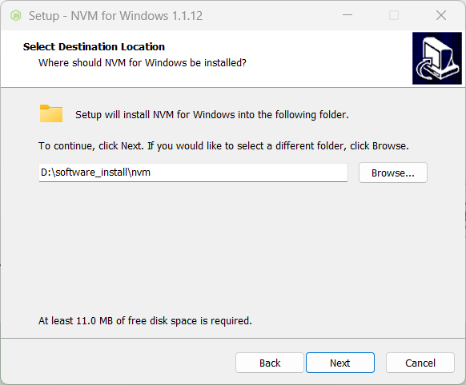

### 选择安装 nodejs 路径（建议安装在和 nvm 安装路径同级目录下）

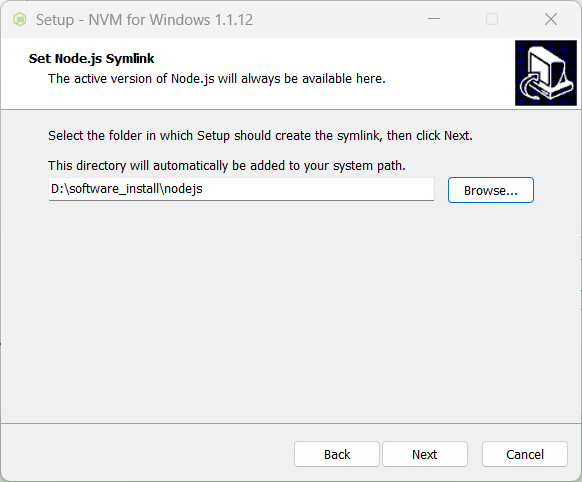

### 确认安装；

### 安装完成后进行确认；

打开 cmd，输入 `nvm -v` 检查是否安装成功；
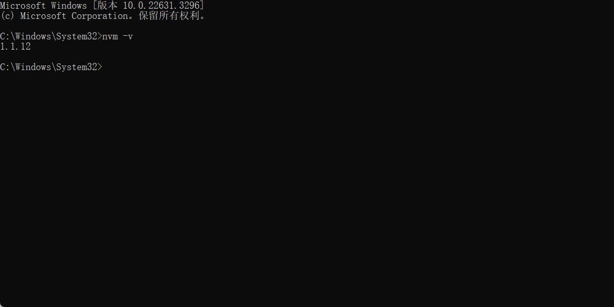

## 配置镜像源

在 nvm 的安装路径下，找到 `settings.txt` 文件，添加如下镜像地址：

```json
root: D:\software_install\nvm
path: D:\software_install\nodejs
node_mirror: http://npm.taobao.org/mirrors/node/
npm_mirror: http://npm.taobao.org/mirrors/npm/
```

## 配置 nvm 环境变量

检查 nvm 安装程序是否有自动添加以下的环境变量（程序一般会默认自动添加）

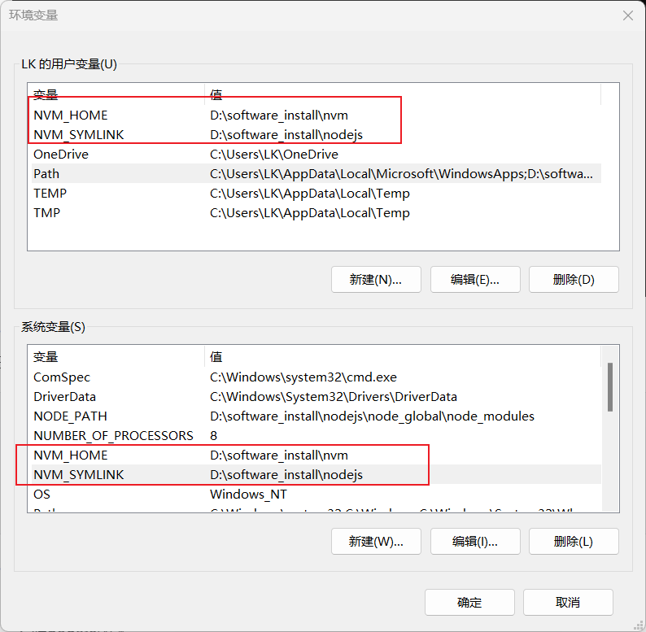

## 安装 nodejs 版本

1. 输入 `nvm list available` 显示可下载版本的列表；
2. 输入 `nvm install 版本号` 进行 nodejs 指定版本下载；
3. 下载成功后，输入 `nvm ls` 进行已安装 nodejs 版本查看
4. 输入 `nvm use 版本号` 进行 nodejs 版本的指定使用；

### 配置 nodejs 环境变量

1. 创建文件夹，在 nodejs 的安装路径下新增 `"node_global"` 和 `“node_cache”` 两个文件夹进行全局安装的时候安装对应的库到这两个文件。

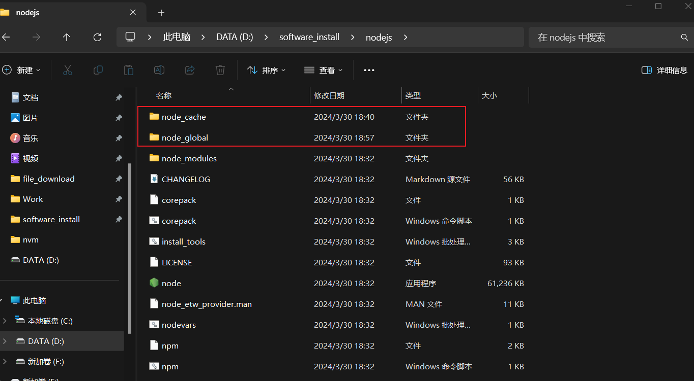

1. 打开 cmd 命令行工具，输入以下两句操作（两个路径就是新建上面两个文件夹的路径，主要目的是方便后面 window 机器使用方便）；
   ```powershell
   ```

npm config set prefix "D:\software_install\nodejs\node_global"
npm config set cache "D:\software_install\nodejs\node_cache"

```

2. 设置环境变量，在【系统变量】新建环境变量 `NODE_PATH` 值为 `D:\software_install\nodejs\node_global\node_modules`，其中`D:\software_install\nodejs\node_global\node_modules` 就是上面创建的全局模块安装路径文件夹。

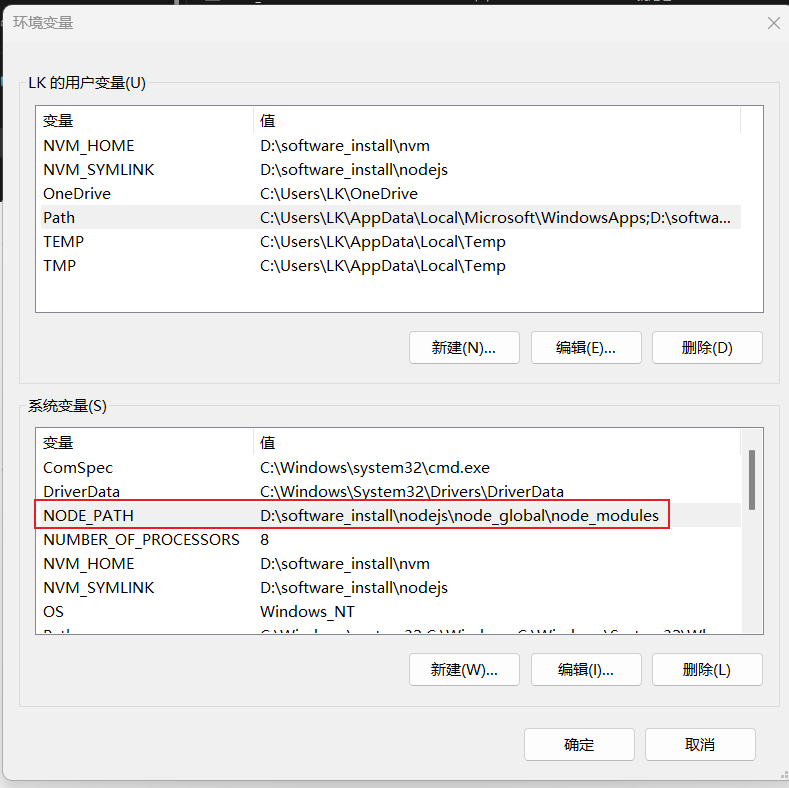

1. 在系统环境变量的`Path`中，添加如下变量：`%NVM_SYMLINK%\node_global`

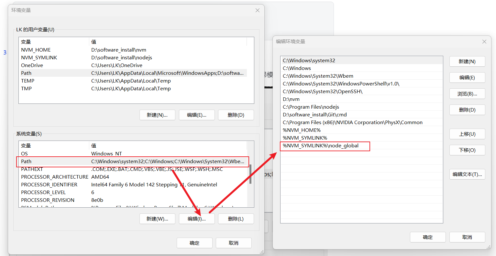

此时环境变量中，用户的环境变量和系统的环境变量中的`path`如下图：

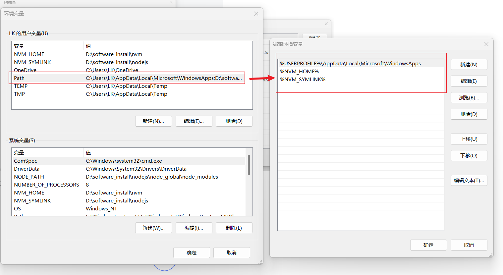

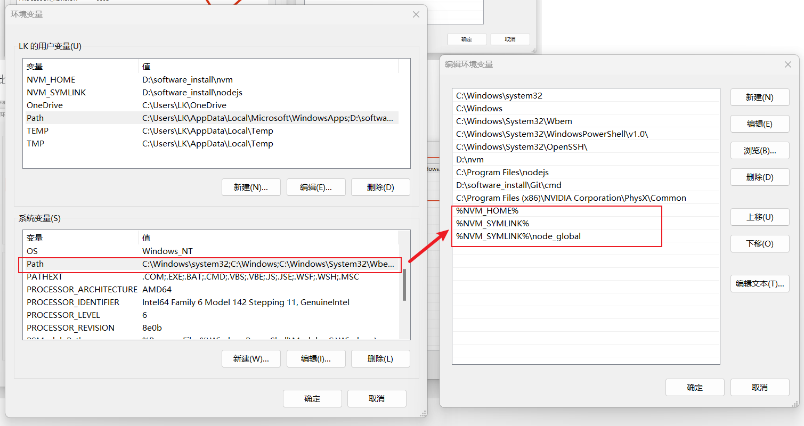

## 全局安装Pnpm

cmd输入命令`npm install pnpm -g`，安装完成后，输入`pnpm --version`检查`pnpm`版本；

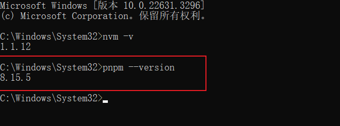

如果安装成功，在nodejs的安装目录下应该是如下的文件结构：

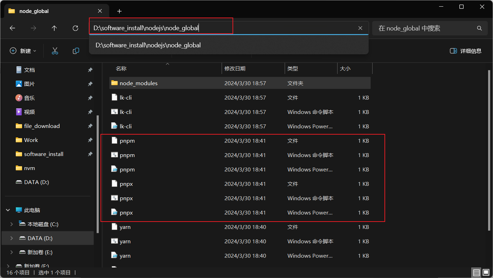

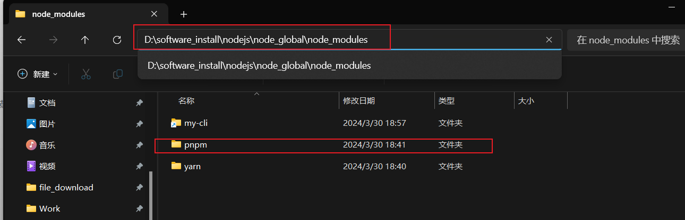

## 解决 pnpm 或 yarn: 无法加载文件

在运行命令的时候，使用pnpm或者yarn出现此错误：

```

pnpm : 无法加载文件 C:\Users\HP\AppData\Roaming\npm\pnpm.ps1，因为在此系统上禁止运行脚本。有关详细信息，请参阅 https:/go.microsoft.com/fwlink/?LinkID=135170 中的 about_Execution_Policies。
所在位置 行:1 字符: 1

- pnpm
- ~~~~
   + CategoryInfo          : SecurityError: (:) []，PSSecurityException
   + FullyQualifiedErrorId : UnauthorizedAccess
  ~~~~

```

解决方法：


```
