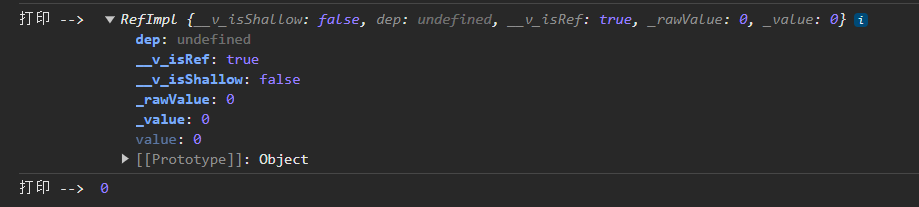

# Vue3 - ref 和 reactive 原理

在 Vue 3 中，`ref` 和 `reactive` 是用于创建响应式数据的两种方式。

## ref

`ref` 函数用于创建一个包装对象，将传入的值转换为响应式数据。它返回一个具有 `value` 属性的对象，通过访问 `value` 属性来获取和修改响应式数据。

```javascript
<script setup>
const count = ref(0);
console.log("打印 --> ", count);
console.log("打印 --> ", count.value);
</script>
```



查看源码

```javascript
function ref(value) {
    return createRef(value, false);
}

function createRef(rawValue, shallow) {
    if (isRef(rawValue)) {
        return rawValue;
    }
    return new RefImpl(rawValue, shallow);
}

function shallowRef(value) {
    return createRef(value, true);
}

class RefImpl {
    constructor(value, __v_isShallow) {
        this.__v_isShallow = __v_isShallow;
        this.dep = undefined;
        this.__v_isRef = true;
        this._rawValue = __v_isShallow ? value : toRaw(value);
        this._value = __v_isShallow ? value : toReactive(value);
    }
    get value() {
        trackRefValue(this);
        return this._value;
    }
    set value(newVal) {
        newVal = this.__v_isShallow ? newVal : toRaw(newVal);
        if (shared.hasChanged(newVal, this._rawValue)) {
            this._rawValue = newVal;
            this._value = this.__v_isShallow ? newVal : toReactive(newVal);
            triggerRefValue(this, newVal);
        }
    }
}
```

执行顺序：ref()=>createRef()=>new RefImpl();

通过 babel 查看编译 class 的解析原理了，其实 es6 中 class 转换后就是 defineProperty。可以知道了，ref 实现原理就是通过 Vue2 中熟悉的配方 Object.defineProperty 来实现的。

同时通过源码查看发现 RefImpl 类中的 set 方法会判断如果是包裹对象的话，会将 ref({})中的对象通过 reactive 包裹起来。

```javascript
const toReactive = (value) => shared.isObject(value) ? reactive(value) : value;
```

## reactive

reactive 的实现原理就比较直观了上源码：就是通过 proxy 进行对象的代理实现.

```javascript
function createReactiveObject(target, isReadonly, baseHandlers, collectionHandlers, proxyMap) {
    if (!shared.isObject(target)) {
        {
            console.warn(`value cannot be made reactive: ${String(target)}`);
        }
        return target;
    }
    // target is already a Proxy, return it.
    // exception: calling readonly() on a reactive object
    if (target["__v_raw" /* RAW */] &&
        !(isReadonly && target["__v_isReactive" /* IS_REACTIVE */])) {
        return target;
    }
    // target already has corresponding Proxy
    const existingProxy = proxyMap.get(target);
    if (existingProxy) {
        return existingProxy;
    }
    // only specific value types can be observed.
    const targetType = getTargetType(target);
    if (targetType === 0 /* INVALID */) {
        return target;
    }
    const proxy = new Proxy(target, targetType === 2 /* COLLECTION */ ? collectionHandlers : baseHandlers);
    proxyMap.set(target, proxy);
    return proxy;
}```
```
