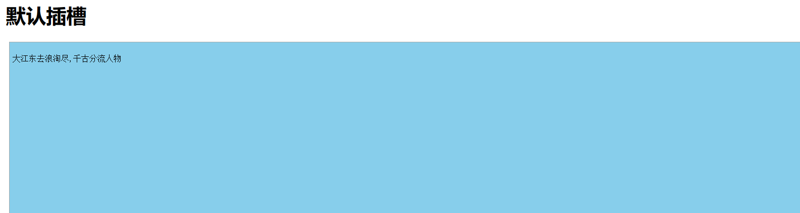
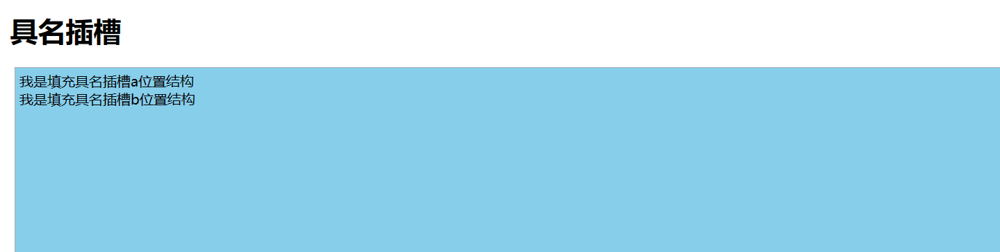
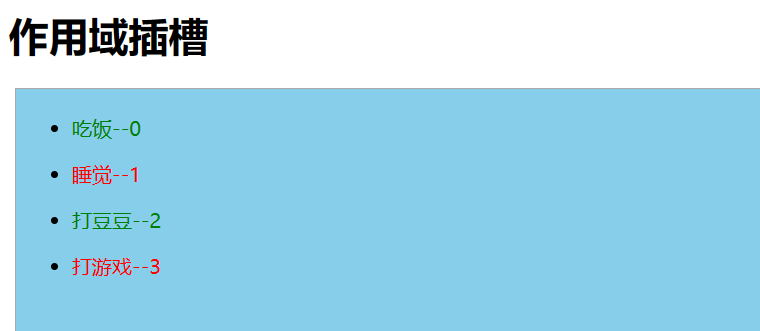

# Vue 组件间通信方法

使用 vue3 作为本文的示例

# 1.props 父子组件间通信

在父组件中通过给子组件绑定自定义属性传递数据；

```html
// 父组件
<template>
  <div class="box">
    <h1>我是父组件</h1>
    <hr />
    <Child info="我是子组件" :money="money"></Child>
  </div>
</template>

<script setup lang="ts">
//props:可以实现父子组件通信,props数据还是只读的！！！
import Child from "./Child.vue";
import { ref } from "vue";
let money = ref(10000);
</script>
```

```html
// 子组件
<template>
  <div class="son">
       <h1>我是子组件</h1>
       <p>{{props.info}}</p>
       <p>{{props.money}}</p>
      <!--props可以省略前面的名字--->
       <p>{{info}}</p>
       <p>{{money}}</p>
       <button @click="updateProps">修改props数据</button>
  </div>
</template>

<script setup lang="ts">
//需要使用到defineProps方法去接受父组件传递过来的数据
//defineProps是Vue3提供方法,不需要引入直接使用
let props = defineProps(['info','money']); //数组|对象写法都可以 --- 简单写法
//按钮点击的回调
const updateProps = ()=>{
  // props.money+=10;  props:只读的
  console.log(props.info)
}
</script>
```

在此补充 defineProps 方法中详细定义 props 数据类型和校验的方法

```javascript
const props = defineProps({
  // 基础类型检查
  // （给出 `null` 和 `undefined` 值则会跳过任何类型检查）
  propA: Number,
  // 多种可能的类型
  propB: [String, Number],
  // 必传，且为 String 类型
  propC: {
    type: String,
    required: true
  },
  // Number 类型的默认值
  propD: {
    type: Number,
    default: 100
  },
  // 对象类型的默认值
  propE: {
    type: Object,
    // 对象或数组的默认值
    // 必须从一个工厂函数返回。
    // 该函数接收组件所接收到的原始 prop 作为参数。
    default(rawProps) {
      return { message: 'hello' }
    }
  },
  // 自定义类型校验函数
  propF: {
    validator(value) {
      // The value must match one of these strings
      return ['success', 'warning', 'danger'].includes(value)
    }
  },
  // 函数类型的默认值
  propG: {
    type: Function,
    // 不像对象或数组的默认，这不是一个工厂函数。这会是一个用来作为默认值的函数
    default() {
      return 'Default function'
    }
  }
})
```

# 2.自定义事件（custom event）父子组件间通信

```html
<!-- 父组件 -->
<template>
  <div>
    <!-- 原生DOM事件 -->
    <pre @click="handler">
      大江东去浪淘尽,千古分流人物
    </pre>
    <button @click="handler1(1,2,3,$event)">点击我传递多个参数</button>
    <hr>
    <!--
        vue2框架当中:这种写法自定义事件,可以通过.native修饰符变为原生DOM事件
        vue3框架下面写法其实即为原生DOM事件

        vue3:原生的DOM事件不管是放在标签身上、组件标签身上都是原生DOM事件
      -->
    <Event1 @click="handler2"></Event1>
    <hr>
    <!-- 绑定自定义事件xxx:实现子组件给父组件传递数据 -->
    <Event2 @xxx="handler3" @click="handler4"></Event2>
  </div>
</template>

<script setup lang="ts">
//引入子组件
import Event1 from './Event1.vue';
//引入子组件
import Event2 from './Event2.vue';
//事件回调--1
const handler = (event)=>{
    //event即为事件对象
    console.log(event);
}
//事件回调--2
const handler1 = (a,b,c,$event)=>{
   console.log(a,b,c,$event)
}
//事件回调---3
const handler2 = ()=>{
    console.log(123);
}
//事件回调---4
const handler3 = (param1,param2)=>{
    console.log(param1,param2);
}
//事件回调--5
const handler4 = (param1,param2)=>{
     console.log(param1,param2);
}
</script>
```

```html
<!-- Event1子组件 -->
<template>
  <div class="son">
      <p>我是子组件1</p>
      <button>点击我也执行</button>
  </div>
</template>
```

```html
<!-- Event2子组件 -->
<template>
  <div class="child">
    <p>我是子组件2</p>
    <button @click="handler">点击我触发自定义事件xxx</button>
    <button @click="$emit('click','AK47','J20')">点击我触发自定义事件click</button>
  </div>
</template>

<script setup lang="ts">
//利用defineEmits方法返回函数触发自定义事件
//defineEmits方法不需要引入直接使用
let $emit = defineEmits(['xxx','click']);
//按钮点击回调
const handler = () => {
  //第一个参数:事件类型 第二个|三个|N参数即为注入数据
    $emit('xxx','东风导弹','航母');
};
</script>
```

# 3.v-model 父子组件间通信

```html
<!-- 父组件 -->
<template>
  <div>
    <h1>v-model:钱数{{ money }}{{pageNo}}{{pageSize}}</h1>
    <input type="text" v-model="info" />
    <hr />
    <!-- props:父亲给儿子数据 -->
    <!-- <Child :modelValue="money" @update:modelValue="handler"></Child> -->
    <!-- 
       v-model组件身上使用
       第一:相当有给子组件传递props[modelValue] = 10000
       第二:相当于给子组件绑定自定义事件update:modelValue
     -->
    <Child v-model="money"></Child>
    <hr />
    <Child1 v-model:pageNo="pageNo" v-model:pageSize="pageSize"></Child1>
  </div>
</template>

<script setup lang="ts">
//v-model指令:收集表单数据,数据双向绑定
//v-model也可以实现组件之间的通信,实现父子组件数据同步的业务
//父亲给子组件数据 props
//子组件给父组件数据 自定义事件
//引入子组件
import Child from "./Child.vue";
import Child1 from "./Child1.vue";
import { ref } from "vue";
let info = ref("");
//父组件的数据钱数
let money = ref(10000);
//自定义事件的回调
const handler = (num:any) => {
  //将来接受子组件传递过来的数据
  money.value = num;
};

//父亲的数据
let pageNo = ref(1);
let pageSize = ref(3);
</script>
```

```html
<!--child子组件-->
<template>
  <div class="child">
    <h3>钱数:{{ modelValue }}</h3>
    <button @click="handler">父子组件数据同步</button>
  </div>
</template>

<script setup lang="ts">
//接受props
let props = defineProps(["modelValue"]);
let $emit = defineEmits(['update:modelValue']);
//子组件内部按钮的点击回调
const handler = ()=>{
   //触发自定义事件
   $emit('update:modelValue',props.modelValue+1000);
}
</script>
```

```html
<!--child1子组件-->
<template>
  <div class="child2">
    <h1>同时绑定多个v-model</h1>
    <button @click="handler">pageNo{{ pageNo }}</button>
    <button @click="$emit('update:pageSize', pageSize + 4)">
      pageSize{{ pageSize }}
    </button>
  </div>
</template>

<script setup lang="ts">
let props = defineProps(["pageNo", "pageSize"]);
let $emit = defineEmits(["update:pageNo", "update:pageSize"]);
//第一个按钮的事件回调
const handler = () => {
  $emit("update:pageNo", props.pageNo + 3);
};
</script>
```

# 4.useAttrs 父子组件间通信

```html
<!--父组件-->
<template>
  <div>
    <h1>useAttrs</h1>
    <el-button type="primary" size="small" :icon="Edit"></el-button>
    <!-- 自定义组件 -->
    <HintButton type="primary" size="small" :icon="Edit" title="编辑按钮" @click="handler" @xxx="handler"></HintButton>
  </div>
</template>

<script setup lang="ts">
//vue3框架提供一个方法useAttrs方法,它可以获取组件身上的属性与事件！！！
//图标组件
import {
  Check,
  Delete,
  Edit,
  Message,
  Search,
  Star,
} from "@element-plus/icons-vue";
import HintButton from "./HintButton.vue";
//按钮点击的回调
const handler = ()=>{
  alert(12306);
}
</script>
```

```html
<!--HintButton 子组件-->
<template>
  <div :title="title">
     <el-button :="$attrs"></el-button>   
  </div>
</template>

<script setup lang="ts">
//引入useAttrs方法:获取组件标签身上属性与事件
import {useAttrs} from 'vue';
//此方法执行会返回一个对象
let $attrs = useAttrs();

//万一用props接受title
let props =defineProps(['title']);
//props与useAttrs方法都可以获取父组件传递过来的属性与属性值
//但是props接受了useAttrs方法就获取不到了
console.log($attrs);
</script>
```

# 5.ref，$parent 父子组件间通信

```html
<!--父组件-->
<template>
  <div class="box">
    <h1>父组件:{{money}}</h1>
    <button @click="handler">子组件减10</button>
    <hr>
    <Son ref="son"></Son>
    <hr>
    <Dau></Dau>
  </div>
</template>

<script setup lang="ts">
//ref:可以获取真实的DOM节点,可以获取到子组件实例VC
//$parent:可以在子组件内部获取到父组件的实例
//引入子组件
import Son from './Son.vue'
import Dau from './Daughter.vue'
import {ref} from 'vue';
//父组件钱数
let money = ref(100000000);
//获取子组件的实例
let son = ref();
//父组件内部按钮点击回调
const handler = ()=>{
   money.value+=10;
   //儿子钱数减去10
   son.value.money-=10;
   son.value.fly();
}
//对外暴露
defineExpose({
   money
})
</script>
```

```html
<!--子组件son-->
<template>
  <div class="son">
    <h3>我是子组件:{{money}}</h3>
  </div>
</template>

<script setup lang="ts">
import {ref} from 'vue';
let money = ref(666);
const fly = ()=>{
  console.log('我可以飞');
}
//组件内部数据对外关闭的，别人不能访问
//如果想让外部访问需要通过defineExpose方法对外暴露
defineExpose({
  money,
  fly
})
</script>
```

```html
<!--子组件dau-->
<template>
  <div class="dau">
     <h1>{{money}}</h1>
     <button @click="handler($parent)">点击像父组件拿10000</button>
  </div>
</template>

<script setup lang="ts">
import {ref} from 'vue';
//钱数
let money = ref(999999);
//按钮点击回调
const handler = ($parent)=>{
   money.value+=10000;
   $parent.money-=10000;
}
</script>
```

# 6.provide-inject 隔代组件间通信

```html
<!-- 祖先组件 -->
<template>
  <div class="box">
    <h1>Provide与Inject{{car}}</h1>
    <hr />
    <Child></Child>
  </div>
</template>

<script setup lang="ts">
import Child from "./Child.vue";
//vue3提供provide(提供)与inject(注入),可以实现隔辈组件传递数据，
// 子组件也可以通过inject获取到provide的数据
// 隔代组件不仅包含第三代组件（重孙组件以后的均可以通过inject获取到provide注入的数据）
import { ref, provide } from "vue";
let car = ref("法拉利");
//祖先组件给后代组件提供数据
//两个参数:第一个参数就是提供的数据key
//第二个参数:祖先组件提供数据
provide("TOKEN", car);
</script>
```

```html
<!-- 子组件 -->
<template>
  <div class="child">
     <h1>子组件</h1>
     <Child></Child>
     <button @click="updateCar">更新数据</button>
  </div>
</template>

<script setup lang="ts">
import Child from './GrandChild.vue';
import { inject } from 'vue'
let car = inject('TOKEN');
console.log(car);  // 这里子组件也可以获取到数据
let updateCar = ()=>{
   car.value  = '自行车';
}
</script>
```

```html
<!-- 孙组件 -->
<template>
  <div class="child1">
    <h1>孙子组件</h1>
    <p>{{car}}</p>
    <button @click="updateCar">更新数据</button>
  </div>
</template>

<script setup lang="ts">
import {inject} from 'vue';
//注入祖先组件提供数据
//需要参数:即为祖先提供数据的key
let car = inject('TOKEN');
const updateCar = ()=>{
   car.value  = '自行车';
}
</script>
```

# 7.pinia 任意组件间通信

pinia 是类似于 vuex 的集中式管理状态容器，可以实现任意组件间的通信；

```javascript
//创建大仓库 -- 入口 此文件需在项目的main.ts入口文件引入
import { createPinia } from 'pinia';
//createPinia方法可以用于创建大仓库
let store = createPinia();
//对外暴露,安装仓库
export default store;
```

options 常规配置

```javascript
//定义info小仓库
import { defineStore } from "pinia";
//第一个仓库:小仓库名字  第二个参数:小仓库配置对象
//defineStore方法执行会返回一个函数,函数作用就是让组件可以获取到仓库数据
let useInfoStore = defineStore("info", {
    //存储数据:state
    state: () => {
        return {
            count: 99,
            arr: [1, 2, 3, 4, 5, 6, 7, 8, 9, 10]
        }
    },
    actions: {
        //注意:函数没有context上下文对象
        //没有commit、没有mutations去修改数据
        updateNum(a: number, b: number) {
            this.count += a;
        }
    },
    getters: {
        total() {
            let result:any = this.arr.reduce((prev: number, next: number) => {
                return prev + next;
            }, 0);
            return result;
        }
    }
});
//对外暴露方法
export default useInfoStore;
```

使用

```html
<template>
  <div class="child">
    <h1>{{ infoStore.count }}---{{infoStore.total}}</h1>
    <button @click="updateCount">点击我修改仓库数据</button>
  </div>
</template>

<script setup lang="ts">
import useInfoStore from "@/store/info";
//获取小仓库对象
let infoStore = useInfoStore();
console.log(infoStore);
//修改数据方法
const updateCount = () => {
  //仓库调用自身的方法去修改仓库的数据
  infoStore.updateNum(66,77);
};
</script>
```

composition 配置

```javascript
//定义组合式API仓库
import { defineStore } from "pinia";
import { ref, computed,watch} from 'vue';
//创建小仓库
let useTodoStore = defineStore('todo', () => {
    let todos = ref([{ id: 1, title: '吃饭' }, { id: 2, title: '睡觉' }, { id: 3, title: '打豆豆' }]);
    let arr = ref([1,2,3,4,5]);

    const total = computed(() => {
        return arr.value.reduce((prev, next) => {
            return prev + next;
        }, 0)
    })
    //务必要返回一个对象:属性与方法可以提供给组件使用
    return {
        todos,
        arr,
        total,
        updateTodo() {
            todos.value.push({ id: 4, title: '组合式API方法' });
        }
    }
});

export default useTodoStore;
```

使用

```html
<template>
  <div class="child1">
    <p @click="updateTodo">
    arr:{{ todoStore.arr }}
    total:{{todoStore.total}}
    </p>
  </div>
</template>

<script setup lang="ts">
//引入组合式API函数仓库
import useTodoStore from "@/store/todo";
let todoStore = useTodoStore();
//点击p段落去修改仓库的数据
const updateTodo = () => {
  todoStore.updateTodo();
};
</script>
```

# 8.slot 父子组件间通信

1. 默认插槽

```html
<template>
  <div>
    <h1>默认插槽</h1>
    <Test>
      <div>
        <pre>大江东去浪淘尽,千古分流人物</pre>
      </div>
    </Test>
  </div>
</template>
<script setup lang="ts">
import Test from "./Test.vue";
</script>
```

```html
<!--Test子组件-->
<template>
  <div class="box">
    <!-- 默认插槽 -->
    <slot></slot>
  </div>
</template>

<script setup lang="ts">
</script>
```



1. 具名插槽

```html
<template>
  <div>
    <h1>具名插槽</h1>
    <Test>
      <!-- 具名插槽填充a -->
      <template #a>
        <div>我是填充具名插槽a位置结构</div>
      </template>
      <!-- 具名插槽填充b v-slot指令可以简化为# -->
      <template v-slot:b>
        <div>我是填充具名插槽b位置结构</div>
      </template>
    </Test>
  </div>
</template>
<script setup lang="ts">
import Test from "./Test.vue";
</script>
```

```html
<!--Test子组件-->
<template>
  <div class="box">
    <slot name="a"></slot>
    <slot name="b"></slot>
  </div>
</template>
```



1. 作用域插槽

作用域插槽:就是可以传递数据的插槽,子组件可以讲数据回传给父组件,父组件可以决定这些回传的数据是以何种结构或者外观在子组件内部去展示。

```html
<template>
  <div>
    <h1>作用域插槽</h1>
    <Test1 :todos="todos">
      <template v-slot="{ $row, $index }">
        <p :style="{ color: $row.done ? 'green' : 'red' }">
          {{ $row.title }}--{{ $index }}
        </p>
      </template>
    </Test1>
  </div>
</template>

<script setup lang="ts">
import Test1 from "./Test1.vue";
import { ref } from "vue";
//todos数据
let todos = ref([
  { id: 1, title: "吃饭", done: true },
  { id: 2, title: "睡觉", done: false },
  { id: 3, title: "打豆豆", done: true },
  { id: 4, title: "打游戏", done: false },
]);
</script>
```

```html
<!--Test1子组件-->
<template>
  <div class="box">
    <ul>
      <li v-for="(item, index) in todos" :key="item.id">
        <!--作用域插槽:可以讲数据回传给父组件-->
        <slot :$row="item" :$index="index"></slot>
      </li>
    </ul>
  </div>
</template>

<script setup lang="ts">
//通过props接受父组件传递数据
defineProps(["todos"]);
</script>
```



在 element-ui 上插槽的使用，以下是 table 组件案例

```html
<template>
  <el-table :data="tableData" style="width: 100%">
    <el-table-column label="Date" width="180">
      <template #default="scope">
      <!--这里的#default为具名插槽和作用域插槽同时使用-->
        <div style="display: flex; align-items: center">
          <el-icon><timer /></el-icon>
          <span style="margin-left: 10px">{{ scope.row.date }}</span>
        </div>
      </template>
    </el-table-column>
    <el-table-column label="Name" width="180">
      <template #default="scope">
        <el-popover effect="light" trigger="hover" placement="top" width="auto">
          <template #default>
            <div>name: {{ scope.row.name }}</div>
            <div>address: {{ scope.row.address }}</div>
          </template>
          <template #reference>
            <el-tag>{{ scope.row.name }}</el-tag>
          </template>
        </el-popover>
      </template>
    </el-table-column>
    <el-table-column label="Operations">
      <template #default="scope">
        <el-button size="small" @click="handleEdit(scope.$index, scope.row)"
          >Edit</el-button
        >
        <el-button
          size="small"
          type="danger"
          @click="handleDelete(scope.$index, scope.row)"
          >Delete</el-button
        >
      </template>
    </el-table-column>
  </el-table>
</template>

<script lang="ts" setup>
import { Timer } from '@element-plus/icons-vue'

interface User {
  date: string
  name: string
  address: string
}

const handleEdit = (index: number, row: User) => {
  console.log(index, row)
}
const handleDelete = (index: number, row: User) => {
  console.log(index, row)
}

const tableData: User[] = [
  {
    date: '2016-05-03',
    name: 'Tom',
    address: 'No. 189, Grove St, Los Angeles',
  },
  {
    date: '2016-05-02',
    name: 'Tom',
    address: 'No. 189, Grove St, Los Angeles',
  },
  {
    date: '2016-05-04',
    name: 'Tom',
    address: 'No. 189, Grove St, Los Angeles',
  },
  {
    date: '2016-05-01',
    name: 'Tom',
    address: 'No. 189, Grove St, Los Angeles',
  },
]
</script>
```

# 9.全局事件总线

在 vue3 中，因为不再存在 this 的访问，故也不存在 $bus 全局事件总线，在此使用第三方库 mitt

```javascript
// @/mitt/index.ts 文件
//引入mitt插件:mitt一个方法,方法执行会返回bus对象
import mitt from 'mitt';
const $bus = mitt();
export default $bus;
```

```html
<!-- 子组件1 -->
<template>
  <div class="child1">
    <h3>我是子组件1</h3>
  </div>
</template>

<script setup lang="ts">
import $bus from "@/mitt";
//组合式API函数
import { onMounted } from "vue";
//组件挂载完毕的时候,当前组件绑定一个事件,接受将来兄弟组件传递的数据
onMounted(() => {
  //第一个参数:即为事件类型  第二个参数:即为事件回调
  $bus.on("car", (car) => {
    console.log(car);
  });
});
</script>
```

```html
<!-- 子组件2 -->
<template>
  <div class="child2">
     <h2>我是子组件2</h2>
     <button @click="handler">点击</button>
  </div>
</template>

<script setup lang="ts">
//引入$bus对象
import $bus from '@/bus';
//点击按钮回调
const handler = ()=>{
  $bus.emit('car',{car:"法拉利"});
}
</script>
```
